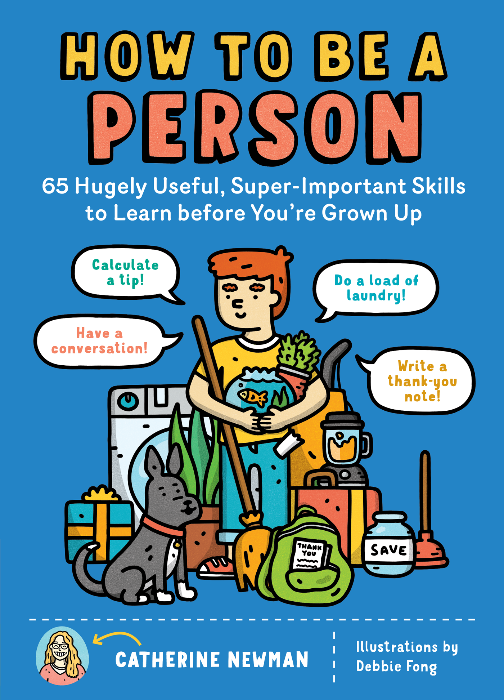

<!-- use for all ebooks except apple -->

 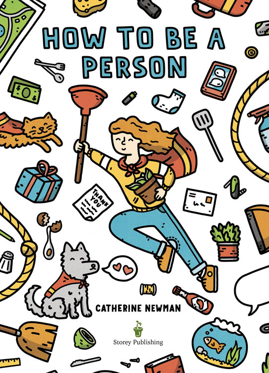

The mission of Storey Publishing is to serve our customers by publishing
practical information that encourages personal independence in harmony
with the environment.

Edited by Deanna F. Cook and Michal Lumsden

Art direction and book design by Alethea Morrison

Text production by Kristy L. MacWilliams

Illustrations by © Debbie Fong

Text © 2020 by Catherine Newman

Ebook production by Kristy L. MacWilliams

Ebook version 1.0

May 26, 2020

All rights reserved. No part of this book may be reproduced without
written permission from the publisher, except by a reviewer who may
quote brief passages or reproduce illustrations in a review with
appropriate credits; nor may any part of this book be reproduced, stored
in a retrieval system, or transmitted in any form or by any means —
electronic, mechanical, photocopying, recording, or other — without
written permission from the publisher.

The information in this book is true and complete to the best of our
knowledge. All recommendations are made without guarantee on the part of
the author or Storey Publishing. The author and publisher disclaim any
liability in connection with the use of this information.

**Storey books are available at special discounts when purchased in bulk
for premiums and sales promotions as well as for fund-raising or
educational use. Special editions or book excerpts can also be created
to specification. For details, please call 800-827-8673, or send an
email to <sales@storey.com>.**

**Storey Publishing\
210 MASS MoCA Way\
North Adams, MA 01247\
[www.storey.com](http://www.storey.com)**

Library of Congress Cataloging-in-Publication Data

Names: Newman, Catherine, 1968- author.

Title: How to be a person / Catherine Newman.

Description: North Adams : Storey Publishing, 2020. \| Audience: Ages
10–14 \| Audience: Grades 4–6 \| Summary: “Catherine Newman has written
the ultimate guidebook for kids, jam-packed with tips, tricks, and
skills to become a more dependable person”— Provided by publisher.

Identifiers: LCCN 2019056617 (print) \| LCCN 2019056618 (ebook) \| ISBN
9781635861822 (paperback) \| ISBN 9781635861839 (ebook)

Subjects: LCSH: Self-presentation—Juvenile literature. \|
Self-actualization (Psychology)—Juvenile literature.

Classification: LCC BF697.5.S44 N489 2020 (print) \| LCC BF697.5.S44
(ebook) \| DDC 155.42/491—dc23

LC record available at
[https://lccn.loc.gov/2019056617](https://lccn.loc.gov/2019056617)

LC ebook record available at
[https://lccn.loc.gov/2019056618](https://lccn.loc.gov/2019056618)

For Ben and Birdy and everyone else who’s trying
to be their best selves — all of us. We got this.

— Catherine

For Allistair, Murray, and Cooper.

— Debbie

# Contents

[Becoming Your Best
Self](#626182HowToBeAPerson_ebook-3.xhtml__idTextAnchor004)

[**Other Beings:**\
How to Care for the People, Pets, and Plants in Your
Life](#626182HowToBeAPerson_ebook-4.xhtml__idTextAnchor005)

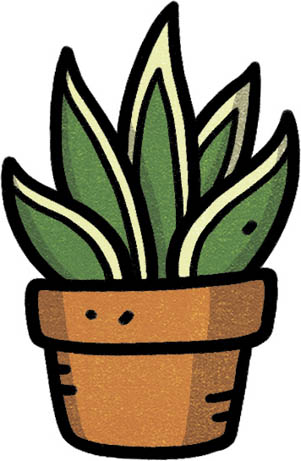

[**Saying It Right:**\
How to Be Kind and Get Your Point
Across](#626182HowToBeAPerson_ebook-5.xhtml__idTextAnchor007)

[**Dirty Things:**\
How to Clean and Care for Your
Home](#626182HowToBeAPerson_ebook-6.xhtml__idTextAnchor010)

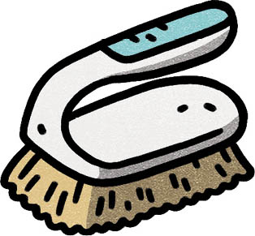

[**Edible Food:**\
How to Make Meals and Find Your Way around the
Kitchen](#626182HowToBeAPerson_ebook-7.xhtml__idTextAnchor012)

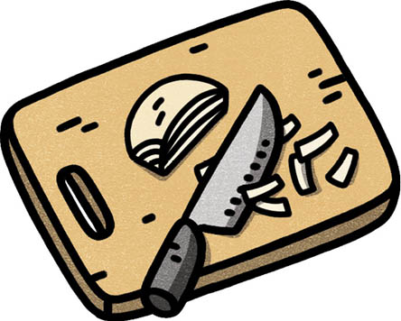

[**You’re Wearing That?:**\
How to Clean and Care for Your
Clothes](#626182HowToBeAPerson_ebook-8.xhtml__idTextAnchor013)

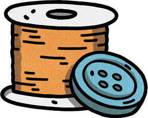

[**Your Two Cents:**\
How to Get, Give, and Spend
Money](#626182HowToBeAPerson_ebook-9.xhtml__idTextAnchor016)

[**Useful Skills:**\
How to Do Basic Important
Things](#626182HowToBeAPerson_ebook-10.xhtml__idTextAnchor019)

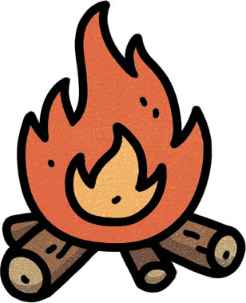

[Thank You](#626182HowToBeAPerson_ebook-11.xhtml__idTextAnchor021)

[Power Up Your DIY Skills with More Books from
Storey](#626182HowToBeAPerson_ebook-12.xhtml__idTextAnchor022)

[Share Your Experience!](#share.xhtml)

# Becoming Your Best Self

We swear we’re not trying to turn you into a premature adult! We don’t
want you trudging around in a small suit with a briefcase or wedging
yourself under the sink to fix the plumbing in your bathroom. But we do
think you’ll be a happier person if you learn the skills in this book —
some of which you probably already know, others of which people probably
think you already know (*shhhh*), and all of which will come in handy
pretty much immediately. The truth is that it feels good to do
meaningful things, and it feels good to be appreciated, and these skills
pretty much guarantee a combination of those two good feelings.

Look, we understand that maybe you
didn’t pick this book out all on your own. Maybe your grown-ups even
passive-aggressively gave it to you for your birthday along with a pair
of rubber gloves and a plunger. (You’re welcome!) But it doesn’t really
matter, because we’re convinced that a lot of the tasks we tend to think
of as *chores* can be truly rewarding — especially if you have a chance
to step toward them with confidence rather than being backed into them
by that bulldozer of nagging otherwise known as your mom or dad. Or
maybe by the time you’re reading this, there’s a robot that can do all
of the household chores! Perfect. Put this book aside to show your
children one day. “Before we had robots, we had to water the plants and
wipe the kitchen counters ourselves!” you’ll say, and the kids will
shake their heads and pity you.

One thing we know: asking, “What can I do to help?” is a sure way to be
your best self. And with this book in hand, you won’t have to say
awkwardly, “Um, I don’t actually know how to do that!”

**A note:** if you have different abilities — neurologically,
cognitively, or physically — then some of these skills might require
various kinds of adaptation and hacking. We’d love to hear your thoughts
about how to make this book work better for you: choose “contact” from
the menu on my website,
[catherinenewmanwriter.com](https://www.catherinenewmanwriter.com/).

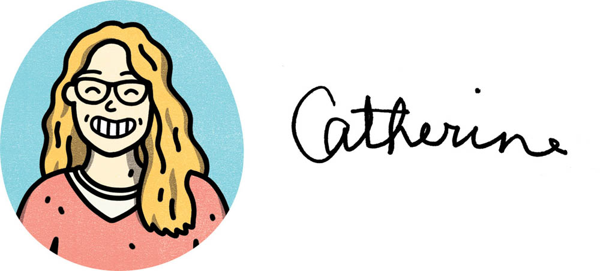

# Other Beings

How to Care for the People, Pets, and Plants in Your Life

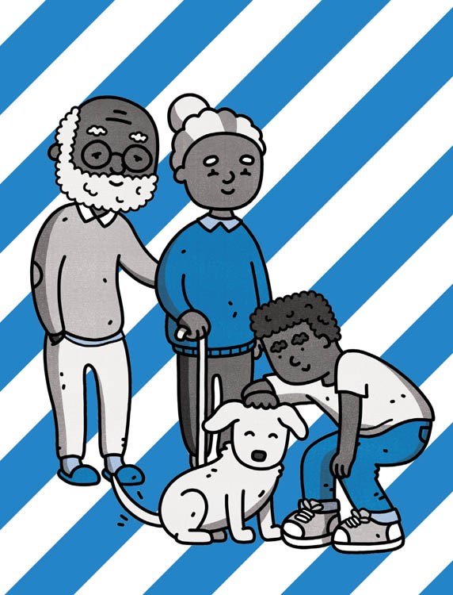

Someone can feel looked after by you without you doing anything at all.
You could be just smiling or sitting nearby. But some situations require
more active caretaking, and these are a handful of them.

## How to Cheer Up Sick People

If someone in your house is sick, you can **bring them something
soothing**, like a glass of ginger ale, a bowl of soup, or some
scrambled eggs on toast. Or **keep them company** while they watch TV or
do a puzzle book or look through the box of old holiday cards.

If a friend is sick, you could **drop
by**[\*](#626182HowToBeAPerson_ebook-4.xhtml_fn_01) **with flowers or a
magazine, or send a card**.

For a classmate who’s been sick for a while, you could **gather cards
from the whole class** and send them in a big envelope.

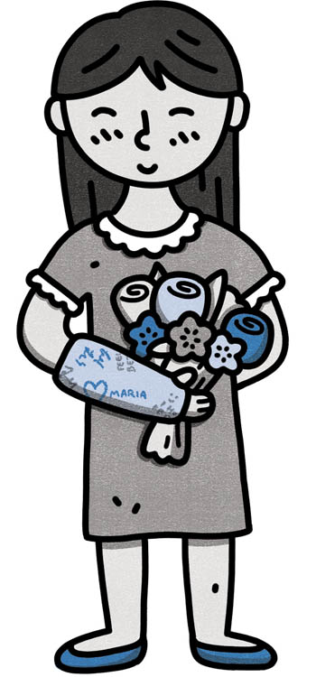

\* Wash your
hands when you leave if it’s something you could catch!

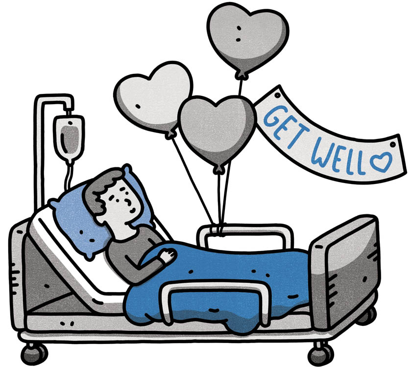

**Bring some sunshine.** It’s nice to visit someone who’s in the
hospital and bring a homemade card or even a “Get Well” banner to hang
by their bed. You might need to gather your courage, because hospitals
can be a little frightening, but you don’t need to stay long, and your
sick person will be so happy to see your face! They’re still the same
person under there, even if they are surrounded by weird tubes and
blankets or a hospital-y smell.

## How to Bring a Little Sunshine to Older Folks

Just the fact of you being there is likely to bring cheer! But you could
offer to play a game (they might want to teach you a strange one you’ve
never heard of) or do a jigsaw puzzle or read to them, if that’s
something they might like.

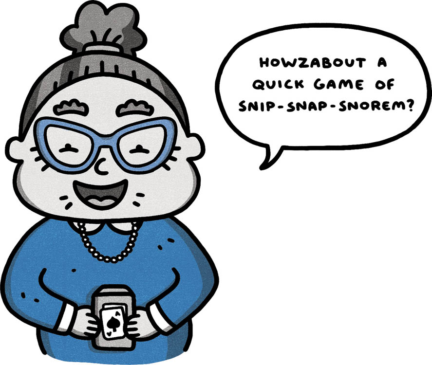

If you are good with nail polish,
your person might say yes to a manicure!

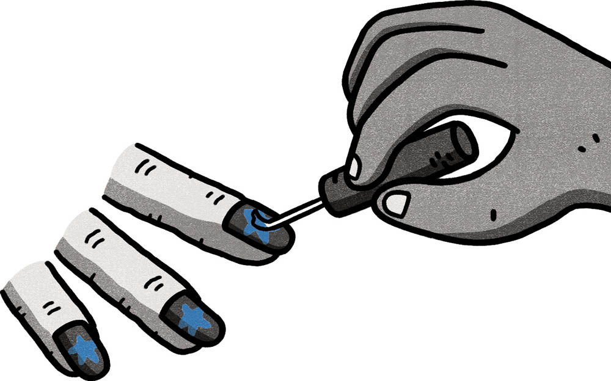

If you play an instrument, sing, tell jokes, or do magic tricks, your
older person will likely be a very appreciative audience, and you will
end up feeling like a STAR.

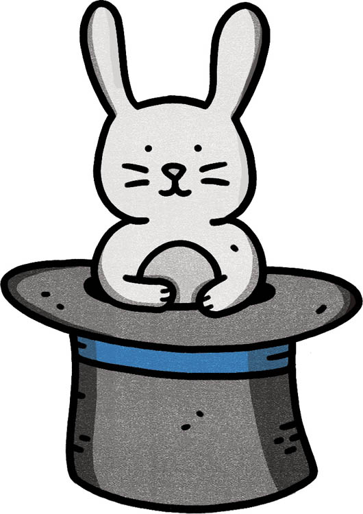

## How to Be with a Baby or a Little Kid

Maybe you’ve got teeny-tiny guests at home — or even a whole new
sibling. Whatever the reason, there’s a baby in the house, so you will
want to pay attention to it!

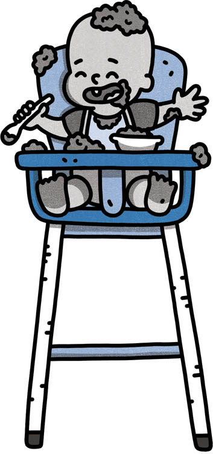

- Be patient and gentle. Babies might need a little time to get to know
  you!
- Ask an adult to help you learn how to hold the baby safely, what the
  baby likes, and if there are any books or toys for the baby. If you’d
  like to help feed or bathe the baby, just ask!
- Don’t freak out if the baby, uh, gets something on you. Babies are
  messy, and they can’t help it.
- Play with the baby or toddler
  the way they like. Maybe the baby wants you to build the tallest block
  tower ever, but then just wants to knock the blocks down — over and
  over and over again. Or they might want you to “read” the same board
  book with no words in it over and over and over again. Okay! Ask an
  adult if there’s anything dangerous you should worry about, such as
  choking hazards, electrical outlets, or food allergies.Ask for help if
  you need it.
  

  

  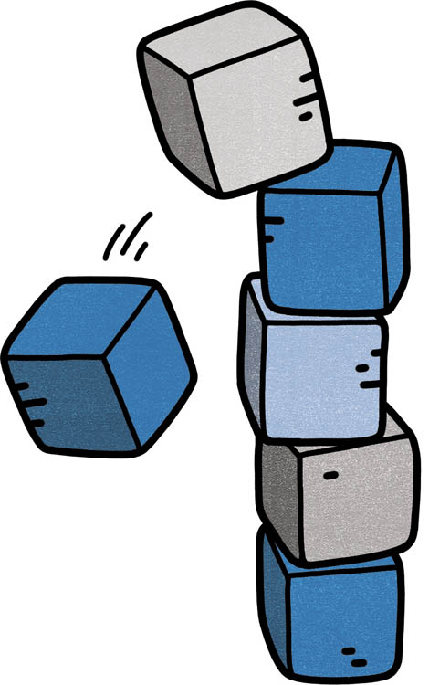

  

  

If you’re interested in **babysitting**, consider working first as a
**parent’s helper** — which means watching a baby or child while a
parent or other caregiver is in another part of the house, but still
available to step in and help if you need them.

## How to Help Someone (Including Yourself) Fall Asleep

Lots of people —including little kids, big kids, older folks, and
fretful folks—have a hard time falling asleep. There are many strategies
to try. Feel free to mix and match as much as you like!

**A sleepy mugful.** Warm milk actually contains a neurochemical called
tryptophan, and although the science isn’t clear on whether or not this
actually helps you fall asleep, creating an association between sleep
and a comforting mug of warm, nourishing milk definitely can.

Chamomile tea may also scientifically help or psychologically help.
Either way it’s good.

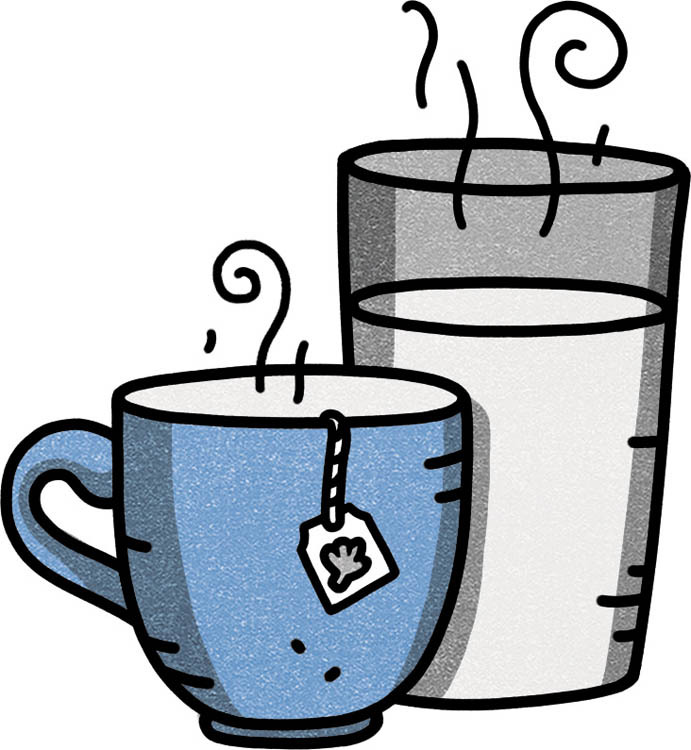

**Aromatherapy.** Chamomile and
lavender essential oils are thought to be relaxing. You can shake a few
drops into a hot bath, onto a tissue near your pillow, or into a
diffuser, which is like a tiny humidifier.

**Relaxation techniques.** Try a little yoga or stretching, or meditate
for 2 to 5 minutes. (There are apps for this.) Put on some relaxing
music, preferably without distracting lyrics.

**Pure sleep space.** Avoid reading or working in bed and keep cell
phones out of your bedroom. You want to create an association between
**bed** and **sleep**.

**The placebo effect** is a really powerful tool! Just because something
is “all in your head” doesn’t mean it’s not real. So if you tell
yourself that whatever you’re doing is going to help you fall asleep, it
will.

## How to Take Care of A Pet

Okay, we can’t really teach you how exactly to care for your gecko or
cockatiel or cocker spaniel, but there are some basic ways to approach
caring for a pet that are helpful.

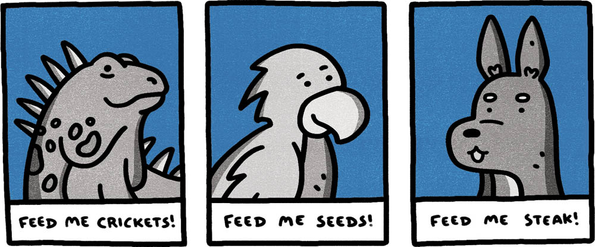

- Love them. That’s easy — you and your pet will both get so much out of
  the relationship.
  

  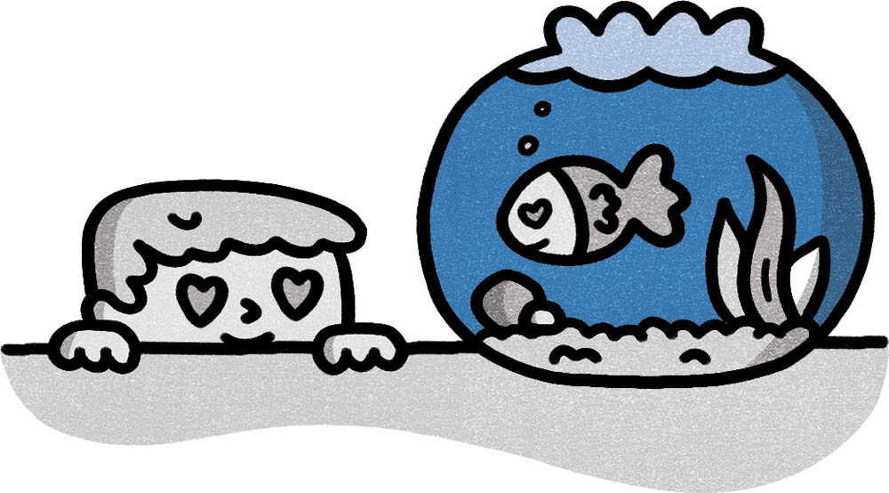

  

- Remind yourself that animals
  are dependent on us to take care of them. It’s kind of a huge
  responsibility, and we honor it by remembering to give them what they
  need.
- If it’s your job to give your lizard fresh water or take the dog for
  an afternoon walk, you can make a schedule for yourself or create a
  visual reminder. (Lots of animals will find ways to remind you, but
  some can’t.)
- If you are responsible for a particular chore — scooping the cat
  litter or changing the hamster’s bedding, say — be sure to do it, even
  if it’s gross.
- When you have a couple of extra minutes in your day, brush your pet or
  play with them. They’ll love that!
  

  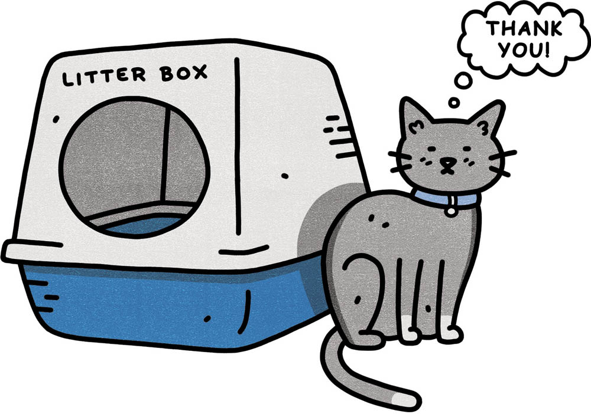

  

## How to Care for Houseplants

Houseplants ask for so little and give us so much! Green leaves to look
at, more oxygen to breathe, and even (sometimes) flowers or fruit.

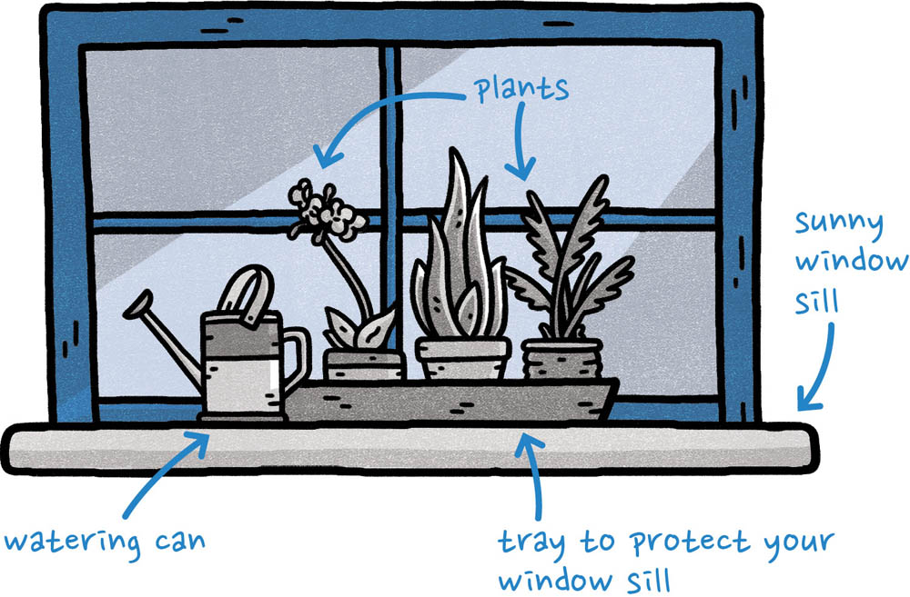

All plants ask for is some sunlight and not to be over- or underwatered.
That’s right. They want to be watered **just the right amount**.

**Fun Fact.** People are more likely to water plants too much than too
little!

If your plant came with a tag
saying what it likes, great! You’ll know how much water and sunlight it
needs, and you can put it in a sunny window sill (or not, if it prefers
shade) and create a little watering schedule for yourself.

If your plant didn’t come with a tag, then stick your finger up to its
first knuckle into the soil. If you can feel dampness, it probably
doesn’t need water yet.

You can also look up your plant online or in a book to learn more about
what it needs.

If it’s dry, then add water until it drips out of the drainage holes at
the bottom of the pot — which means that it has had enough.

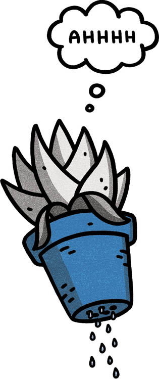

If your plant starts to seem
unhappy, you can try giving it a little bit of plant fertilizer. Or move
it into a bigger pot so it can spread out a little.

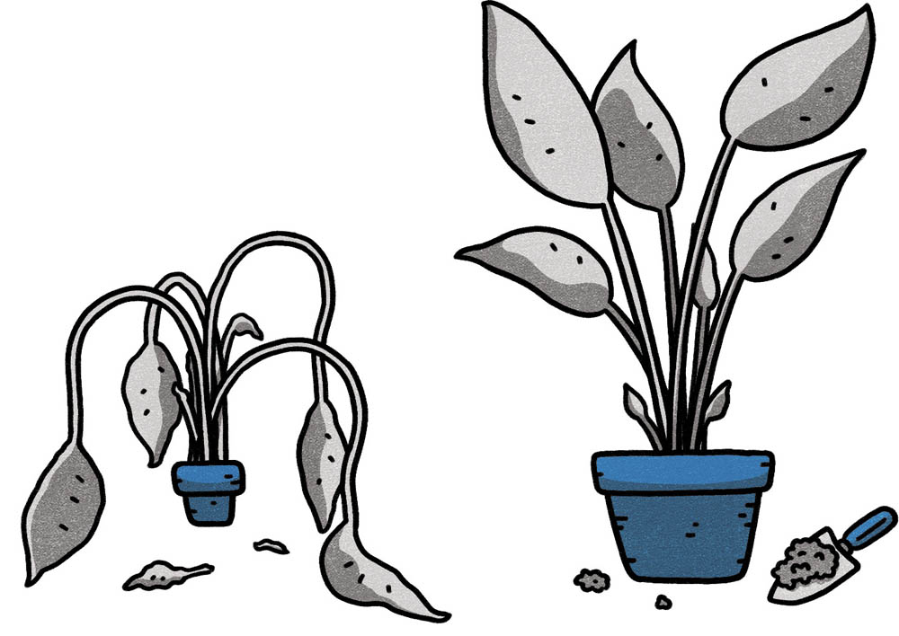

Cacti look like little cartoon plants and are easy to take care of.
Mostly they just like to be in a warm sunny spot where you can ignore
them — aside from telling them how cute they are and watering them every
now and then.

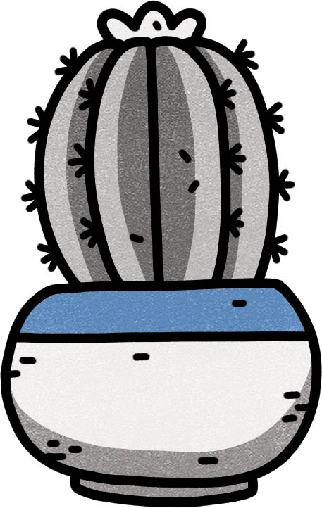

## How to Be a Welcome Guest

Yay! You got invited to a friend’s house. If there’s one message you
want to communicate to your host, it’s “I’m so happy
to be here!”

If you run into other family members in the house, introduce yourself.

If you’re not sure about something, just ask.

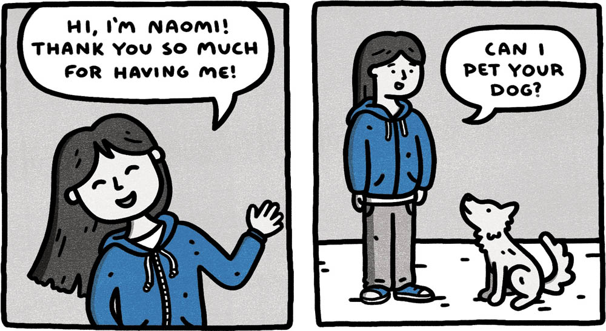

If your host offers you choices about what to do, go ahead and pick
something. (Saying, “I don’t care” is not usually that helpful.)

Assuming it’s okay with your
grown-ups, follow the house rules when you’re at someone else’s place.
This might mean something more fun than at your house (they drink soda
with dinner and you only drink milk) or something less fun (kids do the
dinner dishes and they don’t have a dishwasher). **Whatever it is, just
go with the flow**.

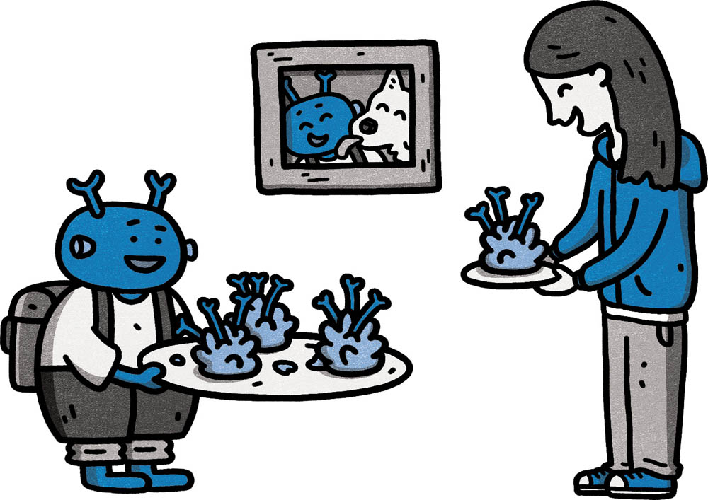

When it’s time to leave, try to find your friend’s family to thank them
and say goodbye.

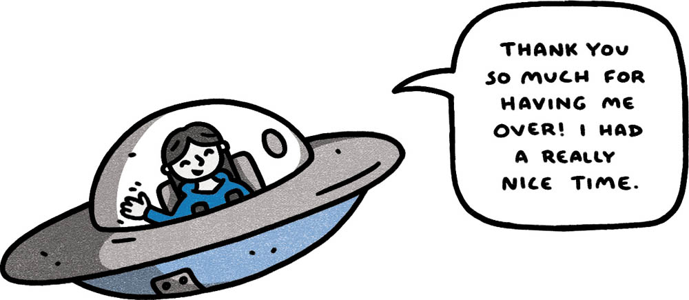

# POP QUIZ!

You’re eating dinner at a friend’s house and you knock your cup over,
spilling milk all over the place. You:

|  |  |
|----|----|
| **A.** | Scream and run out of the room and out of the house and all the way home, screaming. |
| **B.** | Laugh milk out of your nose while their dog laps up the puddles. |
| **C.** | Wait for the robot maid to roll in and clean it up. |
| **D.** | Say, “I’m so sorry! Is there a dish towel I can use to clean this up?” |

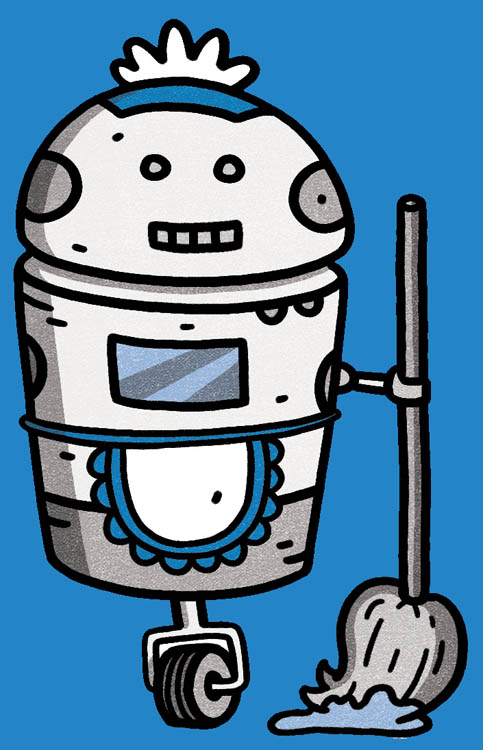

**Answer:** D, of course. And maybe B, but only in addition to — not
instead of — D.

## How to Be a Gracious Host

Yay! You’ve got a friend over. If there’s one message you want to
communicate to your guest, it’s **“I’m so glad you’re here**!**”**

Introduce them to your family.

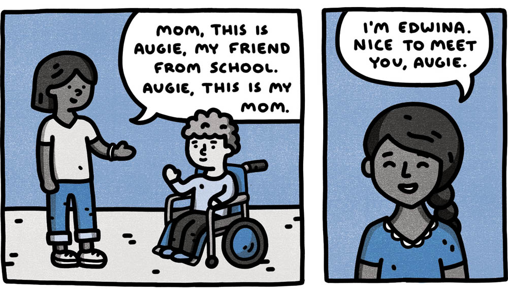

Offer your guest a snack and something to drink.

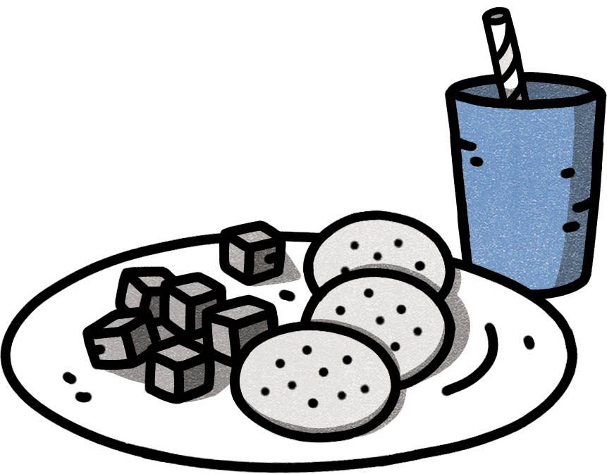

Let your guest choose how to
spend the time together, and give them some choices — listening to
music, playing a game, going for a tour of the neighborhood — if they’re
not sure what to do.

Show your guest to the door when it’s time to say goodbye.

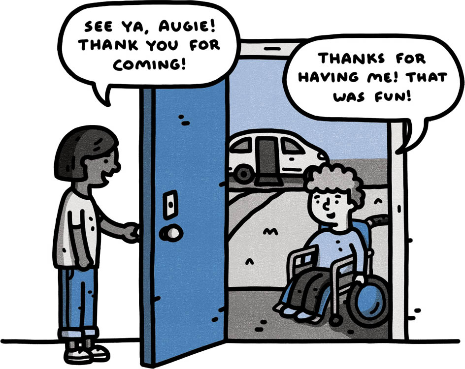

Stash your phones, unless you’re using them to do something together.

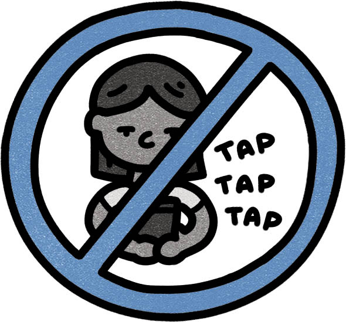

## How to Wrap a Present

You got invited to a party! Or maybe it’s a holiday. Anyway, you’ve got
a present to give. And even if you’re giving the smallest gift, wrapping
it makes it all the more special.

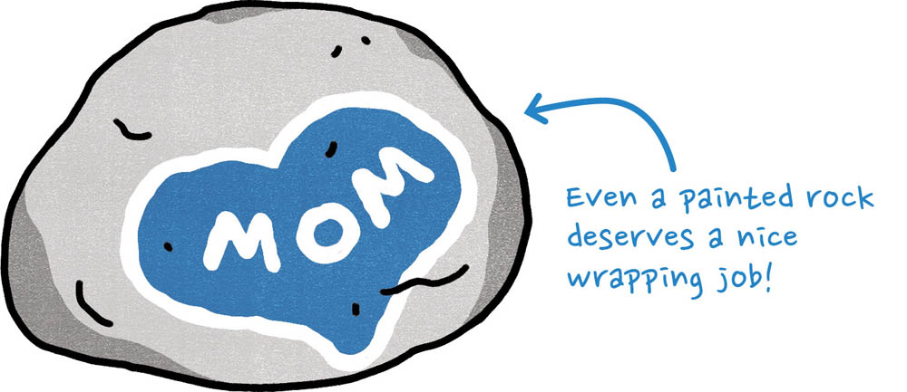

**Bag it.** The easiest way is to wrap a gift loosely in tissue paper
and put it in a gift bag. (This is especially good for odd-shaped
things.) Stuff some more crumpled tissue paper on top to hide the gift
and make the bag look festive.

**Or box it up.** Put the gift in a box and then wrap the box (like we
show on the next page). You’ll need wrapping paper, scissors, clear
tape, and ribbon or twine for this method. Oh, and a hard surface (not
the couch or a carpet). This is the same way you’d wrap something that
starts out rectangular, like a book or a game.

1.  1. Cut a big enough**\***
    piece of paper to go around the box (or book or whatever you’re
    wrapping). You’ll want the paper long enough so that it goes all the
    way around the box and wide enough so that there’s extra to cover
    the side of the box.

    **\***Do you know the expression “measure twice, cut once”? So,
    yeah.

    

    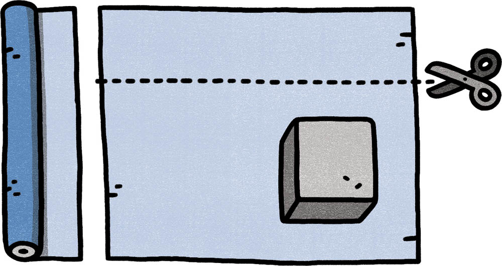

    

2.  2. Wrap the paper around the box, pull it
    tight, and press a piece of tape along the seam where the paper
    meets itself.
    

    

    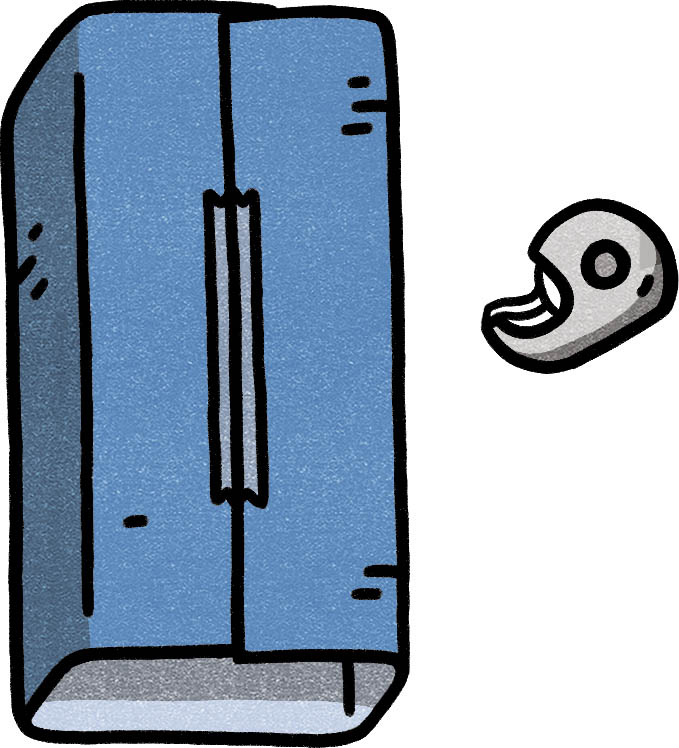

    

    

3.  3. Finish one side at a
    time: With the seam still facing up, fold down the top flap onto one
    side of the box, making two little wings at the side. Flatten the
    wings in against the box, then fold the remaining paper up against
    the box. Press a piece of tape to the seam where the paper meets
    itself.

    Repeat with the other side of the box. It doesn’t need to be
    perfect.

    

    

    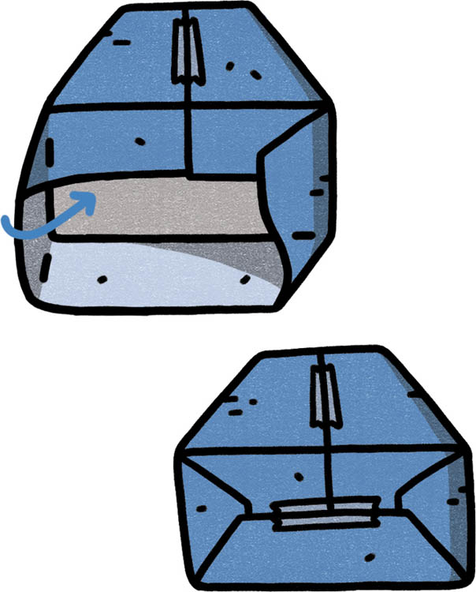

    

    

### Add Ribbon!

1.  1. Keep the ribbon (or twine) still
    attached to the spool and wrap it loosely around the box three times
    to measure. Cut it.
2.  2. With the seam still facing up, slide the
    ribbon under the box and stretch the ends over the box, lining them
    up and pulling them tight.
    

    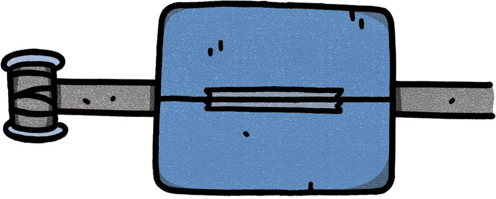

    

3.  3. Cross the ribbon and
    pull the ends toward the other sides of the box.
    

    

    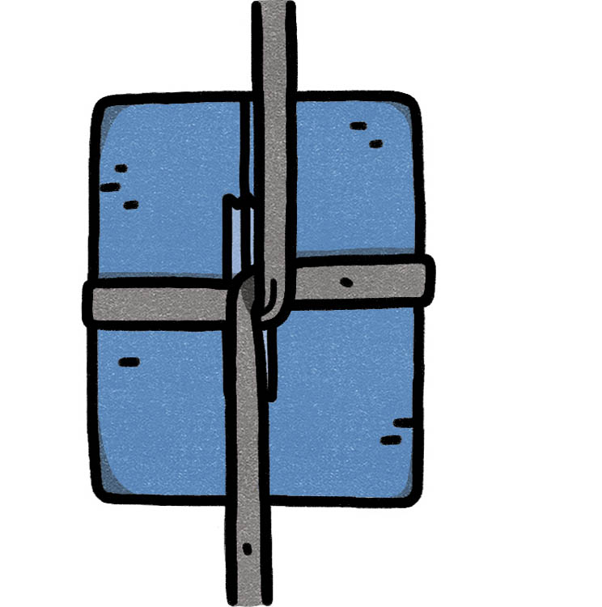

    

    

4.  4. Flip the box over and tie a bow on top!
    You will need someone else to press a finger on the ribbon to hold
    it tight as you’re tying it. (Or you can try growing a third arm!)
    Trim the excess ribbon.
    

    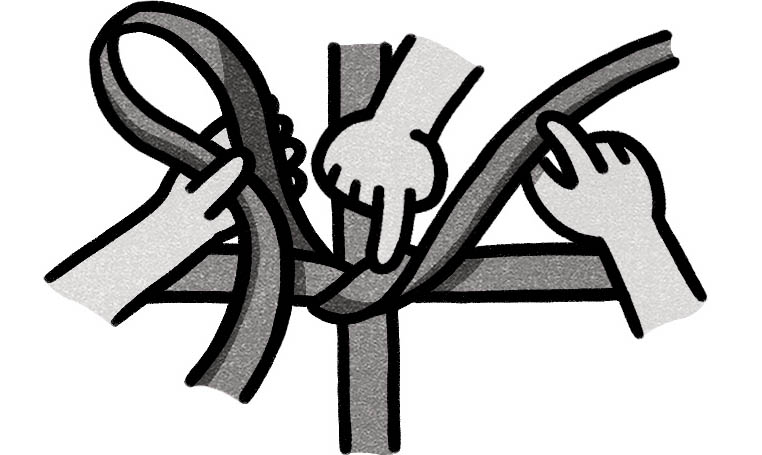

    

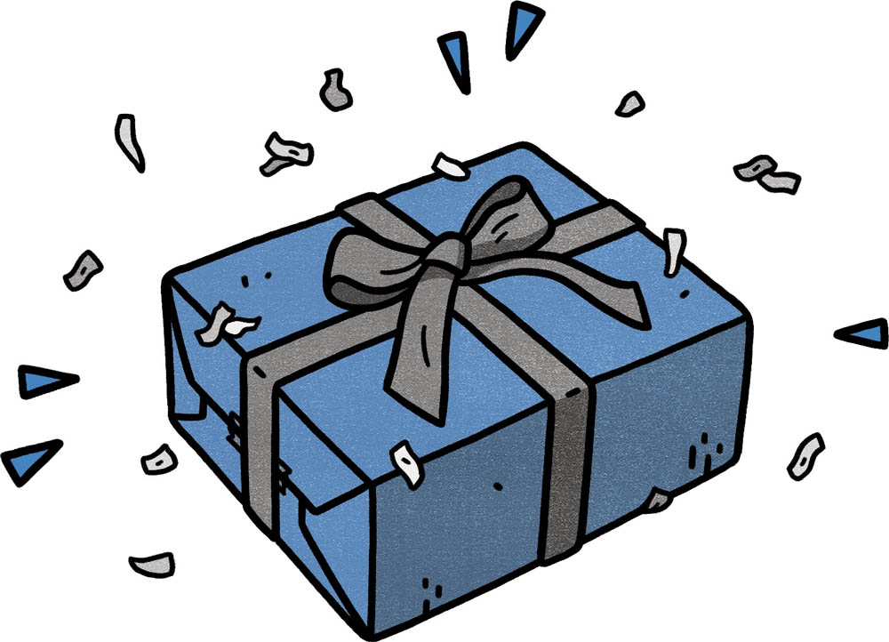

#  Saying It Right

How to Be Kind and Get Your Point Across

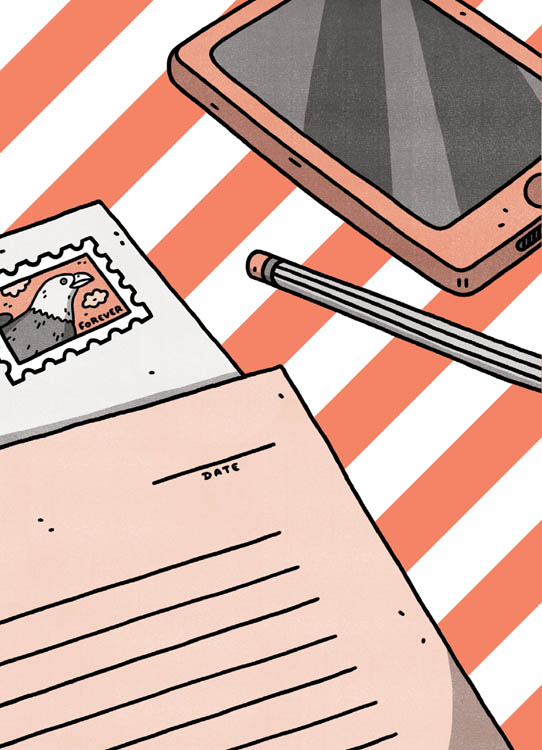

Communicating clearly and well is an important part of being a person,
caring for other people, changing the world, and (to be honest) getting
what you want. Here are some basic tools to help you do all those
things.

## How to Write a Thank-You Note

Someone gave you something or did something nice on your behalf! Lucky
you! Now you get to thank them. And even though you already thanked your
friend at the party for the origami paper, or texted a quick “Thanks for
the \$, Grandma!!!!” it is so nice to send (and receive) a handwritten
thank-you note. And it honestly takes, like, 1 minute to do it. You
totally have 1 minute!

Of course there’s no single formula! But here’s a, uh, single formula.
Just adapt it however you need to, and make sure to add just a sentence
or two more than “Thank you for the \_\_\_\_\_\_\_\_\_\_\_\_\_\_.”

1.  1. Dear \_\_\_\_\_\_\_\_\_\_\_\_\_\_,
2.  2. Thank you so much for the
    \_\_\_\_\_\_\_\_\_\_\_\_\_\_.
3.  3. I can’t wait to spend it on
    \_\_\_\_\_\_\_\_\_\_\_\_\_\_ \[or\] play with/wear/do
    \_\_\_\_\_\_\_\_\_\_\_\_\_\_ with it.
4.  4. It’s exactly my
    favorite color/style/kind of \_\_\_\_\_\_\_\_\_\_\_\_\_\_. You know
    me so well!
5.  5. I’m so glad you were at my party \[or\]
    I hope I get to see you soon.
6.  6. Love, \_\_\_\_\_\_\_\_\_\_\_\_\_\_

If someone **did** something nice for you rather than **giving** you a
gift, just thank them for whatever it was they did, being sure to add
something about how helpful it was.

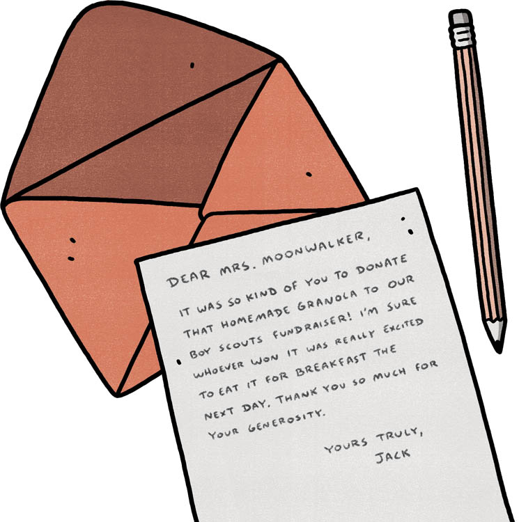

# POP QUIZ!

Your aunt knit you a terrible sweater for your birthday! It’s itchy and
ugly and it has buttons (you hate buttons), but at least it’s your
favorite color. What should you include in your thank-you note?

|  |  |
|----|----|
| **A.** | It is amazing to me that you could manage to create a sweater that is both ugly *and* uncomfortable! |
| **B.** | You sure as heck knit a sweater! Thanks for it. |
| **C.** | Dear Auntie, Thank you for the present. Love, me |
| **D.** | Dear Auntie, Remember when you taught me to knit? It took me six months to make that one lopsided pot holder! I can’t believe you knit me a whole entire sweater. And you picked out yarn that is, as you know, my absolute favorite color in the world! Thank you for being the best aunt ever. I am so lucky to be your nephew. xoxo |

**Answer:** D, of course. It is always possible to be truthful in a
thank-you note — to feel and express gratitude for the act of someone
caring enough to do or buy something for you — even if you didn’t get
your favorite-ever present.

## How to Write a Condolence\* Note

If someone close to you loses someone close to them — their grandma,
their old beagle, a beloved anybody — then it’s nice to write a
condolence note. The point is just to say, “I’m sorry” — not in the
sense of “I apologize,” but in the sense of, “I wish you didn’t have to
feel this grief.” A condolence note can be short. You’re just reminding
the person that their community is there to support them while they’re
sad.

\*Condolence means an “expression of sympathy.”

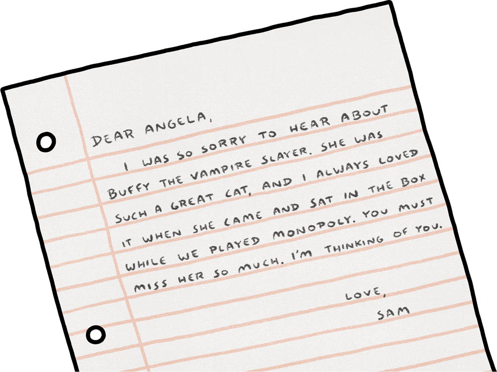

## How to Address an Envelope

### Right

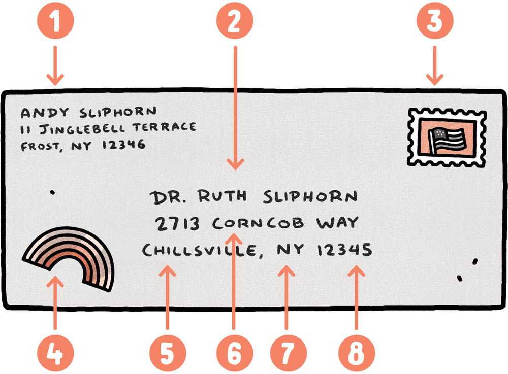

1.  1. your name and address in the upper left
    corner (or on the back flap)
2.  2. full name of the person you’re mailing
    it to
3.  3. postage stamp in the upper right corner
4.  4. Stickers and drawings are fine as long
    as there’s a postage stamp, too!
5.  5. city or town
6.  6. treet address or P.O. box
7.  7. state
8.  8. ZIP code

### Wrong

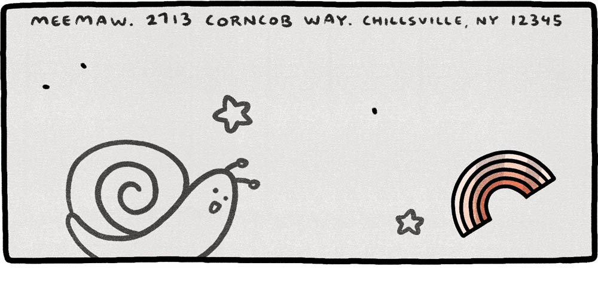

(Though if you put a stamp on it, it would probably get to your Meemaw
anyway.)

If you’re sending mail to a different country, the address might look
different. Make sure to include the country name and find out what kind
of stamp you need.

**Fun Fact.** The truth is, the post office is pretty forgiving, and
your letter is likely to get there even if you don’t follow the rules
exactly. You could even put an address label on a potato and, as long as
you put enough postage on it, the post office will deliver it.

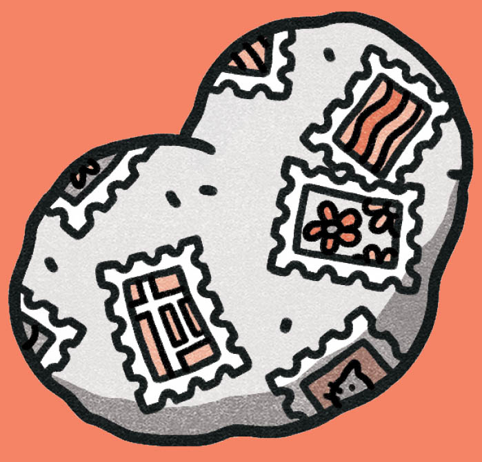

## How to Apologize

If something you did hurt somebody else, take responsibility for it and
apologize, even if you didn’t mean to do it or say it or cause any harm.
Imagining the other person’s feelings is called empathy, and it’s
super-helpful to experience and to express.

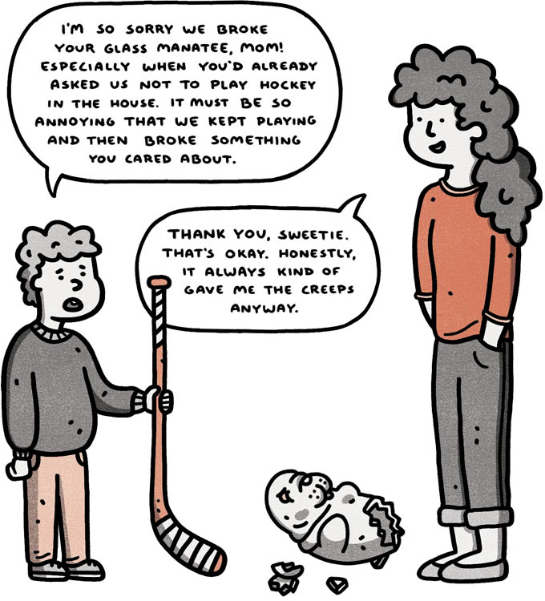

## How to Include Someone

People end up alone for lots of reasons: they’re new; they’re different
from most of the people at your school; other people think they’re
weird. Those are all good reasons to reach out. This might mean:
inviting them to sit with you and your friends; saying, “Can I join
you?” and plunking down your lunch tray; including them in a
get-together; or simply smiling when you pass in the hallway. You — yes,
you — can make all the difference in the world. And one day, when you’re
new or lonely yourself, you’ll be so glad when someone else reaches out.

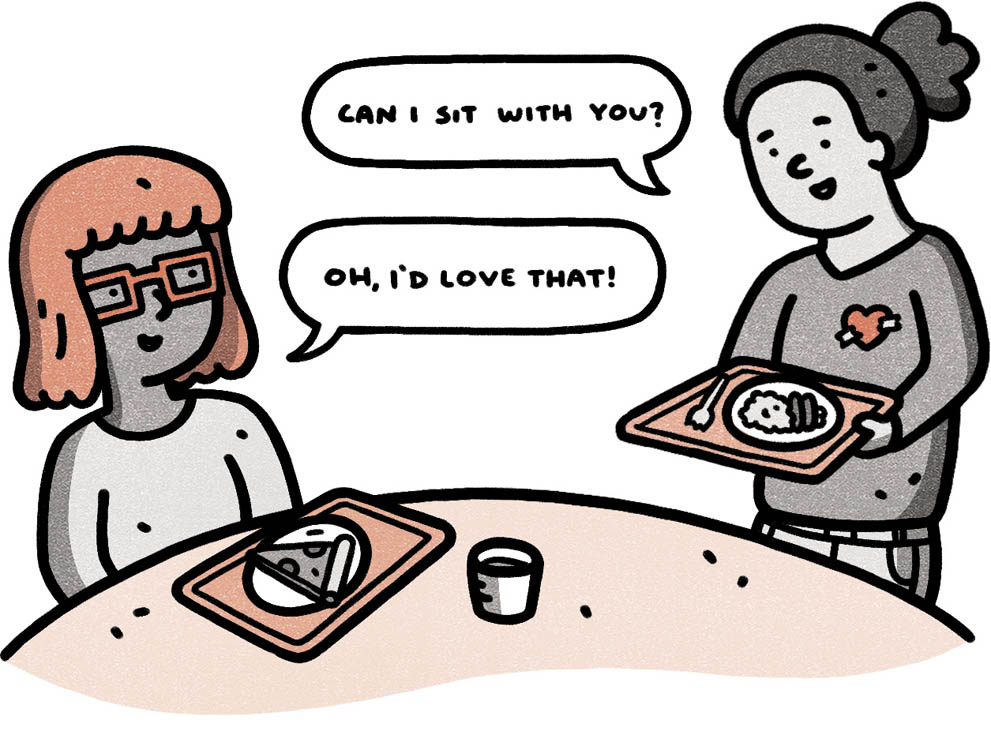

**Fun Fact.** Lots of “weird” people turn out to be really cool. (But
you already know that.)

## How to Have a Conversation

If you ever feel awkward talking to somebody, just ask a question. That
gives them an opportunity to talk—and it gives you an opportunity to
learn more about them. That’s a great recipe for conversation!

When the other person is speaking, you can show that you’re listening by
making eye contact, nodding, asking follow-up questions, and saying back
what you hear them say.

### Your questions can be

# Good Listening

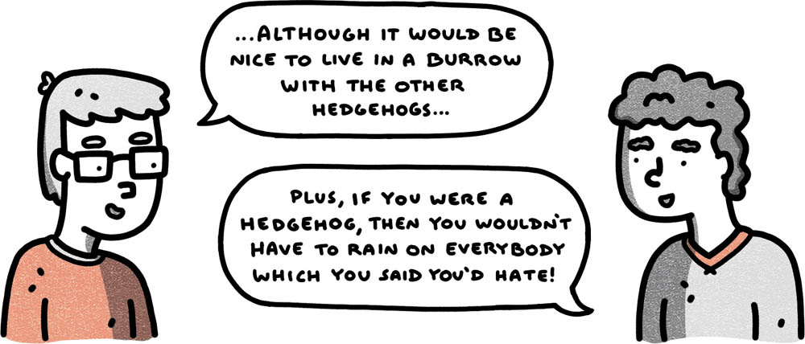

# Bad Listening

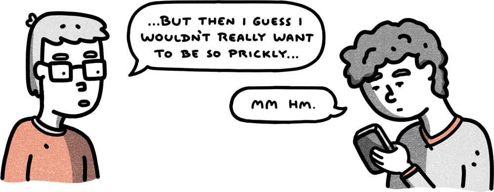

**Fun Fact.** A study found that people tend to assume their
conversation partners enjoy their company less than they actually do. In
other words, you’re more fun to be around than you think! It doesn’t
matter if you’re weird or awkward. Just be yourself.

## How to Ask for Something Over E-mail

You’ll need to ask for a lot of favors in your life! You’ll want
teachers to write you recommendation letters, managers to switch your
shift at Cinnabon, grandparents to donate to your Bagpipe Club
fundraiser. The key to asking for something over e-mail is to be clear
about what you’re asking, to be polite, and to express your gratitude.

# Wrong

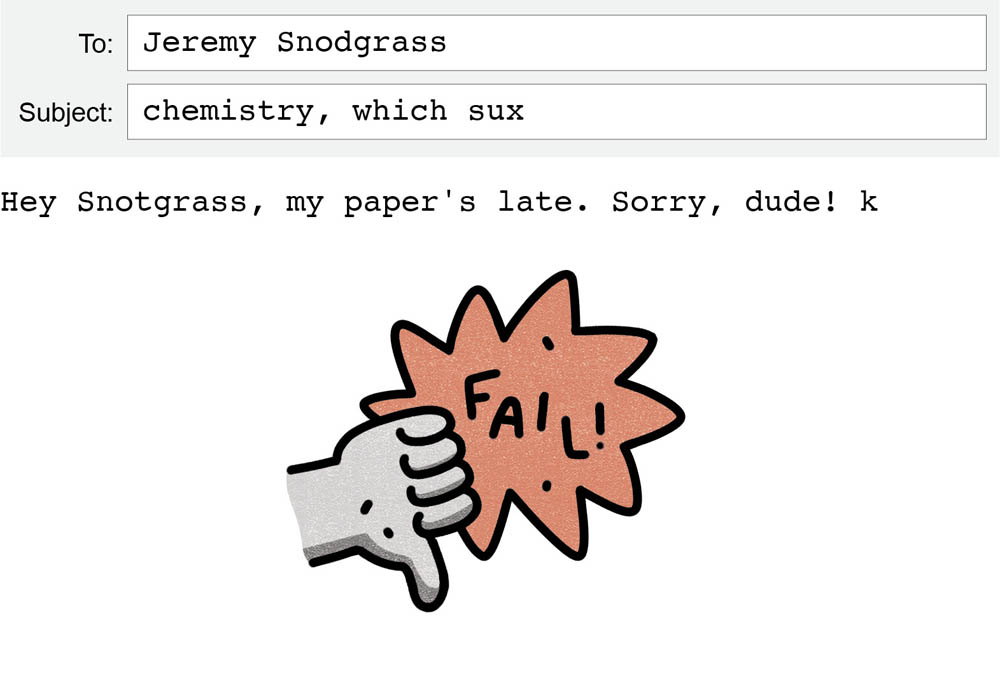

# Right

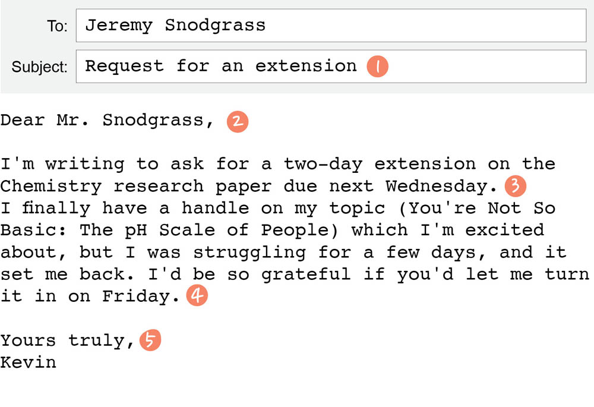

1.  1. The subject line is clear and direct.
2.  2. There’s a friendly greeting and a proper
    form of address, such as Ms., Dr., or Mr.
3.  3. You’re giving the person a reasonable
    amount of time to deal with whatever you’re asking.
4.  4. You express your appreciation for the
    person’s assistance.
5.  5. There’s a polite sign-off.

If they agree to whatever you’re asking, then don’t forget to thank them
(see [here](#626182HowToBeAPerson_ebook-5.xhtml__idTextAnchor008)).

## How to Fill Out a Form

You’re going to fill out a lot of forms in your life — starting, well,
now. Library card requests, doctor’s office questionnaires, job
applications, online orders, school and sports permission forms,
learner’s permit and driver’s license applications . . . so many forms.
If you’ve ever done Mad Libs, then you totally know how to fill out a
form! (Just don’t put in words like “fried egg” and “poopy.”) Here’s
how:

**Read through the whole form first** and check for instructions such as
whether to “print” (this means clear, separate letters as opposed to
cursive), use pen or pencil in a specific ink color, or get a signature
from a parent or guardian.

**Fill in your name.** You might write it all on one line, or it might
be last name then first name, or you might need to fit each letter in a
little box.

**There might be dates to fill out —** like today’s or your birthday.
The format (MM/DD/YYYY) means that you should fill in the month as two
numbers, then the date, then the year. October 6, 2030, would be
10/06/2030.

**You might need to sign the form** if it asks for a signature. That
means writing your whole name out in your own way, in cursive if you
know how (see example).

**Practice on a magazine subscription card —** the kind that falls out
when you open the magazine.

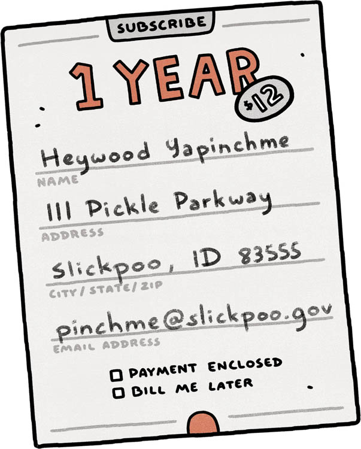

## How to Answer the Phone

If your phone rings — either a cell phone or landline — tap the green
button or the word “answer” (cell) or lift up the receiver (landline)
and say, “Hello.” (When someone calls you, you need to be the one to
speak first).

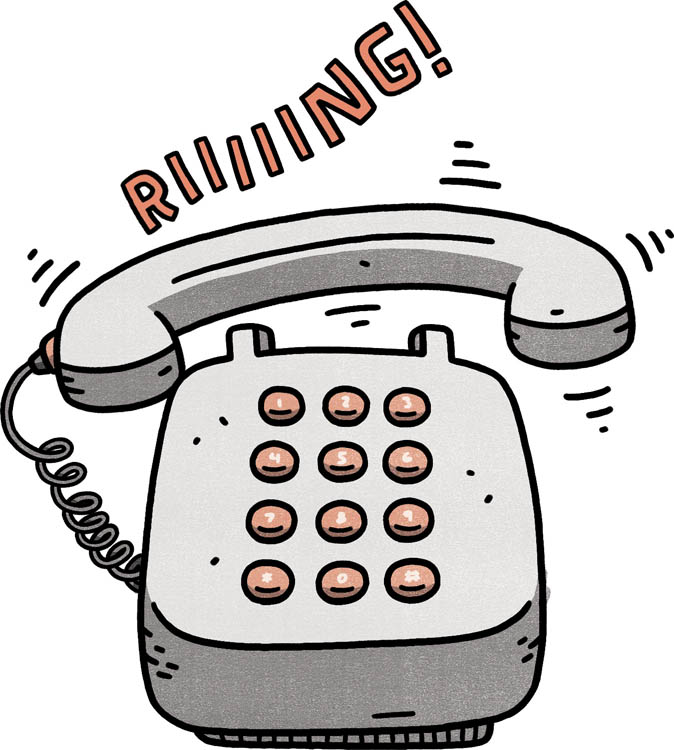

# Right

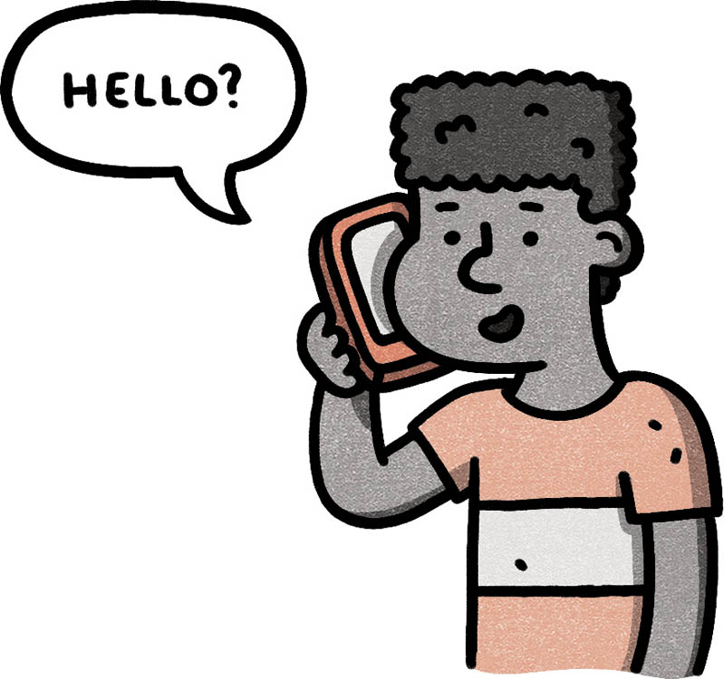

# Wrong

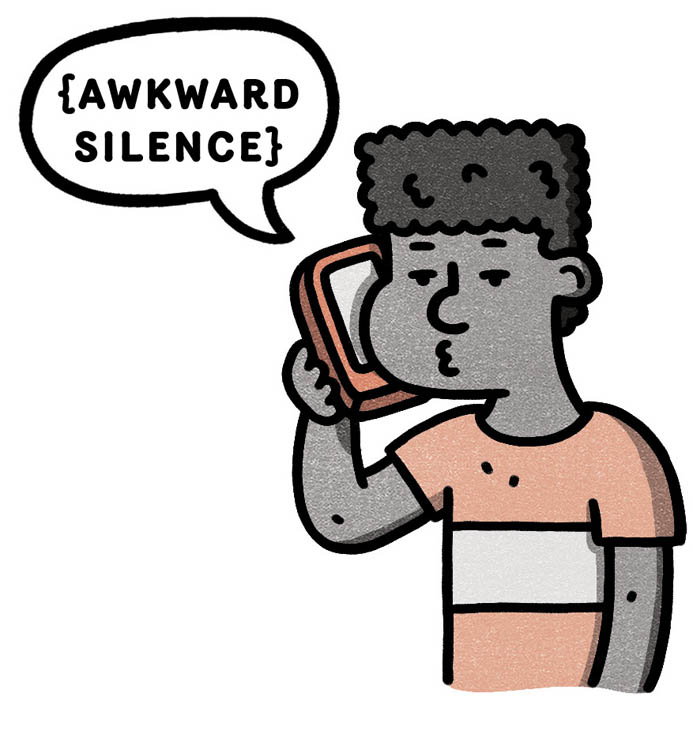

Talking on the phone is easiest if you are quiet and attentive — that
is, not chewing, whistling, playing the ukulele, or paying close
attention to something else, like TV, your gerbil Eeny-Beeny, or
algebra.

If you don’t recognize the caller’s number or voice, say, “May I ask
who’s calling?”

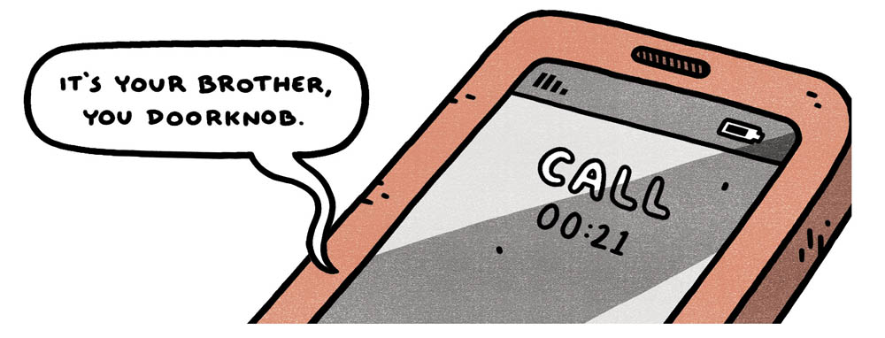

## How to Make a Phone Call

When you call someone else, the phone will ring and then they will speak
first, usually by saying, “Hello.” Identify yourself and explain why
you’re calling.

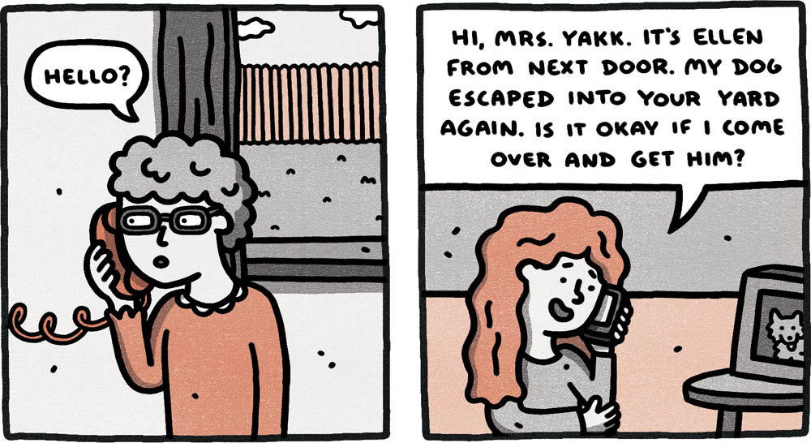
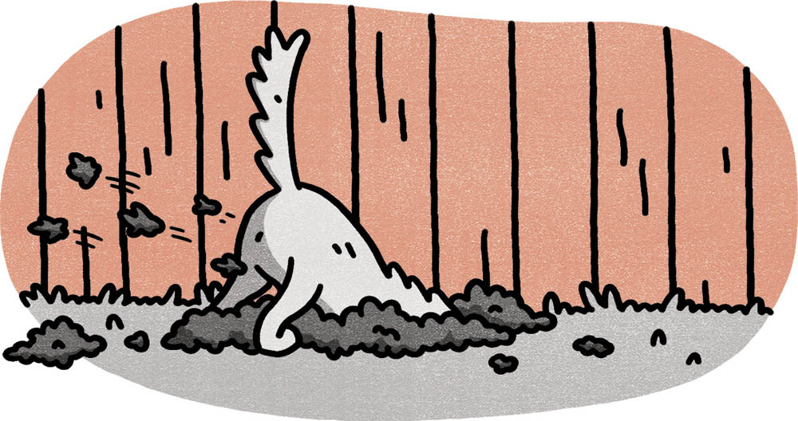

If your call goes to voice mail,
there will be something like a beep or a tone cuing you to leave a
clear, brief message, including your name, your phone number, and what
you’re hoping will happen next.

# Right

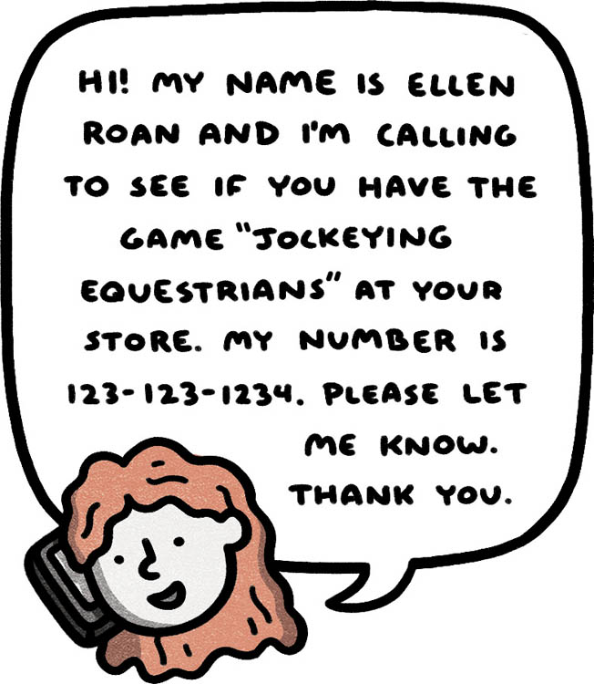

# Wrong

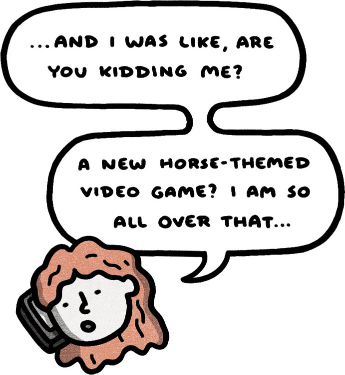

Texting gives you plenty of time to figure out how you want to write or
respond to someone else. Making a phone call is a little trickier
because it involves a conversation happening here and now, and you can’t
start over as easily. But you can do it! Worst case scenario, you act
kind of dorky, and that’s fine.

## How to Contact Your Political Representatives

If there’s an issue you care about, then do something about it! Contact
your political representatives — senators, House representatives, state
or local politicians — and let them know how you feel. You can do this
even if you’re not old enough to vote!

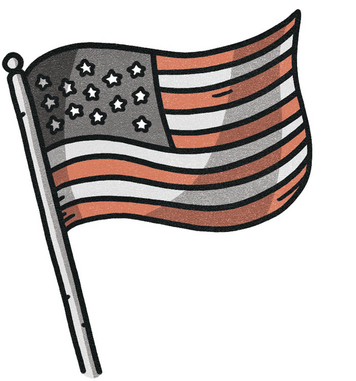

1.  1. **Do your research** to find out where
    the issue is playing out — whether it’s in Congress, your state
    government, or right in your own town.
2.  2. **Figure out who represents you.** If
    you type in your address at whoaremyrepresentatives.org, you’ll get
    a list, from the current president to your state’s governor to the
    elected officials of your city or town.
3.  3. **Look them up** to
    find their contact information: there will likely be phone numbers,
    e-mail addresses, and mailing addresses.
4.  4. **Decide how you want to reach out.** A
    phone call can be a little nerve-wracking (see [How to Make a Phone
    Call](#626182HowToBeAPerson_ebook-5.xhtml__idTextAnchor009)), but
    it’s quick. You will likely leave a voice-mail message or talk to an
    aide (a person who works for the politician), and you can keep it
    short and to the point. There may even be a script online that you
    can follow.

If you prefer, you can send an e-mail or a snail-mail letter that says
more or less the same thing.

\*Not a real issue.

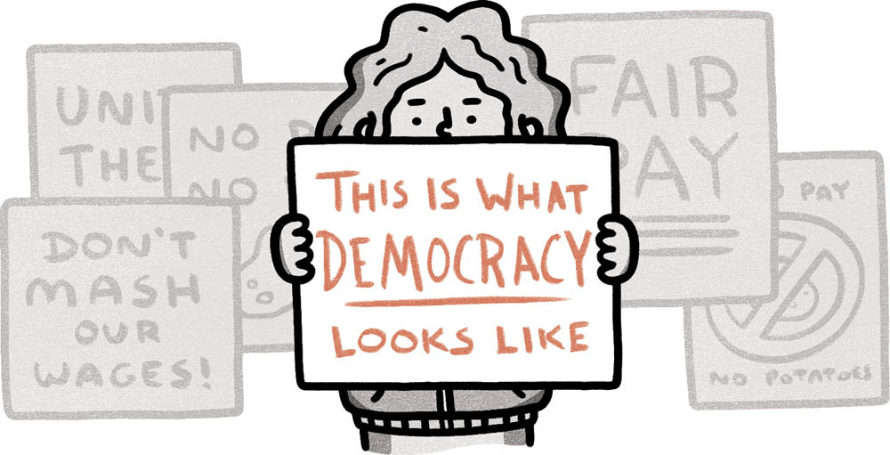

# Dirty Things

How to Clean and Care for Your Home

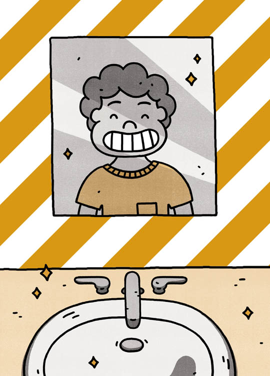

It doesn’t really matter how chores work in your home — whether they’re
assigned to you or your allowance depends on them, whether there’s a
chores wheel or everyone pitches in as the need arises. What matters is
that you learn the basics of housework. (Then, if you don’t do
something, at least it’s not because you don’t know how!)

## How to Load the Dishwasher

1.  1. Scrape the leftover food off the dishes
    into the trash or compost. To make sure your dishes get all-the-way
    clean, rinse them too. (This is especially important if your
    dishwasher was made during the Pleistocene Era.)

2.  2. Load large and heavy things, like dinner
    plates and casseroles, on the bottom rack. Give everything plenty of
    room. Plates fit in the slots and may need to lean a bit. Anything
    that can be filled (such as bowls or pots) should be loaded with the
    open side down so they don’t fill with water.
    

    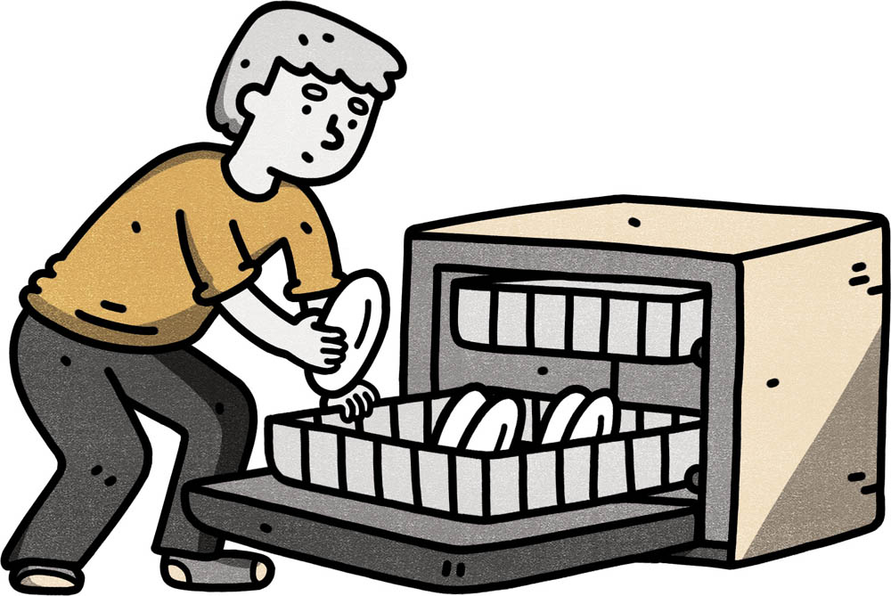

    

3.  3. Arrange glasses, mugs,
    cooking utensils, and anything small, plastic, or delicate\* in the
    top rack. Again, openings should face down so that you don’t end up
    with cups full of icky dishwater.
    

    

    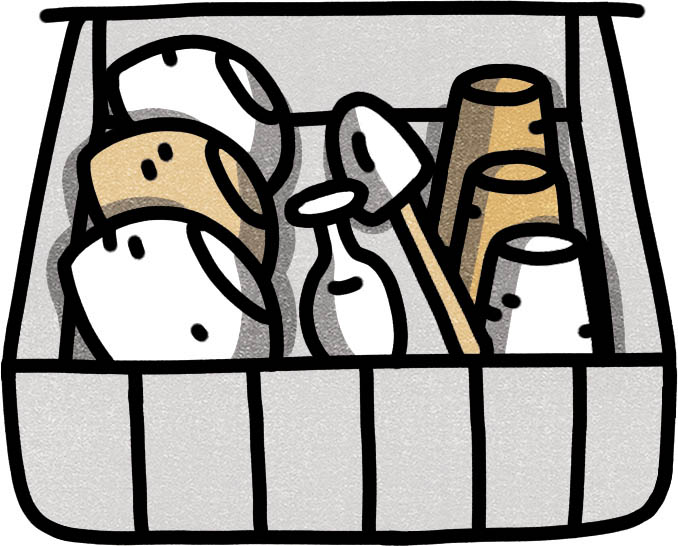

    

    \* Some delicate or fancy or sharp things might not go in the
    dishwasher. Ask before loading.

    

4.  4. Load the silverware in the silverware
    basket, with the dirty part facing out or up. Arrange sharp knives
    blade down, so they don’t stab anyone.

    

    

    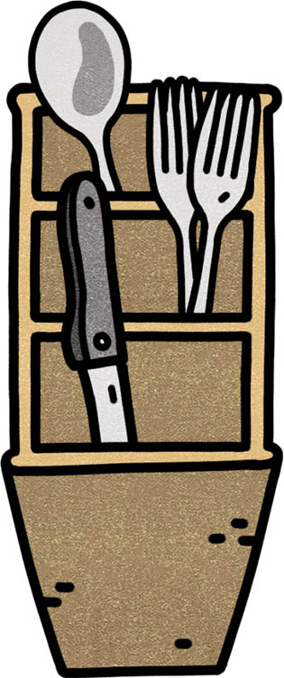

    

    

    **Tip:** Load each type of silverware together to make unloading
    nice and easy.

5.  5. Look inside and make sure that nothing
    is sticking up into the place where something is going to be
    spinning around (e.g., the spray arm).

## How to Empty the Dishwasher

1.  1. Grab a dry dish towel, in case anything
    is still a bit wet as you’re unloading.
2.  2. Put dishes away on shelves or in
    cupboards, dealing with one type at a time to make it easier. If you
    don’t know where something goes — especially stuff like storage
    containers or serving plates — just ask.
    

    

    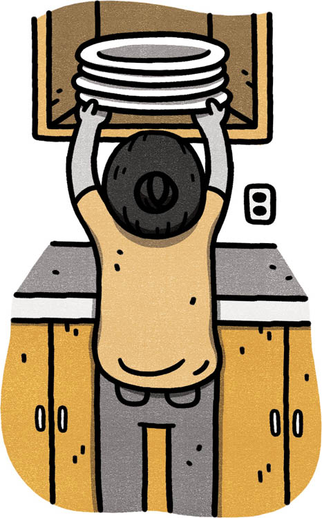

    

    

3.  3. Sort the silverware into the silverware
    drawer.
    

    

    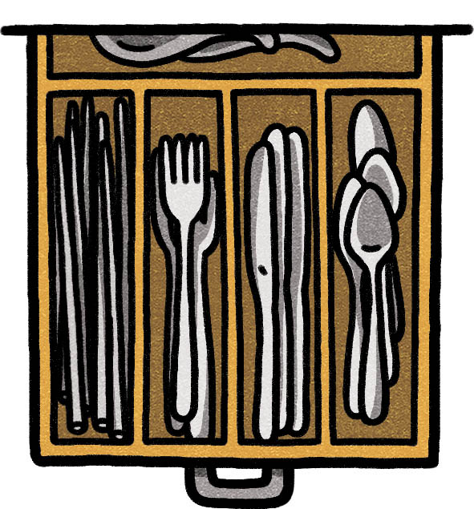

    

    

# POP QUIZ!

Your grown-ups ask you to deal with the dishes after dinner in the
cabin. You can’t help noticing that there is (cue horror-movie music) no
dishwasher! You:

|  |  |
|----|----|
| **A.** | Fling the dishes into the woods and hope nobody notices. |
| **B.** | Hide the dishes in the oven and hope nobody notices. |
| **C.** | Say “Oops!” really loud and drop them all on the floor, then sweep up the broken pieces (see [here](#626182HowToBeAPerson_ebook-6.xhtml__idTextAnchor011)) and throw them away. |
| **D.** | Wash them by hand. |

**Answer:** D. Don’t panic! Turn the page to learn how you do it . . .

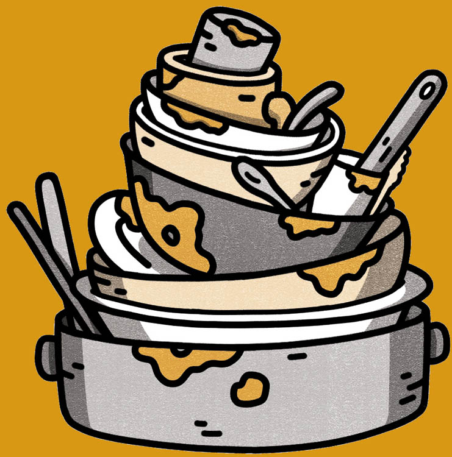

## How to Hand-Wash Dishes

1.  1. Roll up your sleeves and put on some
    rubber gloves if you’ve got them.
    

    

    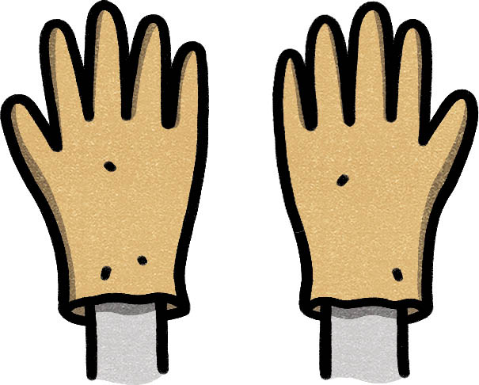

    

    

2.  2. If there’s a super-crusty pot or pan,
    fill it with hot water and a squirt of soap and leave it on the
    counter while you deal with the rest.
    

    

    

    

    

3.  3. Put a stopper in the sink, then fill the
    sink with hot water and add a few squirts of dish soap.
    

    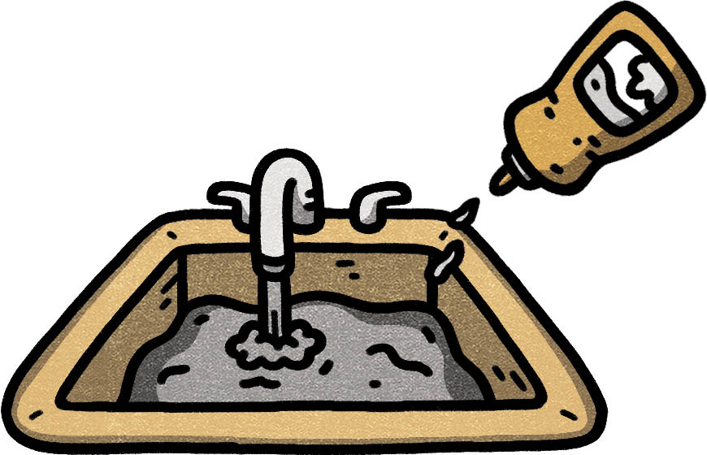

    

4.  4. Wash in order from
    cleanest to dirtiest: the glasses, dishes, and silverware, then the
    pots and pans and cooking utensils. Use a sponge and scrub
    everything so that there is no visible crud on it and so that it
    doesn’t feel greasy between your fingers. Drain and refill the water
    if it gets really mucky.
5.  5. If it’s a double sink, then fill the
    second basin with clean hot water, and dip the dishes in it to rinse
    the soap off of them. Otherwise fill a basin or your largest bowl
    with hot water for rinsing.
    

    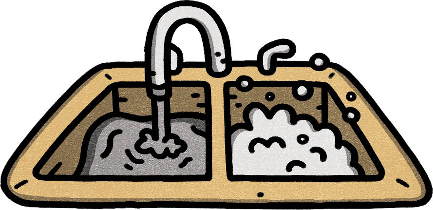

    

6.  6. Hand the rinsed dishes to someone who’s
    standing around with a dish towel, or put them in a drying rack,
    angled so that water can drain out of them as they dry.
    

    

    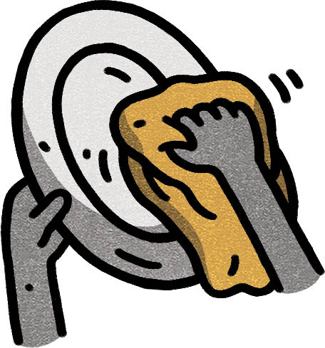

    

    

7.  7. Don’t “forget” those crusty pots! Do
    them last, and use the scrubby side of the sponge or some other type
    of scrubber to get them clean.
    

    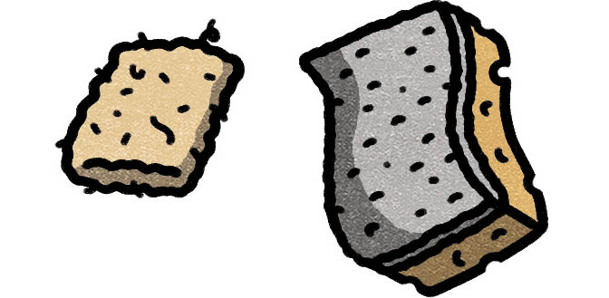

    

8.  8. Drain the sink and wipe it out with a
    sponge. Shake the gross stuff out of the drain baskets into the
    trash. Squeeze the extra water out of the sponge and put it where it
    goes.
    

    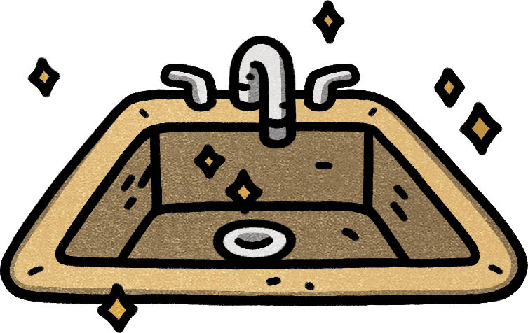

    

## How to Wipe the Table and Counters

If your job was clearing the table and/or doing the dishes, then the
last step is wiping down the surfaces.

1.  1. Move things like salt shakers and
    candlesticks out of the way.
    

    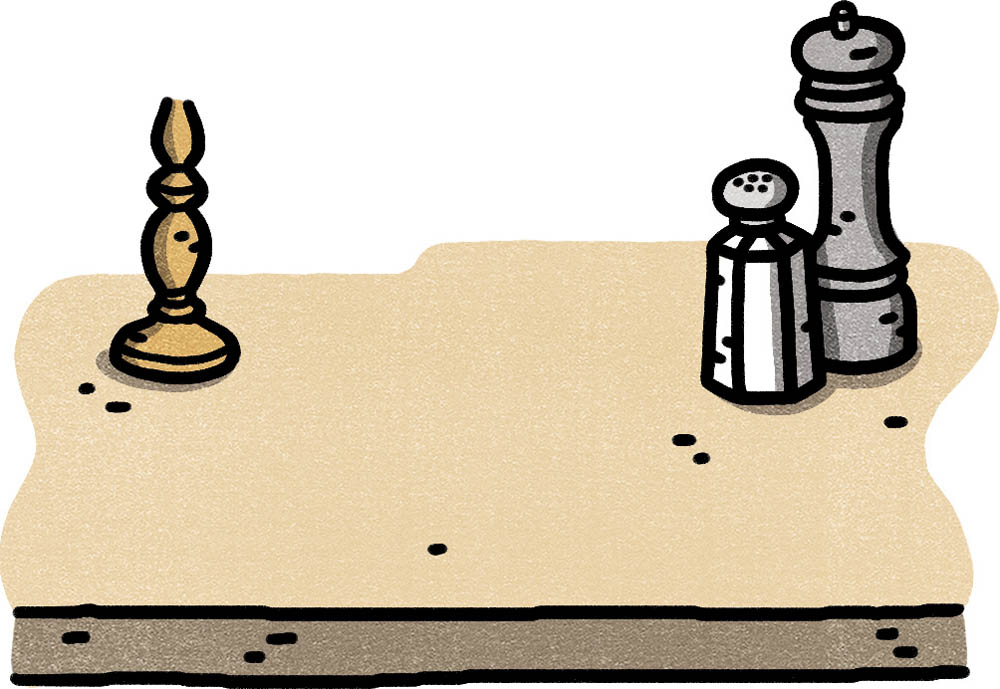

    

2.  2. Wipe up all the crumbs first by cupping
    your hand at the edge of the surface and sweeping the crumbs into
    it.

    

    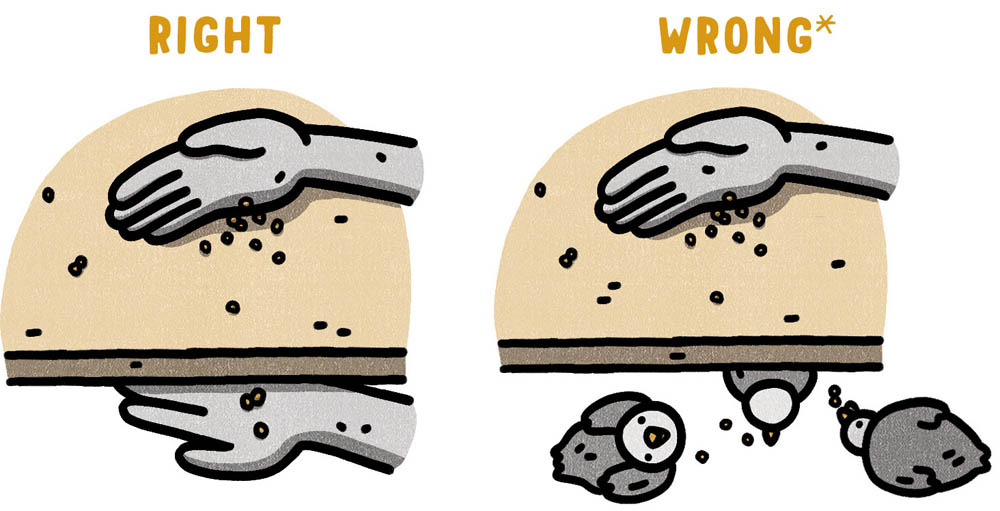

    

    \* Unless there are pigeons living under your table.

3.  3. Wet and then wring out
    a sponge so that it’s damp but not sopping. Then wipe down the
    table.
    

    

    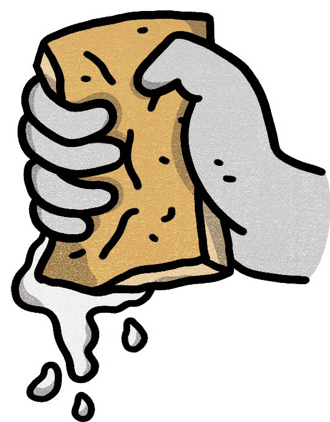

    

    

4.  4. Tackle any sticky or greasy spots, using
    a splash of white vinegar or a spritz of cleaner if you need it.
    Then give the surface one final wipe with the freshly dampened
    sponge.
    

    

    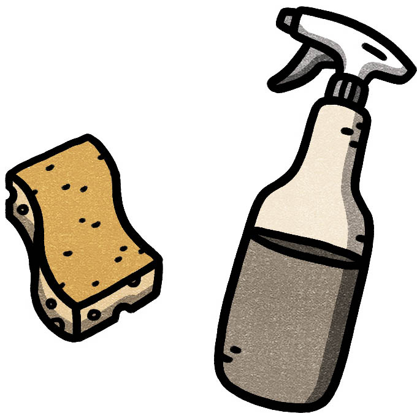

    

    

## How to Take Out the Trash

This is nobody’s favorite chore! But someone has to do it — and if you
notice that the trash stinks or is full, that someone should be you. If
your family composts or recycles, then there will be added steps in your
trash routine! (That sounds like a not-very-fun dance.)

1.  1. Tie the bag closed. If there’s a tie at
    the top of the bag, then pull the two sides to cinch up the top and
    tie them together. If not, check the box of bags and see if there
    are twist ties. Grab the neck of the bag and twist it. Then wrap the
    tie around the neck and twist the tie’s ends together tightly.
    

    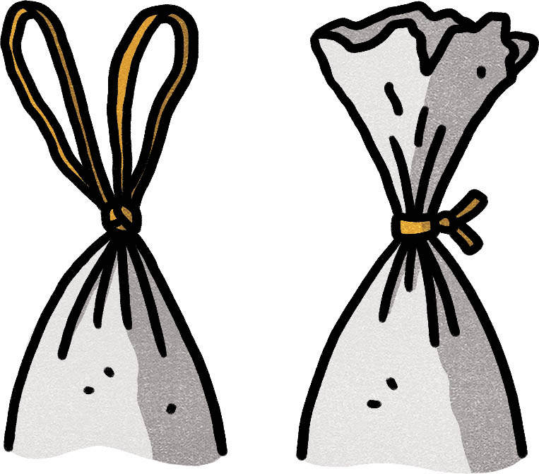

    

2.  2. Bring the bag to the garbage can outside
    your house or the garbage chute in your building, or wherever the
    trash goes.

# POP QUIZ!

You took out the trash. Now what?

|  |  |
|----|----|
| **A.** | Pin a gold star to yourself. |
| **B.** | Clap your hands noisily and yell, “Mission accomplished! You’re welcome.” |
| **C.** | Put a new trash bag in the empty bin and knot or cinch it so that it doesn’t slide down like a sock with no elastic in it. |
| **D.** | All of the above. |

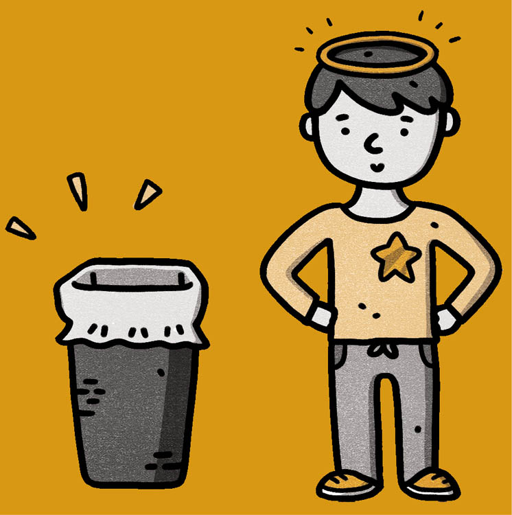

**Answer:** C or D. Feel free to engage in a long, trashy process of
self-congratulation, as long as you remember the new bag.

## How to Sweep the Floor

1.  1. Clear the floor of clutter like shoes
    and coats. (Why is your mom’s coat on the floor anyway?)
2.  2. Shut your pets in a different room, even
    if they think they want to help.
    

    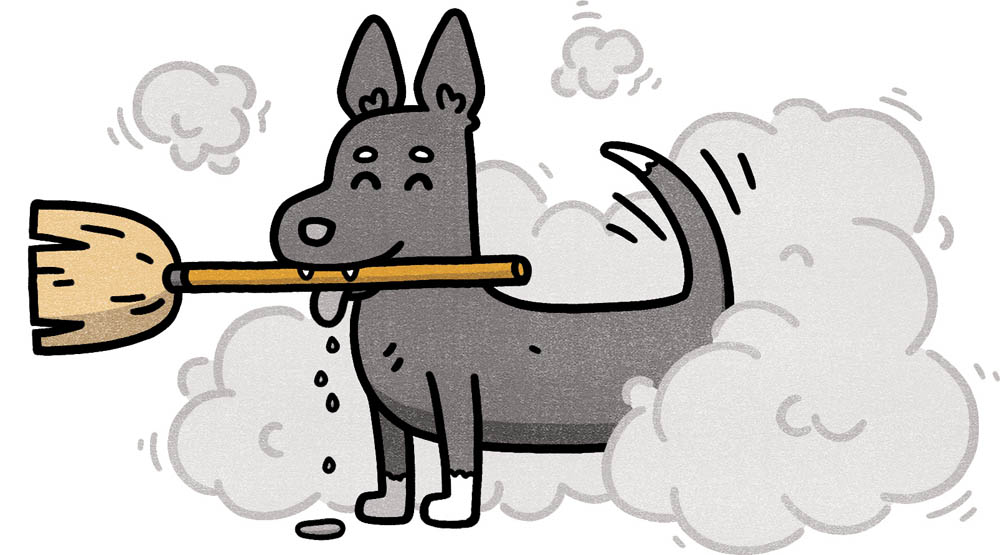

    

3.  3. Hold the broom comfortably and sweep
    slowly in one direction at a time, from the corners of the room
    toward the center. Pull the broom so that it sweeps gently across
    the floor, creating piles as you sweep.
4.  4. Use a dustpan and
    broom (or a little hand broom, if you’ve got one) to sweep up the
    piles and escort them to the trash.

# POP QUIZ!

You’ve swept the pile of dust and dirt into the dustpan. It doesn’t all
go in the dustpan, though. In fact, the pile seems to leave behind a
strip of dust and dirt that the dustpan kind of refuses to deal with.
You:

|  |  |
|----|----|
| **A.** | Keep at it. Eventually the dirt line will get so thin that it will technically kind of more or less not even be there anymore. |
| **B.** | Wipe it up with a damp paper towel or a loop of tape and then shine up your halo with a clean rag. |
| **C.** | Kind of flick it around with the broom on-purpose-by-accident so that it “disappears.” |
| **D.** | Any or all of the above. |

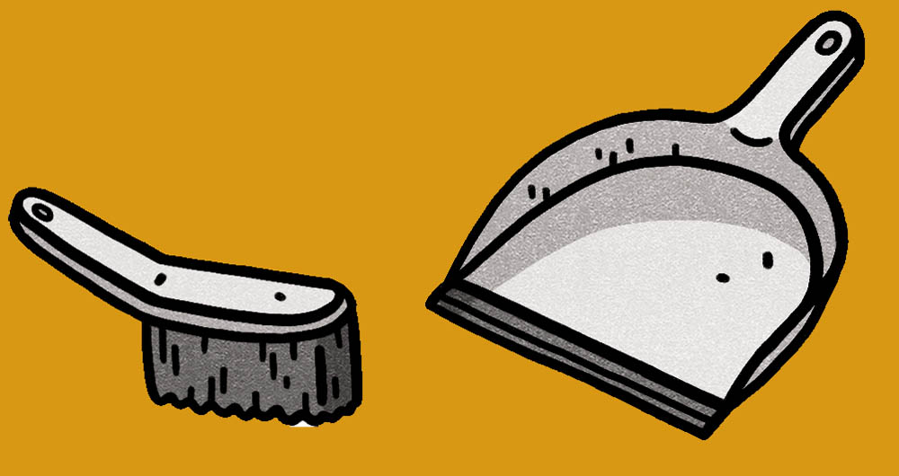

**Answer:** D. It’s not you — it’s the dustpan. Just do your best. We
only want you to be a regular, clean-enough person. We’re not trying to
win you a prize as the World’s Cleanest Person Ever.

## How to Vacuum

The vacuum is noisy and scary and the mortal enemy of pets. Still, it’s
useful for cleaning the floor.

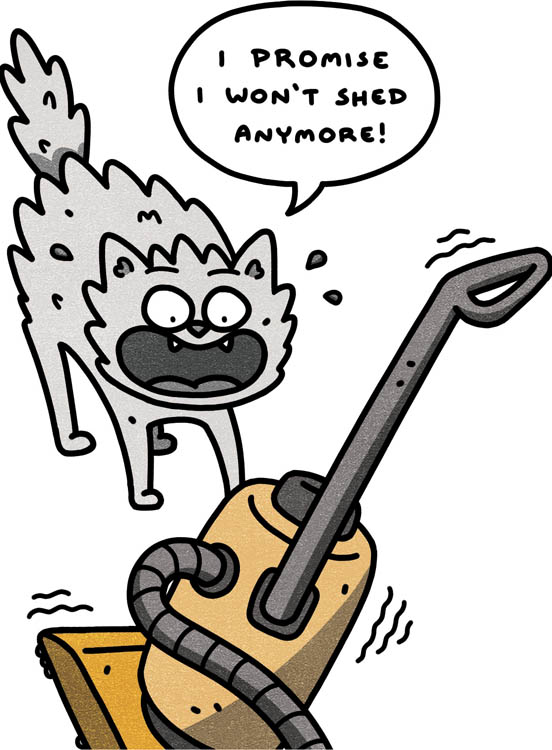

1.  1. **First pick up the floor.** No, don’t
    **pick up the floor**. You know what we mean. Move the stray LEGOs
    and LEGO catalogues and slippers so you don’t have to vacuum around
    them and so you won’t suck them up by mistake.
2.  2. **Plug in the vacuum cleaner,** turn it
    on, and vacuum the edges and underneaths of the room using the hose
    and the brush attachments. If the vacuum is quiet and not working
    well, that means you forgot to turn it on.
3.  3. **Vacuum the middle**
    of the room by going back and forth and then back and forth the
    other way. Don’t vacuum the vacuum’s cord!
4.  4. **Turn off the vacuum cleaner,** unplug
    it, roll up the cord, and return it to its home—along with anything
    else you moved along the way.

**Extra credit.** Learn how to change the bag or empty the canister
where the dirt goes. (This can be weirdly satisfying in a “Wow, I sure
vacuumed up a lot of crud!” kind of way.)

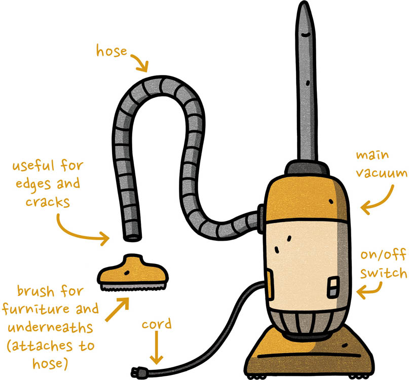

## How to Clean a Bathroom

Put on a pair of rubber gloves, grab the supplies your family uses, and
then:

### Clean the Counters and Sink

1.  1. Clear all the stuff off the counter.
    

    

    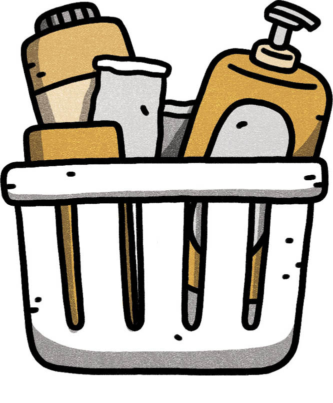

    

    Put the stuff from the counter in a bin or basket while you clean.

    

2.  2. Spritz the counters, sink, and faucet
    with vinegar or cleaning spray and wipe everything thoroughly with
    a  sponge.
3.  3. Rinse the sponge and wipe everything
    down.
4.  4. If the sink is still dirty, you may need
    to sprinkle on baking soda or scrubby powder and rub it hard with
    the sponge.
5.  5. Put everything back on the counters.

# The Very Basic Supplies

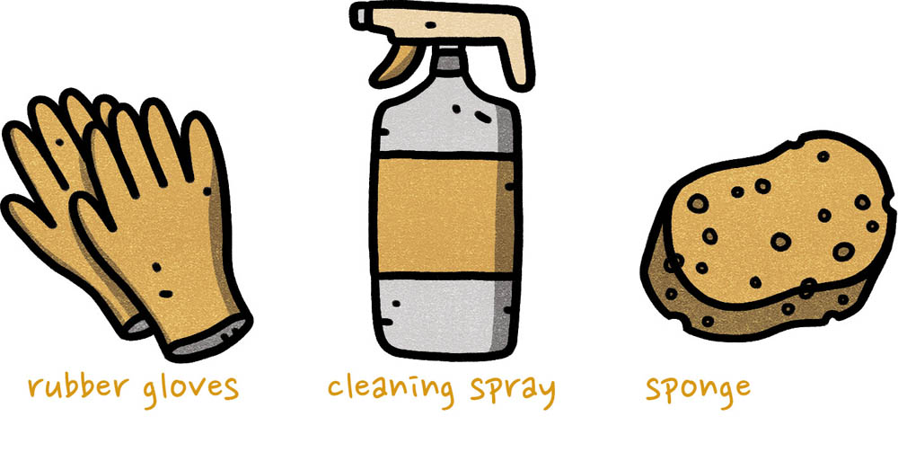

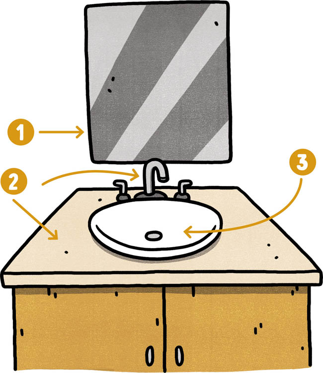

1.  1. Spritz and wipe the mirror with vinegar
    or glass cleaner and a wadded up newspaper or rag.
2.  2. Spritz and wipe.
3.  3. Maybe use a little scrubby powder or
    baking soda in here.

**Tip:** An old toothbrush is good for getting into grubby little
cracks.

### Clean the Toilet

1.  1. Put some toilet bowl cleaner or baking
    soda in the toilet bowl and leave it to soak while you do the rest.
2.  2. Spritz cleaner on the toilet tank, the
    top of the seat, and both the top and bottom of the lid. Wipe them
    off with a sponge or a rag (that you use only for the toilet).
3.  3. Lift up the seat, then spritz and wipe
    the rim of the toilet and the underside of the seat.
4.  4. Spritz and wipe the base of the toilet
    bowl and the floor around the toilet.
5.  5. Scrub the inside of the toilet bowl with
    the toilet brush, then flush.

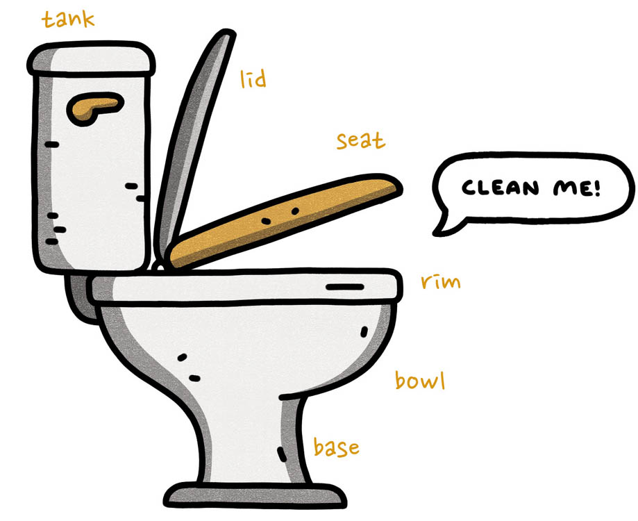

### Clean the Tub and Shower

1.  1. Pull the shower curtain out of the way.
    

    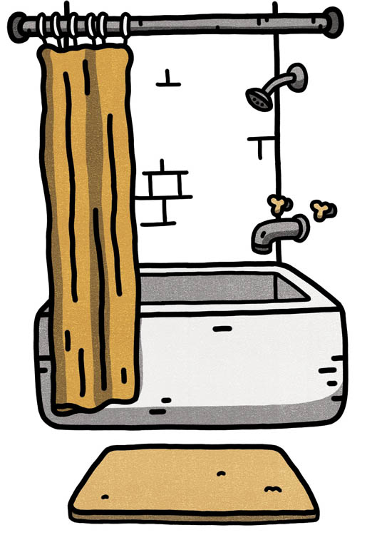

    

2.  2. Spritz all the surfaces with cleaner,
    including the inside of the tub, the rim of the tub, the walls of
    the shower, and the faucet. Use a sponge to wipe.
3.  3. Use baking soda or scrubby powder on
    extra grubby spots.
4.  4. Rinse the sponge and wipe everything
    down.

## How to Plunge a Toilet

It’s okay! It happens! Something’s not going down — so now nothing’s
going down. Don’t panic. But also? **Don’t keep flushing.** (Trust us on
this.)

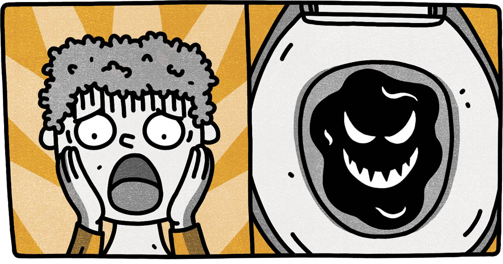

1.  1. Find the plunger. It looks like this.

    

    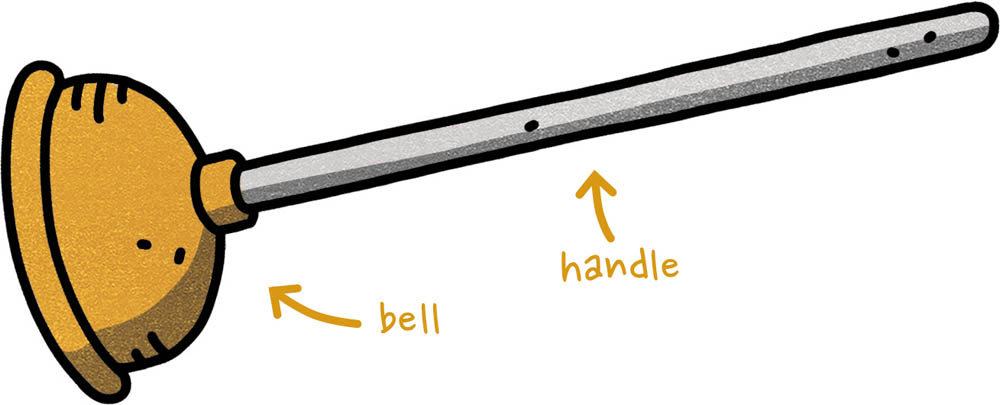

    

    If you can’t find the plunger, you’ll have to awkwardly ask somebody
    for one.

    

    

    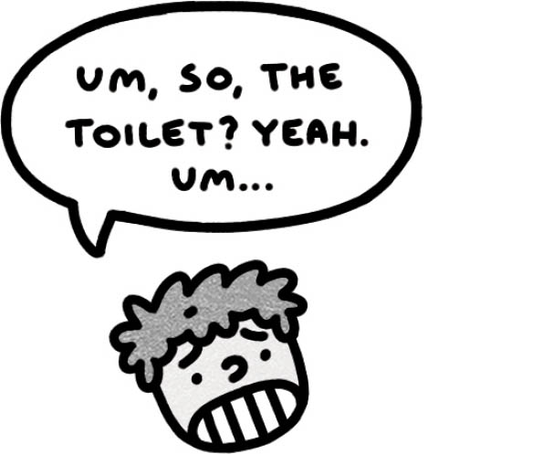

    

    

2.  2. Hold the handle of the
    plunger and put the bell into the toilet bowl so that it covers the
    drain opening. It should create a seal of air.Push down — this
    pushes the air out of the bell and creates a vacuum — and then pull
    up quickly without breaking the seal.
    

    

    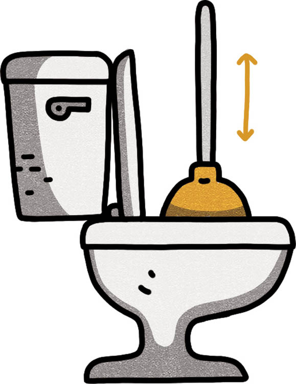

    

    

3.  3. Repeat the pushing down and pulling up
    on the plunger handle until whatever was stuck in the drain gets
    dislodged and the water goes out with a satisfying whoosh. Cross
    your fingers and flush again.
    

    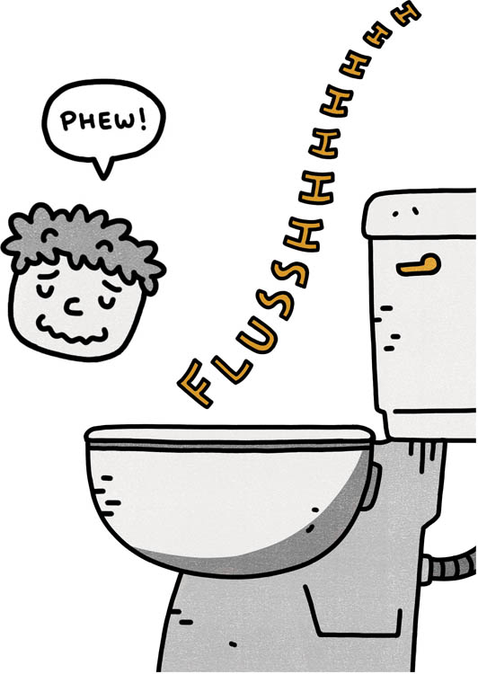

    

## How to Make a Bed

1.  1. Stretch the fitted sheet over the
    mattress. Start with one corner, then do the corner diagonally
    opposite, then the other two. The last corner might feel really
    tight, like you’re pulling sweatpants onto an elephant. Just tug and
    pull a little, and you’ll get it.

    

    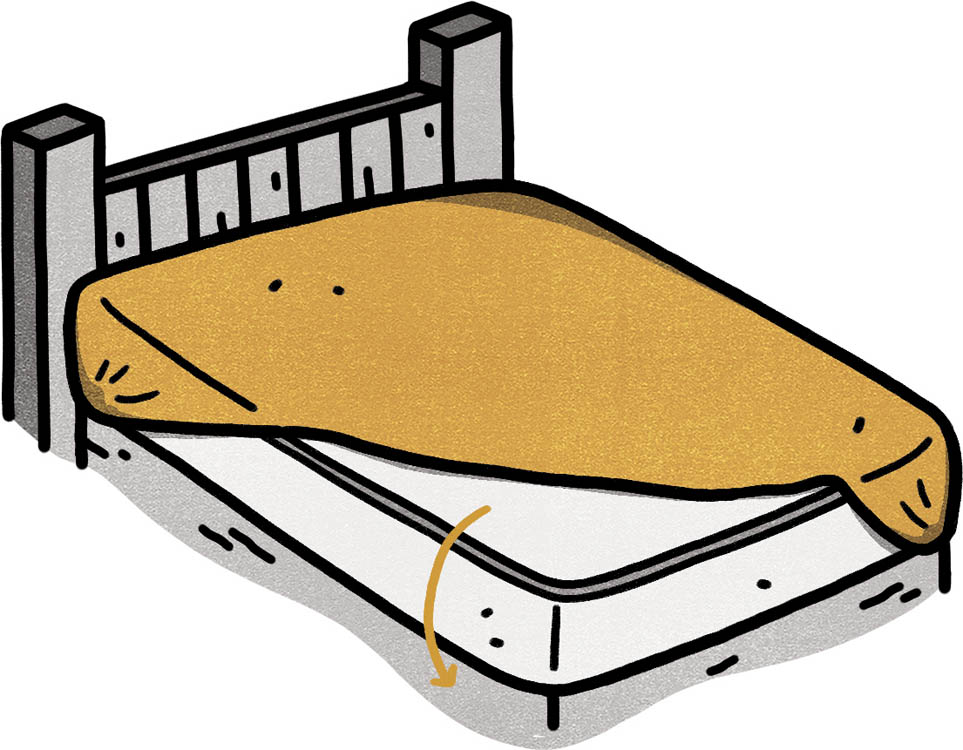

    

    **Tip:** If it’s going really badly, make sure you’re not putting
    the sheet on in the wrong direction.

2.  2. Lay the flat sheet over, with the top
    edge meeting the top edge of the mattress, and the rest hanging down
    evenly at the sides and bottom.

3.  3. Lay the blanket over
    the flat sheet more or less exactly.

4.  4. Neatly fold down the top foot or so of
    the blanket-sheet combo, then tuck in the bottom and sides of both
    like you’re wrapping a present (see
    [here](#626182HowToBeAPerson_ebook-4.xhtml__idTextAnchor006)),
    pulling them nice and smooth.

5.  5. Stuff pillows into their cases and put
    them where they go.

6.  6. Cover it all with a bedspread or duvet,
    if you’ve got one.

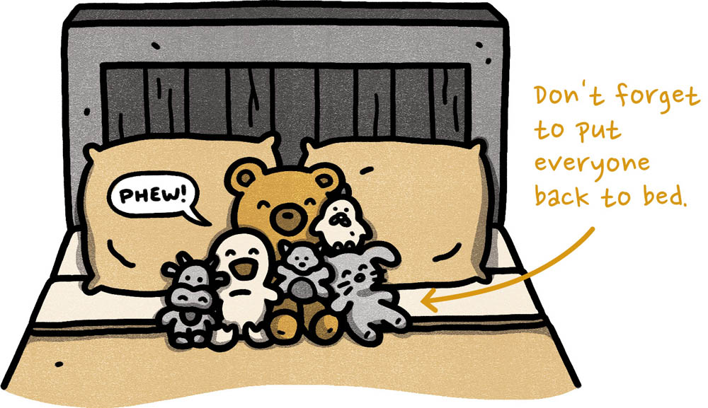

# How to Fold a Fitted Sheet

Just kidding. Go ahead and wad it up like a normal person.

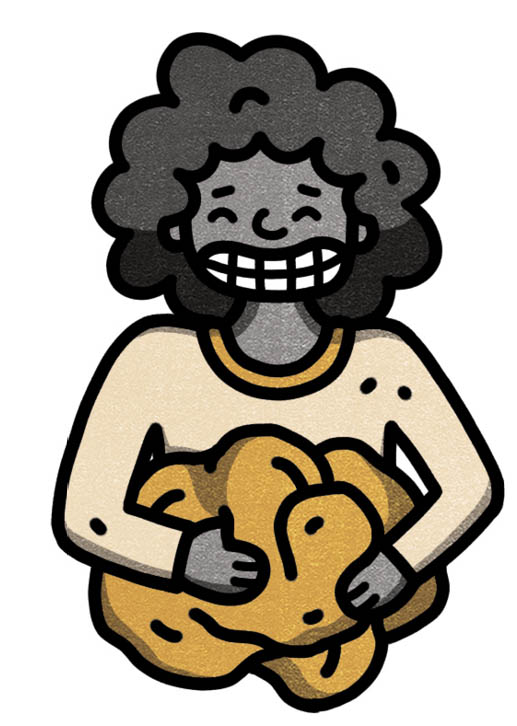

# Edible Food

How to Make Meals and Find Your Way around the Kitchen

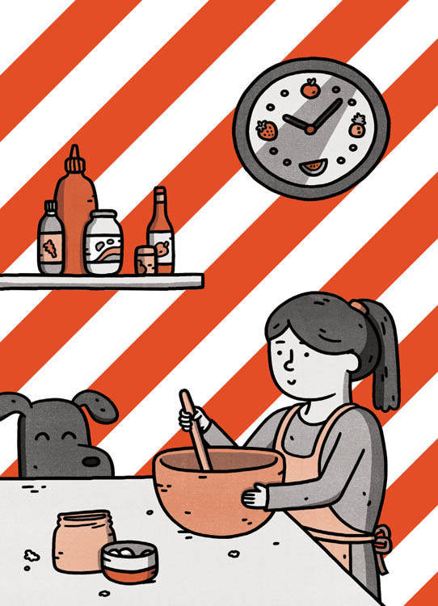

Cooking is one of our most basic life skills (hello, fire!), and it’s
not hard. Plus, feeding people you love is one of the best feelings on
Earth.

We have to offer a couple of health-and-safety reminders about cooking,
even though we know you know these things:

- Remember to wash your hands before you make food.
- Use potholders when you’re working with heat, and turn off the stove
  or oven when you’re done with it.
- Be super careful with sharp knives and appliances like blenders and
  food processors, and put them away safely when you’re finished.
- Have fun and be creative! (Okay, that’s not technically a
  health-and-safety reminder, but still.)

## How to Whip Up A Smoothie

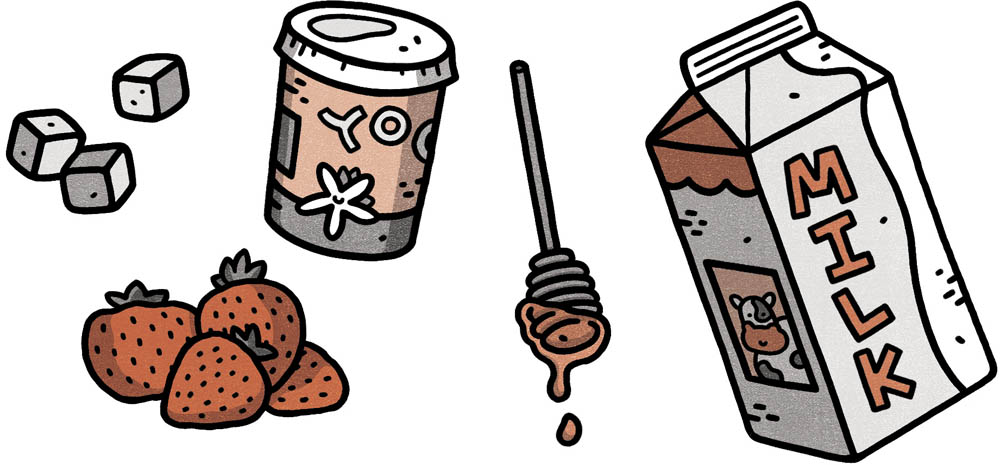

- 1 cup frozen (or fresh) fruit such as blueberries, strawberries,
  raspberries, blackberries, pitted cherries, or cut-up peaches,
  nectarines, pineapple, or mango
- 1⁄2 cup yogurt (any
  kind)
- 1 cup milk, nondairy “milk,” or juice
- 1⁄2 of a frozen banana
  or 3 ice cubes
- 2 pitted dates or a drizzle of honey or maple syrup
- You might also like to add vanilla extract, shredded coconut, or
  grated lemon zest

Whir everything together in a
blender at the highest setting until thick and smooth. (It’s okay if you
need to stop the blender and encourage everything a little bit with the
end of a wooden spoon.)

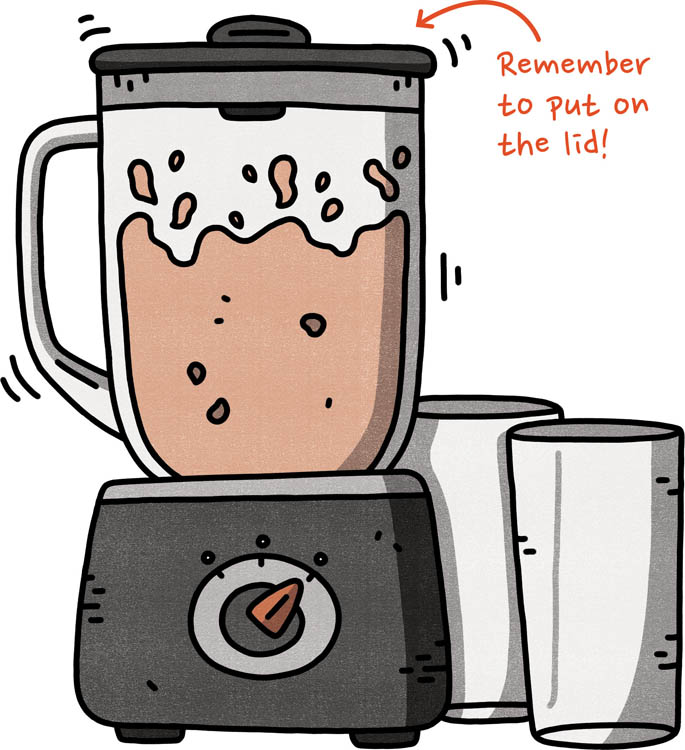

## How to Scramble Eggs

1.  1. Beat together 2 eggs, a large pinch of
    salt, and 2 teaspoons of water in a bowl.
    

    

    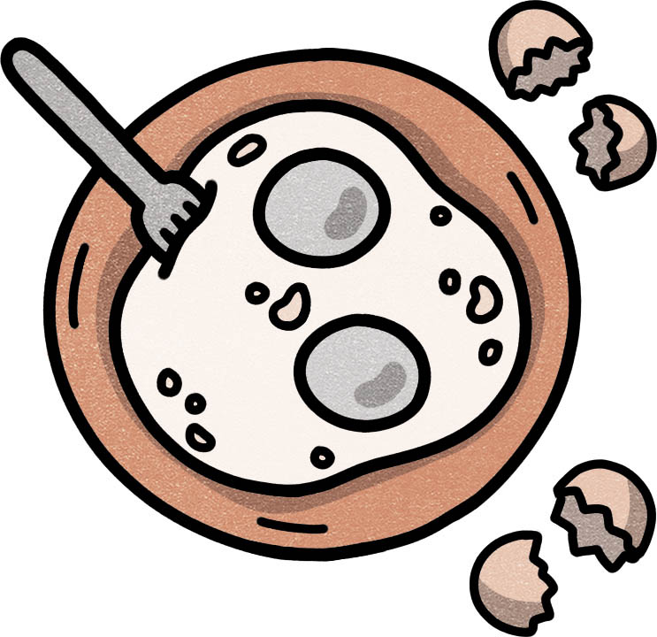

    

    

2.  2. Melt a tablespoon of butter in a pan
    over medium-low heat.
    

    

    

    

    

3.  3. When the melted butter seems nice and
    hot, pour in the eggs and scramble them, dragging a spatula across
    the bottom of the pan so that the egg that hasn’t set (firmed up)
    yet can run underneath the egg that has.
    

    

    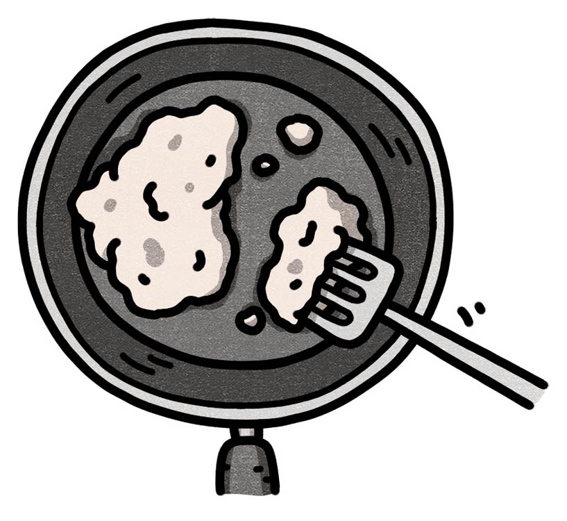

    

    

4.  4. You might want to add
    some tasty things:
    - grated cheese
    - cream cheese
    - a handful of baby spinach
    - chopped herbs
    - hot sauce
      

      

      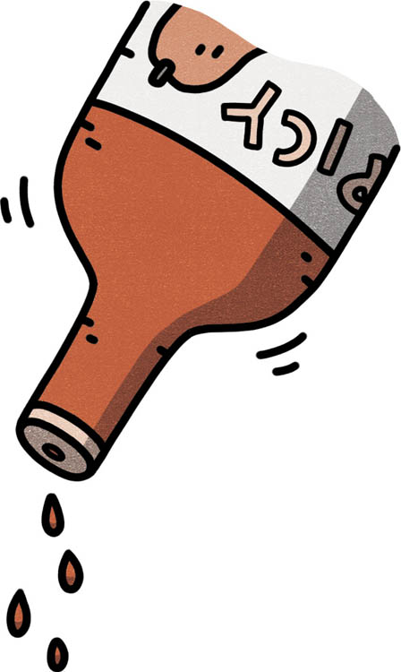

      

      

5.  5. When they seem done just right, eat
    them.
    

    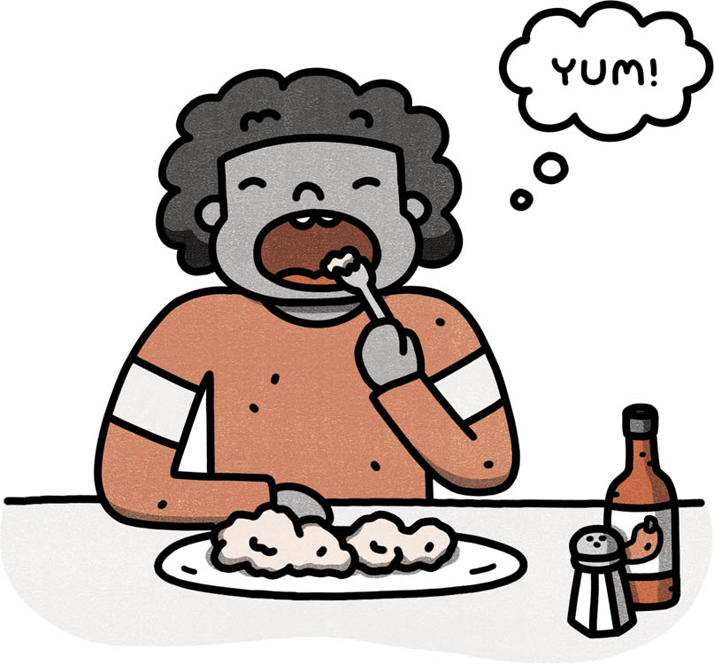

    

## How to Perfectly Boil an Egg

Put an egg (or eggs) in a small pot, then cover it (them) with water by
an inch or so. Put the pot on the stove, turn the heat to high, and
bring the water to a boil. (You’ll see big, bursting bubbles and the
eggs will start moving around). Then cover the pot, turn off the burner,
and let the eggs sit for exactly 10 minutes if you want the yolk firm
but tender. Or try 8 minutes for a softer yolk or 12 minutes for a
firmer one.

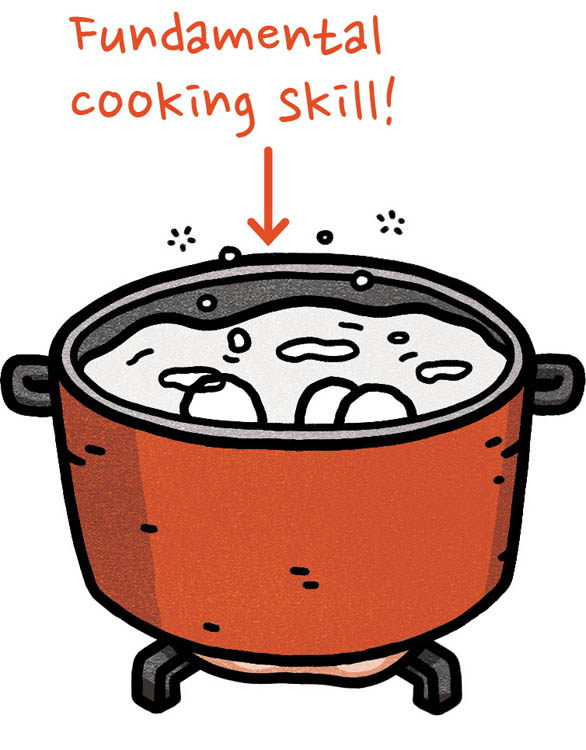

Pour the eggs and water into the sink, then run cold water over them
until they’re cool enough to touch. Roll each egg on the counter to
crack it all over, then peel it.

Make it yummier with salt, pepper, hot sauce, or cupcake sprinkles —
then eat it!

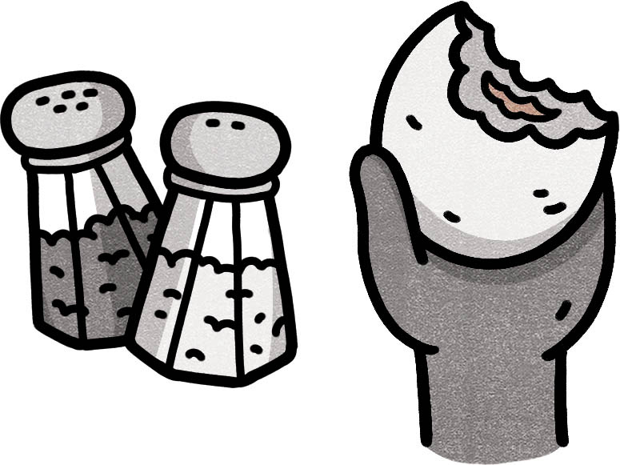

## How to Make Salad Dressing

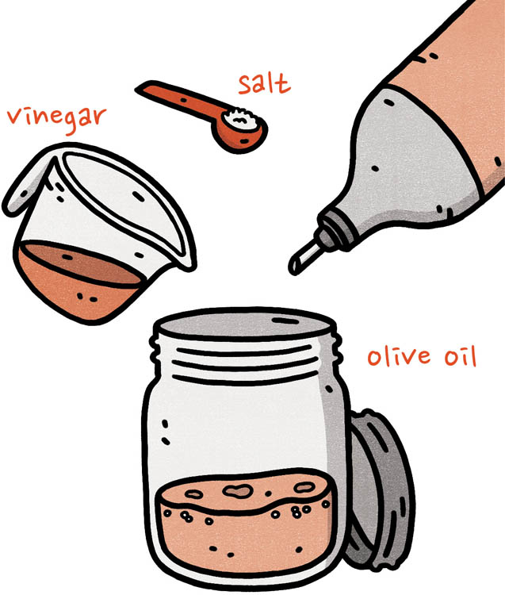

- 1⁄3 cup vinegar (plain
  white, red wine, white wine, balsamic, apple cider, or whatever you
  have)
- 1 teaspoon salt
- 2⁄3 olive oil

Put all the ingredients in a container with a lid, screw the lid on
tight, and shake it up well. Then drizzle it over a bowlful of leafy
greens, and you’ve got salad! There will be leftover dressing. Keep it
in the fridge.

# Other Possible Additions

- bloop of mustard and/or mayo (this helps keep it from separating)
- dried or fresh herbs such as oregano, basil, dill, thyme, or chives
- minced garlic or some garlic powder
- freshly ground black pepper
- other spices or seasoning blends
- grated lemon zest

## How to Make a Quesadilla

1.  1. Put a pan over medium-low heat and add a
    pat of butter or a bloop of oil.
    

    

    

    

    

2.  2. Put a tortilla in the pan and sprinkle a
    handful of shredded Monterey Jack or cheddar cheese over half of it.
    

    

    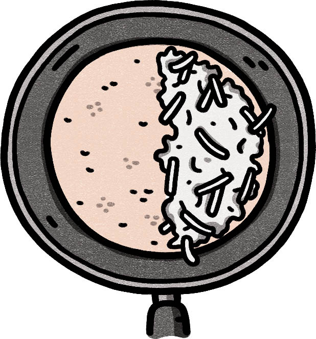

    

    

3.  3. Use a spatula to fold the tortilla in
    half.
    

    

    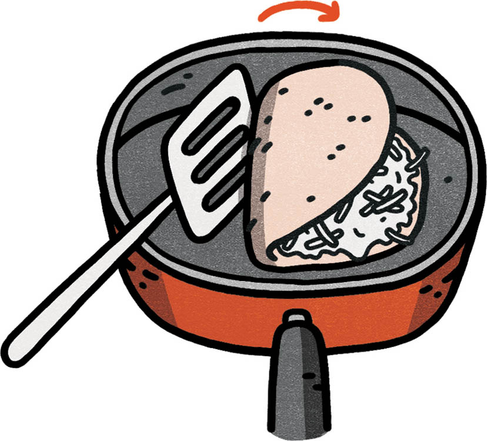

    

    

4.  4. Cook until the bottom
    is golden-brown, then flip it with a spatula and cook until the
    other side is golden brown and the cheese is melted.
    

    

    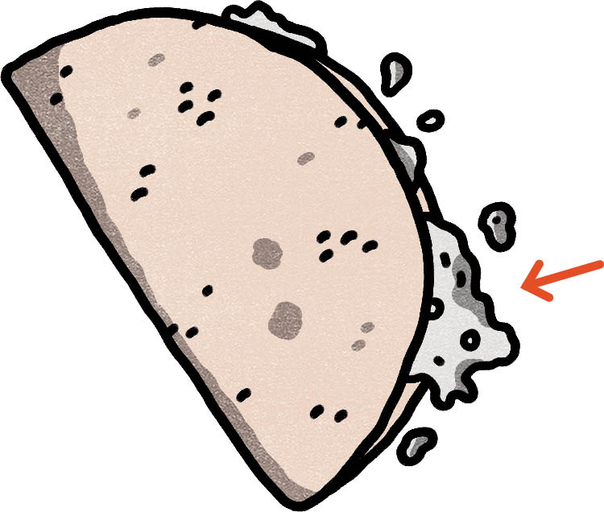

    

    We call the crispy cheese at the edges “cheese crusto,” and it’s our
    favorite part.

    

5.  5. Serve with sour cream, guacamole, and/or
    salsa.
    

    

    

    

    

## How to Make Your Food Taste Good

You made food! Yay you! Before you eat or serve it, though, taste it and
make sure it’s really good. If it’s not, then add more seasoning.

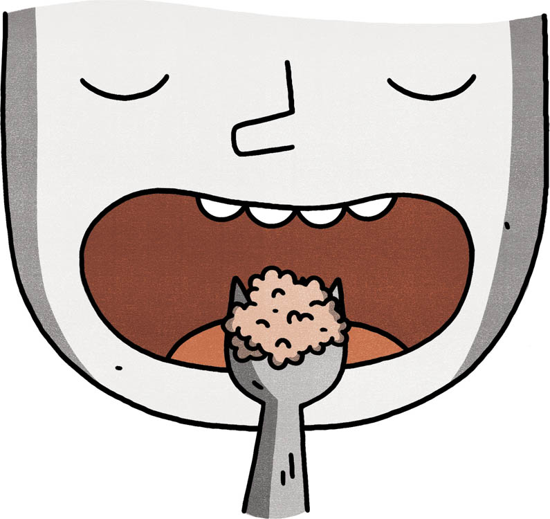

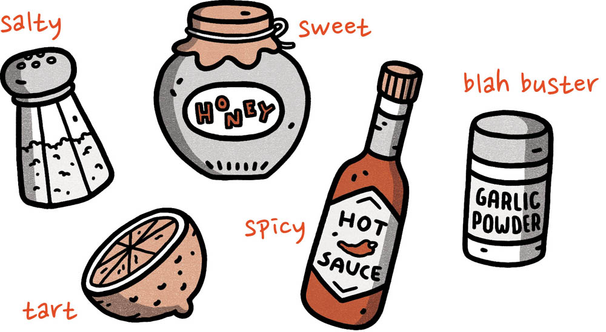

**If it’s too bland,** it might need more salt. Add a pinch and taste
again, then add more if it needs more. Soy sauce adds saltiness as well
as a rich flavor. If the flavor goes well with whatever you made, a
little soy sauce might just do the trick.

**If you still need to brighten up the flavor,** consider adding a
little splash of something tart like lemon juice or vinegar.

**Is it nice and tangy,** but actually a little bit TOO tangy? Add a
tiny drop of a sweetener, such as honey or maple syrup, to balance the
flavor.

**Do you wish it were spicy?** Add a big grinding of black pepper, a
dash of hot sauce, or a pinch of cayenne pepper.

**Is it just kind of blah?** Add a sprinkle of garlic powder or curry
powder or another seasoning you love.

## How to Chop an Onion

Don’t cry, silly! It’s just an onion.

1.  1. On a cutting board, use a large, sharp
    knife to trim the ends off the onion.

    

    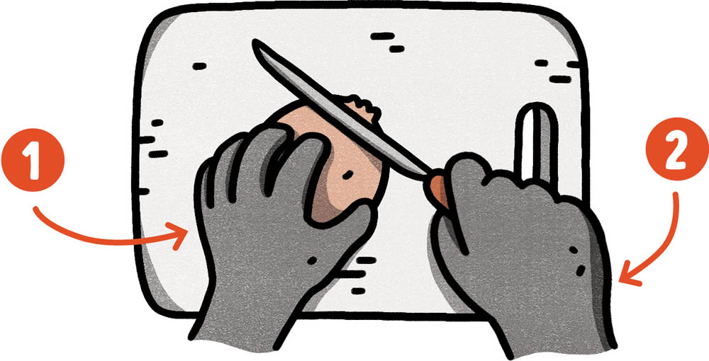

    

    **1.** hand you don’t write with (holding the onion)

    **2.** hand you write with (holding the knife)

2.  2. Cut the onion in half.
    

    

    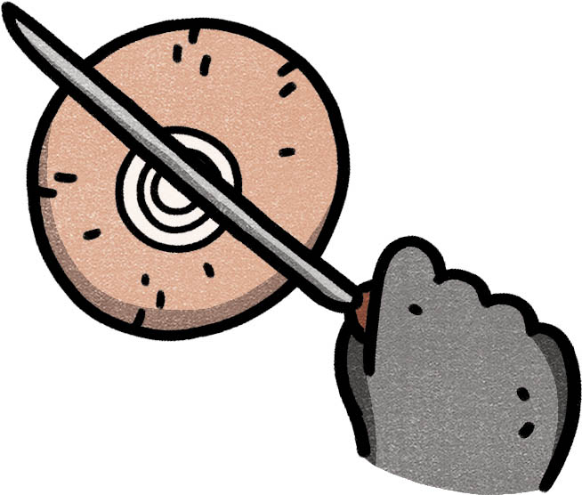

    

    

3.  3. Peel off the papery skin.
    

    

    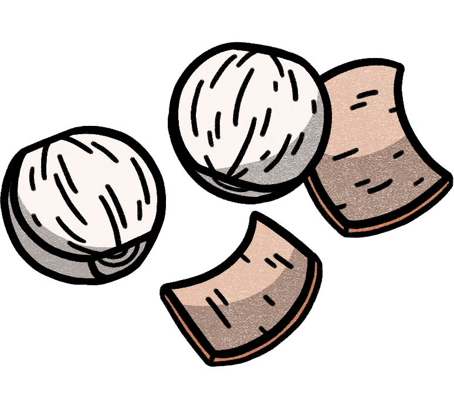

    

    

4.  4. Put the onion halves
    flat side down on the cutting board. Cut each half into slices going
    from end to end. (Hold on to it so the slices stay together.) Then
    cut each half into slices going from side to side. You will end up
    with a grid of little squares.
    

    

    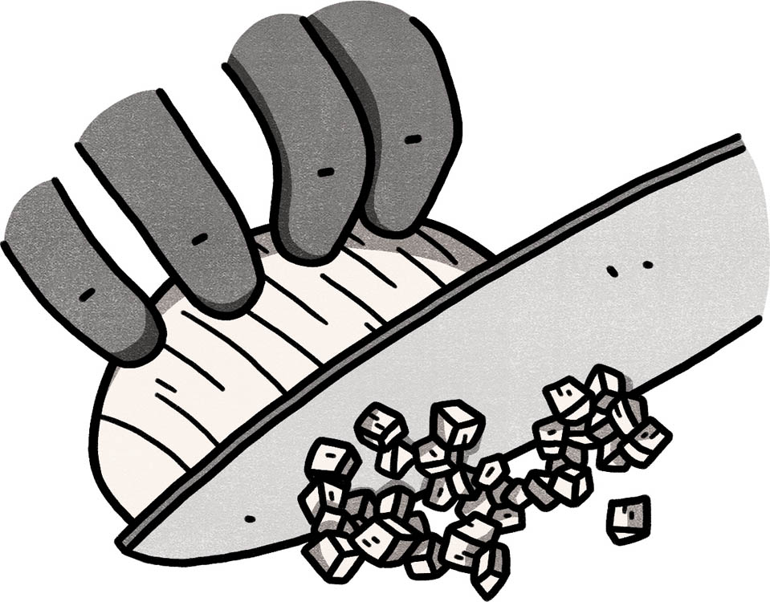

    

    Keep your onion-holding fingers curled out of the way!

    

5.  5. Eat. Just kidding! But lots of recipes
    for soups, stews, salads, and, of course, homemade onion dip start
    with chopping an onion. And now you know how.

## How to Roast a Chicken

1.  1. Heat the oven to 425°F (220°C) and put
    half a stick of butter on a little plate near the warm oven to
    soften up a little.
2.  2. Take the chicken out of its wrapping and
    reach into the front and back of it to check for a little bag of
    giblets (the liver, kidneys, heart, and/or neck). Throw them away,
    unless someone wants them.
3.  3. Put the chicken in a small roasting pan
    and sprinkle salt all over it. Lots of salt. Now rub it all over
    with the butter. This is kind of gross, and not very exact, and
    that’s fine. (You can use olive oil instead if you like it better.)
4.  4. Put the pan in the oven and roast the
    chicken for 11⁄2
    hours. You want the skin to be crisp and brown. If it looks like
    it’s going to burn at any point, turn the heat down to 400°F
    (200°C).

**Note:** Raw chicken is nasty and can make you sick. Wash your hands
with soap and water after you touch it, *each time*! Before you grab the
salt shaker, for instance.

1.  5. Take it out of the oven. Poke the thigh
    (under the drumstick) with the tip of a sharp knife: you want the
    juice that comes out to look clearish rather than pink. If it’s
    pink, then cook it a little longer, wash the knife, and test again.
2.  6. Let the chicken rest for 15 minutes or
    so, then cut it up and serve.
    

    

    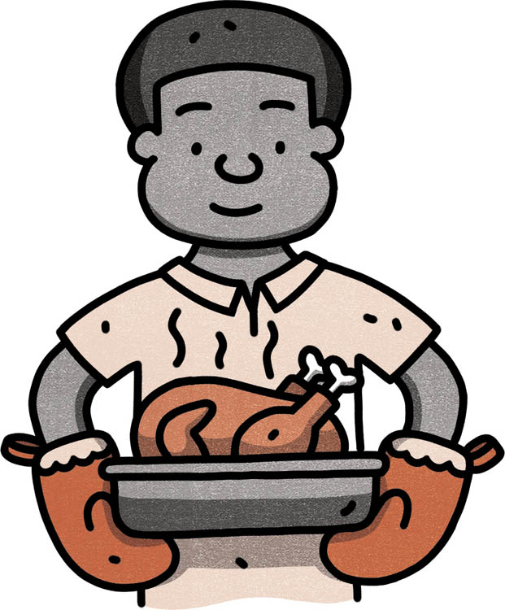

    

    

You can stuff things inside the chicken to flavor it! But you don’t have
to.

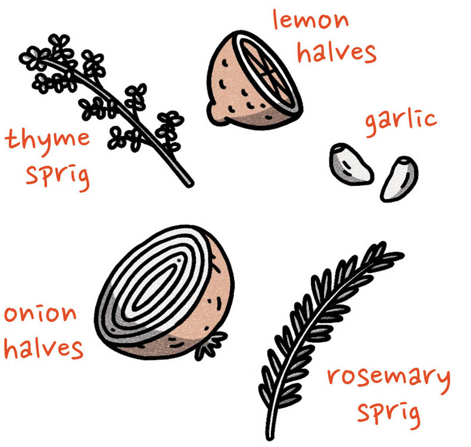

## How to Make Spaghetti

1.  1. Fill a big pot about 2/3 full with cold
    water.
2.  2. Put it on the stove, cover it, and turn
    the heat to high to bring the water to a boil. When the water is
    boiling you’ll see big, bursting bubbles.
3.  3. Add a handful of salt. An actual
    handful!
4.  4. Put the spaghetti (or other pasta) into
    the water, and use tongs or a wooden spoon to stir it around so that
    it doesn’t all clump together.
    

    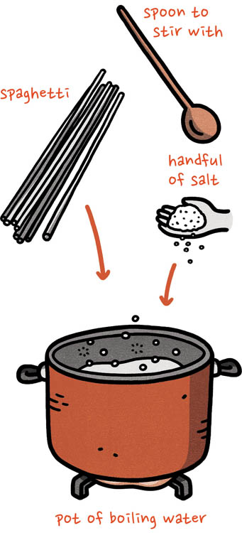

    

5.  5. Set a timer for the
    smallest amount of time the package recommends, put a colander in
    the sink, and stir the pasta some more.
6.  6. When the timer goes off, use tongs to
    fish out a piece of pasta and run it under cold water. Taste it. If
    it seems good, turn the heat off. If you want it cooked longer, then
    test it again in a minute.
7.  7. Use pot holders and very carefully carry
    the pot to the sink. Tip it away from you to pour the water and
    pasta into the colander. Put the pot back on the stove.
8.  8. Shake the colander to get the water out
    of the pasta. Tip the pasta back into the pot and stir in a little
    butter or olive oil while you think about what to do next.
9.  9. Eat it now! Or top it first!
    

    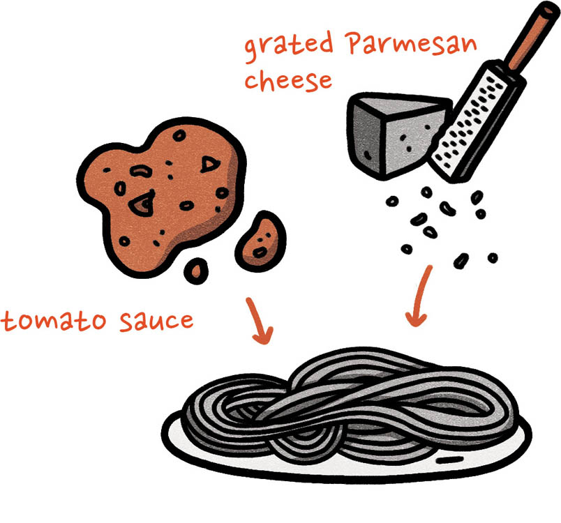
    **Or try:** pesto, olives, garlic powder, lemon zest, whatever you
    like!

    

## How to Set the Table

### If the Queen of England is coming

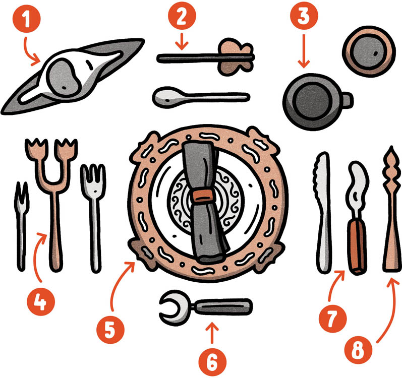

<table id="table-t2_001" class="table-t1">
<colgroup>
<col style="width: 50%" />
<col style="width: 50%" />
</colgroup>
<tbody>
<tr class="table-t2">
<td class="table-t2"><ol>
<li>1. snail boat</li>
<li>2. fairy spoon</li>
<li>3. mead mug</li>
<li>4. cockle spork</li>
</ol></td>
<td class="table-t2"><ol>
<li>5. fancy extra plate</li>
<li>6. rooster wrench</li>
<li>7. liverwurst knife</li>
<li>8. pumpkin carver</li>
</ol></td>
</tr>
</tbody>
</table>

### If it’s just regular people

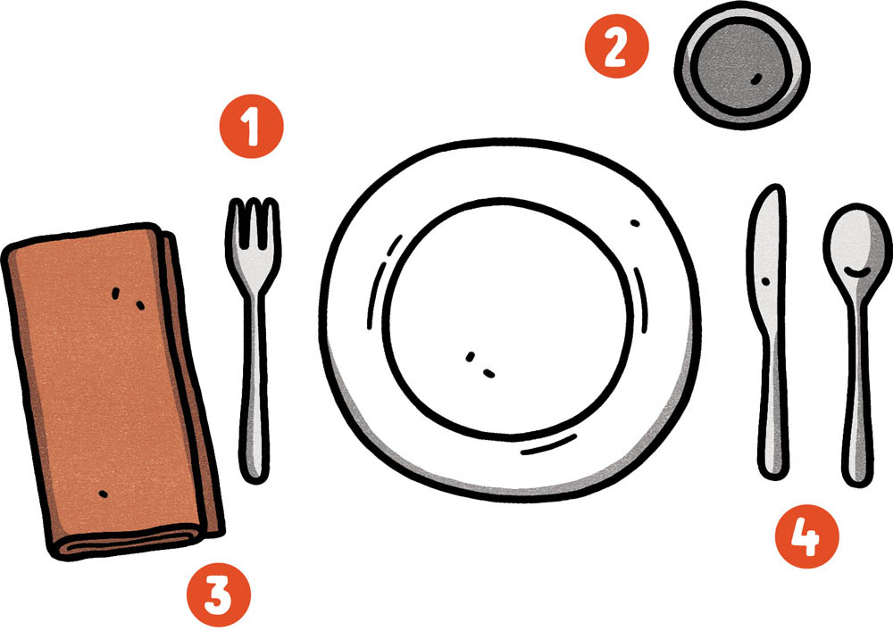

<table id="table-t2_002" class="table-t1">
<colgroup>
<col style="width: 100%" />
</colgroup>
<tbody>
<tr class="table-t2">
<td class="table-t2"><ol>
<li>1. The fork goes to the left of the
plate.</li>
<li>2. The glass goes above the knife and
spoon.</li>
<li>3. The folded napkin goes to the left of
the fork.</li>
<li>4. The knife and spoon go to the right of
the plate.</li>
</ol></td>
</tr>
</tbody>
</table>

Silverware goes in the order eaters will use it, from outside to inside.
If there are two forks, the small salad fork goes on the outside and the
big dinner fork goes on the inside. (But there will likely be only one
fork.)

# POP QUIZ!

You made dinner! And everybody loved it! Yay!

Afterward you:

|  |  |
|----|----|
| **A.** | Post a photo of the giant spaghetti-sauce mess in the kitchen. \#notmyproblem |
| **B.** | Look around at the dirty pots and pans and say, “We should probably move to a new house.” |
| **C.** | Pretend to fall asleep at the table. |
| **D.** | Clean up after yourself and do the dishes. |

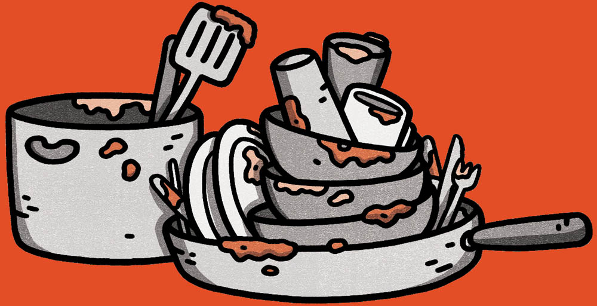

**Answer:** D. But if someone says, “You cooked, so let me do the
dishes,” you can say, “Oh, thank you so much! I’d actually love that.”

## How to Turn a 33-Cent Package of Ramen into Dinner

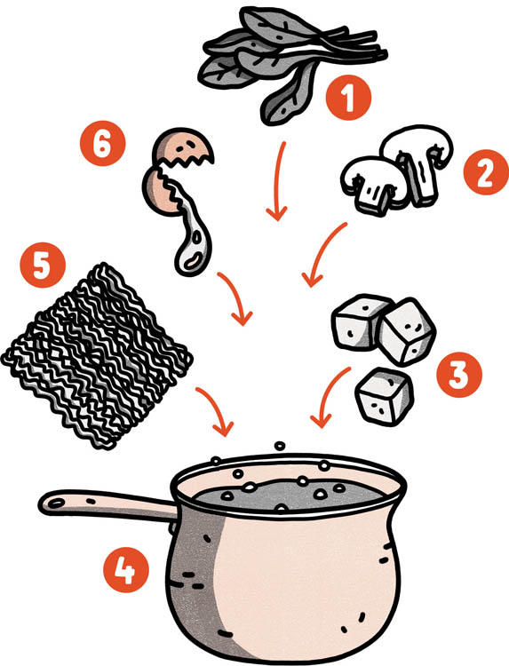

<table id="table-t2_003" class="table-t1">
<colgroup>
<col style="width: 50%" />
<col style="width: 50%" />
</colgroup>
<tbody>
<tr class="table-t2">
<td class="table-t2"><ol>
<li>1. spinach</li>
<li>2. sliced mushrooms</li>
<li>3. cubes of tofu</li>
</ol></td>
<td class="table-t2"><ol>
<li>4. pot of boiling water</li>
<li>5. ramen noodles</li>
<li>6. beaten egg (the hot broth will cook
it)</li>
</ol></td>
</tr>
</tbody>
</table>

To customize your bowl, skip the flavor packet and try adding soy sauce,
sesame oil, and a splash each of rice vinegar and hot sauce.

# You’re Wearing That?

How to Clean and Care for Your Clothes

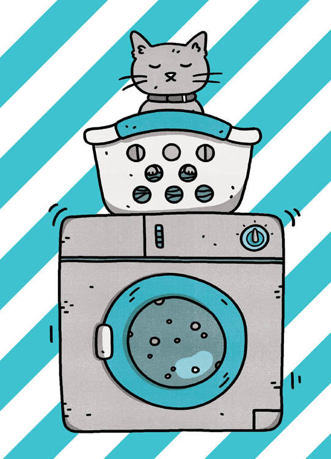

Whether you’re dressing for success, dressing for soccer, or dressing
for just not being naked, you need to have clothes in your life. And
they need to be washed, dried, put away, and even occasionally mended!
Here’s how.

## How to Sort Laundry

1.  1. Bring the laundry hamper(s) or laundry
    basket(s) to wherever you’re going to wash the clothes.
    

    

    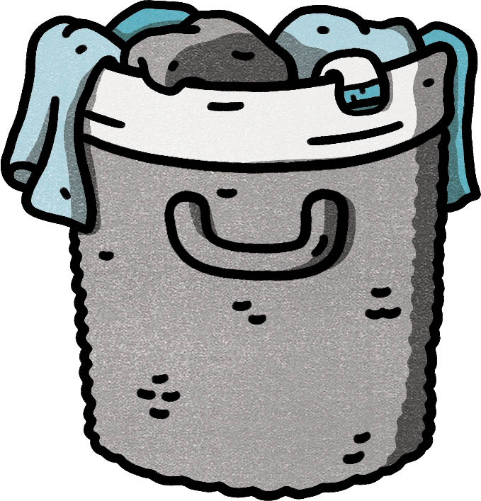

    

    

2.  2. Dump the clothes onto the floor and pick
    out items that look like they might not go in the machine (wool
    sweaters, silky things, fancy things) and put them aside.

    Ask an adult what to do with the things you set aside, and cross
    your fingers that they’ll offer to deal with them.

3.  3. Sort the rest of the
    laundry into two piles: lights and darks, assuming this is your
    house style of doing laundry. (Some families wash all the clothes
    together, which is fine, too.) Traditionally, **lights** include
    undies, towels, and anything else that washes in hot water to get it
    really clean; **darks** include jeans, shirts, and other clothes
    that wash in warm or cold water to keep the color from bleeding out.
    Don’t go crazy trying to determine which pile something goes in. It
    will be fine.

4.  4. Go through everybody’s pants pockets and
    remove whatever you find. Finders keepers! (Not really.)
    

    

    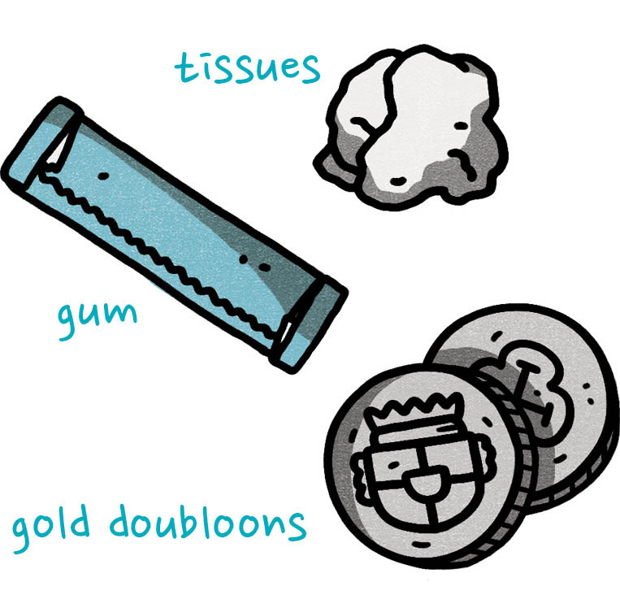

    

    

5.  5. Zip up zippers so they won’t tear other
    clothes.
    

    

    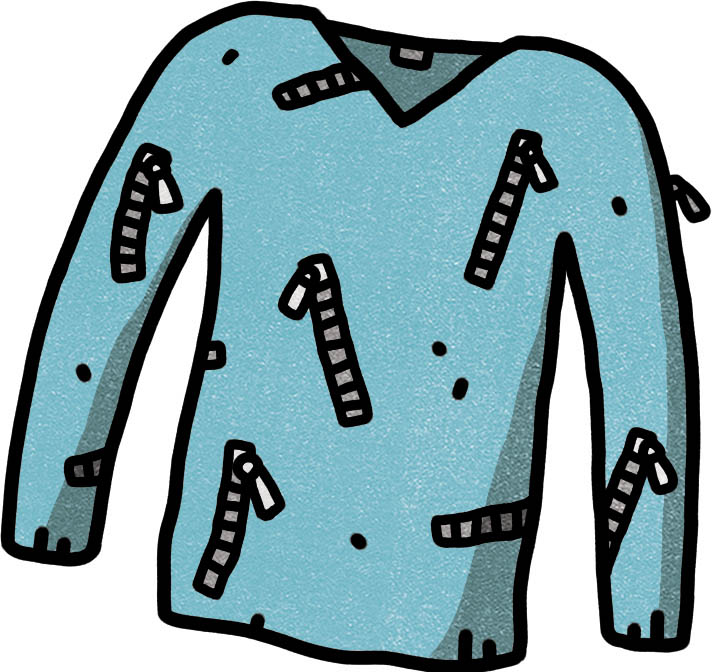

    

    

6.  6. Tie sweatshirt and sweatpants ties so
    they won’t tangle or pull out.

7.  7. Deal with any obvious stains (see [How
    to Get Out a
    Stain](#626182HowToBeAPerson_ebook-8.xhtml__idTextAnchor014)).
    

    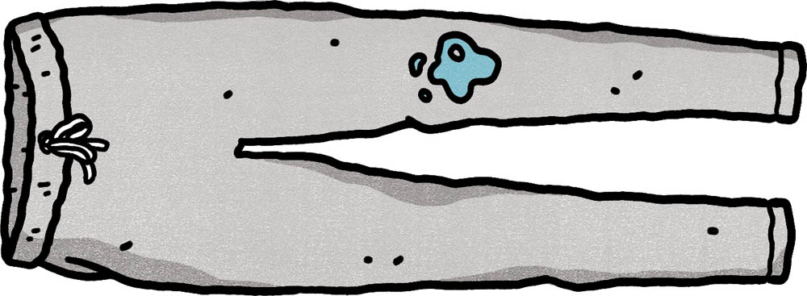

    

## How to Wash a Load of Laundry

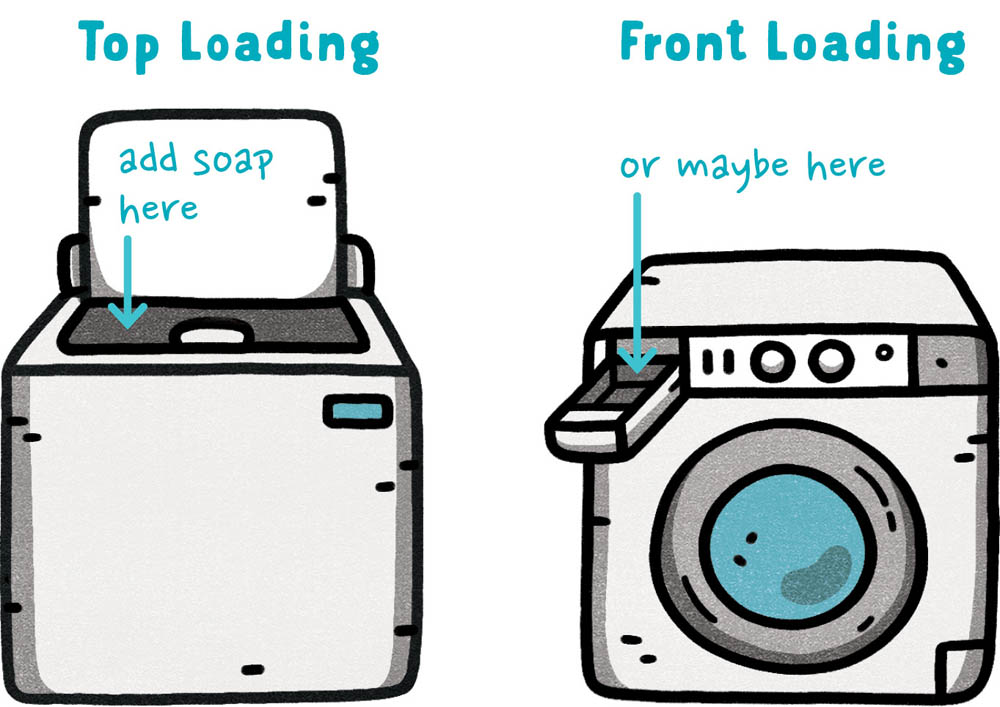

1.  1. Load the laundry — either in the top or
    in the front of the washing machine. Don’t cram it too full or the
    clothes won’t be able to move around!
2.  2. Add the right amount of detergent
    wherever it goes: into a little drawer or right into the tub of the
    washer. If it’s liquid detergent, you can usually measure it right
    in its own cap. If you’re supposed to add the detergent before
    adding the clothes, then pretend this is step 1.
3.  3. Turn the knob(s) to
    the kind of wash cycle you need or have been instructed to use. Ask
    an adult to teach you what the house laundry style is, then make a
    cheat sheet for yourself and post it near the machine. Settings you
    may have to select:
    - how hot or cold the water is for washing and rinsing
    - how fast the machine spins
    - how long the cycle runs
      

      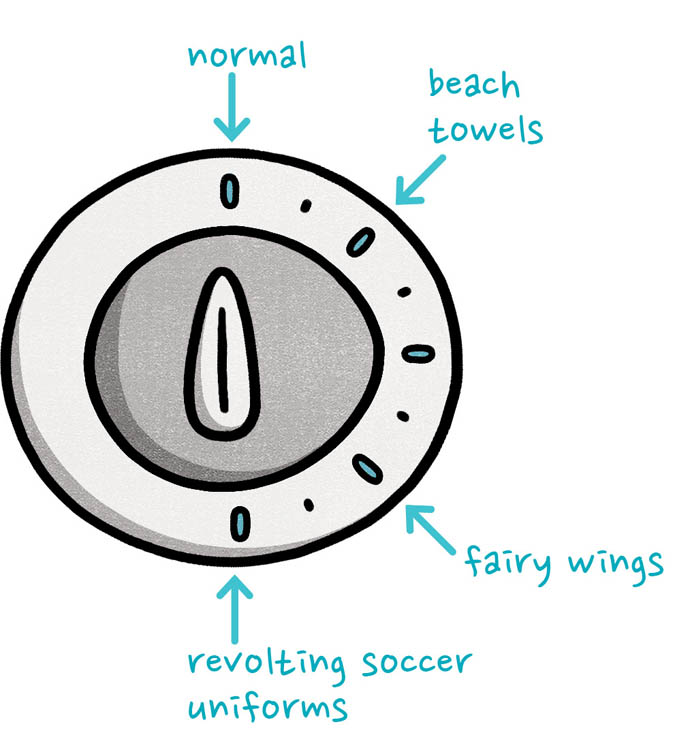

      

4.  4. Press the “start” button.

**Fun Fact.** According to NASA, astronauts on the International Space
Station don’t have a lot of options for dealing with dirty clothes. One
astronaut used a pair of worn underpants as a growing medium for plants,
but otherwise they wear each pair of undies for 3 or 4 days and, at the
end of the trip, send them off with the rest of the trash to be
incinerated in outer space.

## How to Get Out a Stain

Maybe you’re a messy eater or your pen (or pet) leaked! Don’t fret. Just
deal with a stain as quickly as you can, which might mean as soon as you
get home if you blooped ketchup onto yourself at the burger place, or
when you’re sorting laundry if you suddenly notice the grass stains on
your baseball uniform.

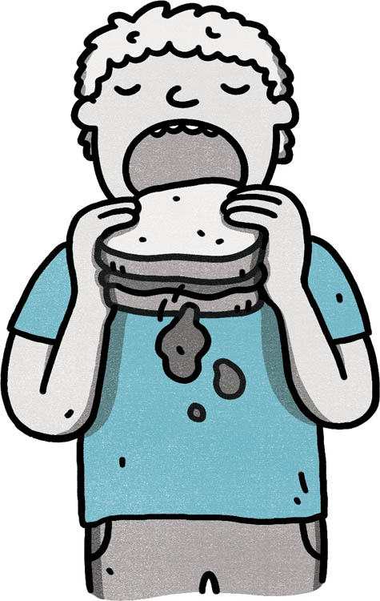

1.  1. If the stain is 3-D (e.g., a dried blob
    of peanut butter), scrape as much of it off the fabric as you can
    using a plastic card (like a library or credit card) or a
    butter knife.
2.  2. If the stain is oily (e.g., bike grease
    or salad dressing), rub some cornstarch into it as soon as you can.
3.  3. Rub or spray the
    stain with a stain remover, checking the product’s label first to
    make sure it’s safe to use on the kind of fabric you have.
4.  4. Leave the stain remover in until you
    next do laundry, unless the product says to wash it out immediately,
    and then use this as an excuse to pop in a load.
    

    

    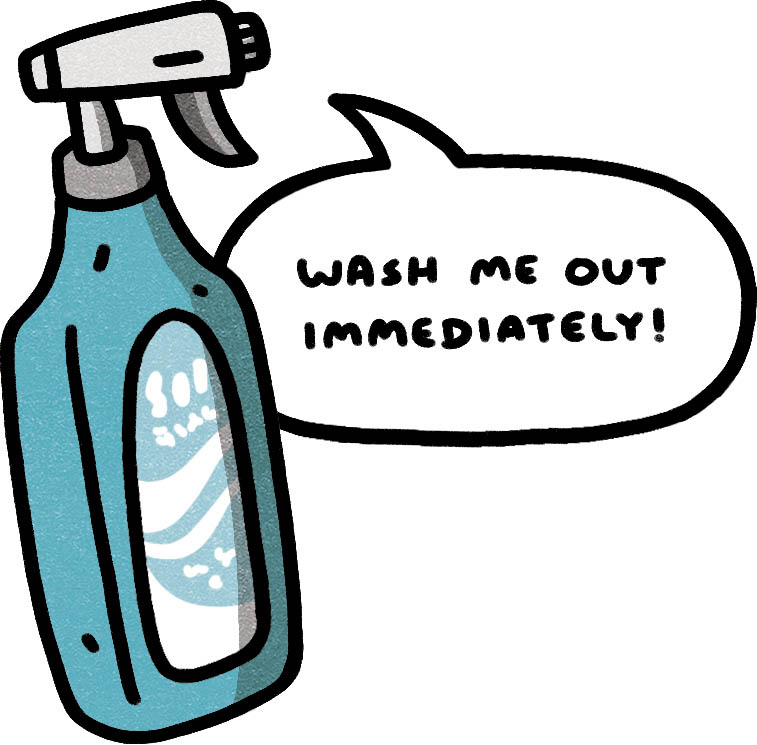

    

    

5.  5. Check your clothes when they come out of
    the washer, and re-treat any stains that are still visible.
    

    

    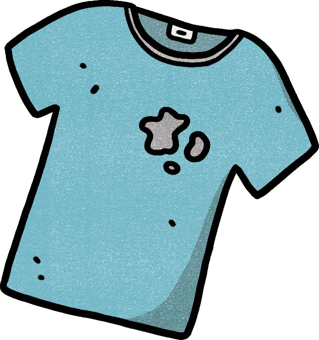

    

    

6.  6. If a stain cannot be removed, consider
    sewing a decorative patch over it. Now your garment is even nicer
    than it was before you “ruined” it!
    

    

    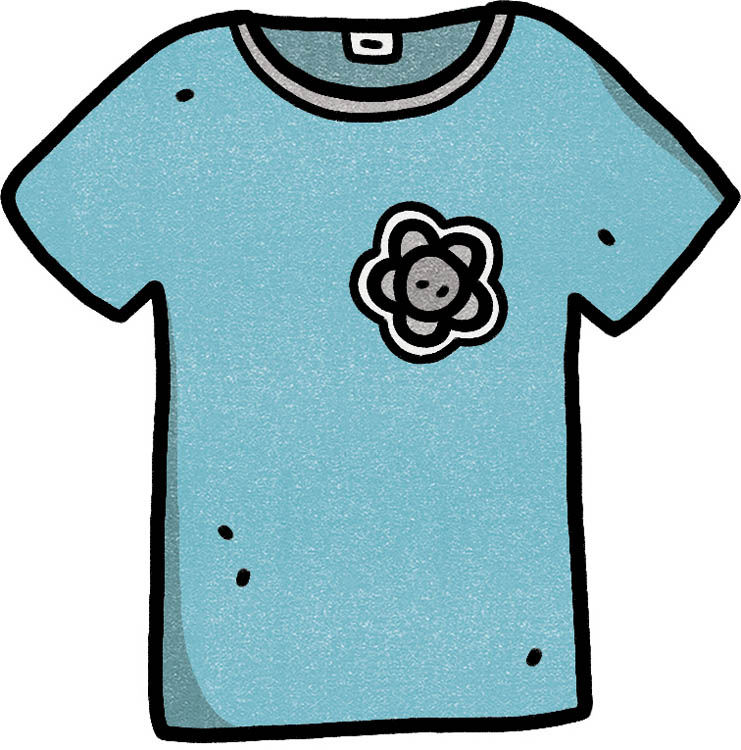

    

    

## How to Dry a Load of Laundry

1.  1. Clean out the dryer’s lint trap. There
    will be either a round screen that twists out or a flat screen that
    pulls up like a drawer at the front of the machine. Grab into the
    lint, swirl it off the screen, and throw it away (this is strangely
    satisfying). Replace the lint trap.
    

    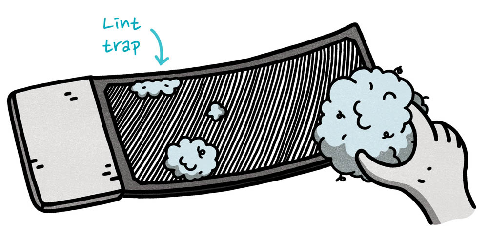

    

2.  2. Take your clean clothes out of the
    washer and put them into the dryer, shaking them out as you go to
    untwist clothes from each other so they won’t dry in a big tangle.

    Make sure you remove anything like sweaters and bras that shouldn’t
    go in the dryer. These items should get hung or laid out to dry.

3.  3. Once the clothes are
    in the dryer, close the door and choose the proper cycle. Depending
    on your machine, you will probably need to choose either a preset
    cycle or a level of heat plus an amount of time. Ask an adult to
    explain this to you once, and make yourself a cheat sheet to post
    near the machine.
    

    

    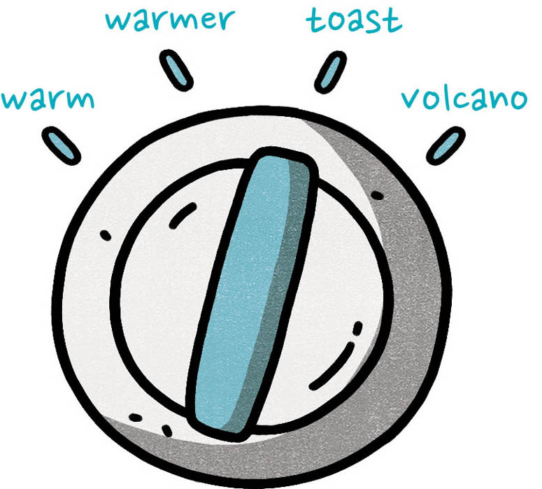

    

    

4.  4. Once the cycle is complete (this will
    usually take around an hour), remove the clothes as soon as you can
    so that they don’t sit around in the dryer and get superwrinkly. Put
    them back in the laundry basket so you can bring them somewhere and
    fold them.

5.  5. Clean the lint trap for the next user,
    who will now be able to skip step 1.

# POP QUIZ!

You put your mom’s favorite sweater in the dryer and now it looks like
it would barely fit Eeny-Beeny, your gerbil. You:

|  |  |
|----|----|
| **A.** | Dress Eeny-Beeny in it, and pretend not to know where it came from. |
| **B.** | Bury it in the backyard. |
| **C.** | Explain to your mother that now it can be used as felt, since shrunk wool won’t unravel when you cut it. (“You’re welcome!”) |
| **D.** | Show it to your mom and apologize. |

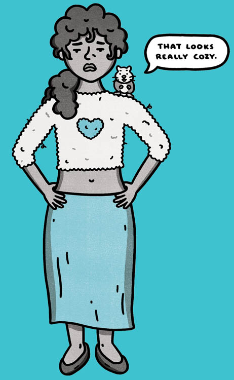

**Answer:** D. But also C! The silver lining of shrunk sweaters is free
crafting supplies. You can make slippers, arm warmers, or mittens out of
the fabric.

## How to Deal with Halfway-Dirty Laundry

Some clothes, like undies and T-shirts, go in the hamper after you wear
them once. Some clothes, like sweaters and jackets, only need washing
now and then.

And some clothes, like jeans and flannel shirts, can be worn more than
once. We call the clothes you might wear again before washing “halfways”
(halfway between dirty and clean), and they should get piled up on a
chair in a disorganized way that wrinkles everything, provides a great
nest for the cats, and makes you think you’ve lost your favorite plaid
pajamas. (Not really.)

Better strategies include hanging the halfways on hooks in the closet or
behind a door, or folding them and keeping them in a halfway basket next
to the hamper to cue you (or someone else) to go ahead and wash your
halfways if they’re doing laundry anyway.

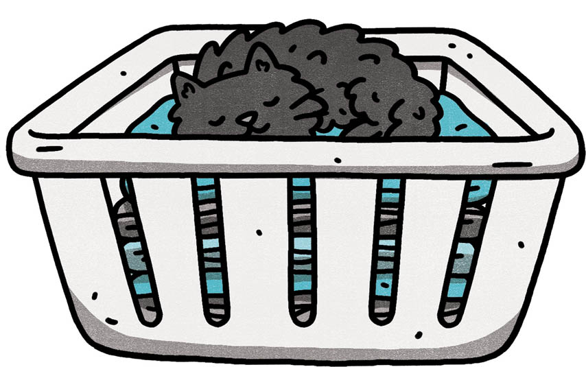

## How to Manage Clean Laundry

Once your laundry comes out of the dryer, you’ll want to hang, fold,
and/or roll your clothing so it won’t look like it’s been slept on by
hibernating bears.

- Stack undies.
- Match socks.
- Fold pants, T-shirts, and sweatshirts.
- Put pajamas wherever they go.
- Hang dresses, shirts with buttons, and whatever else you hang.

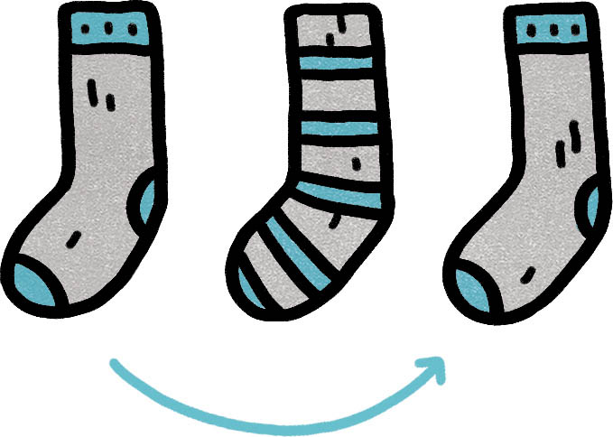

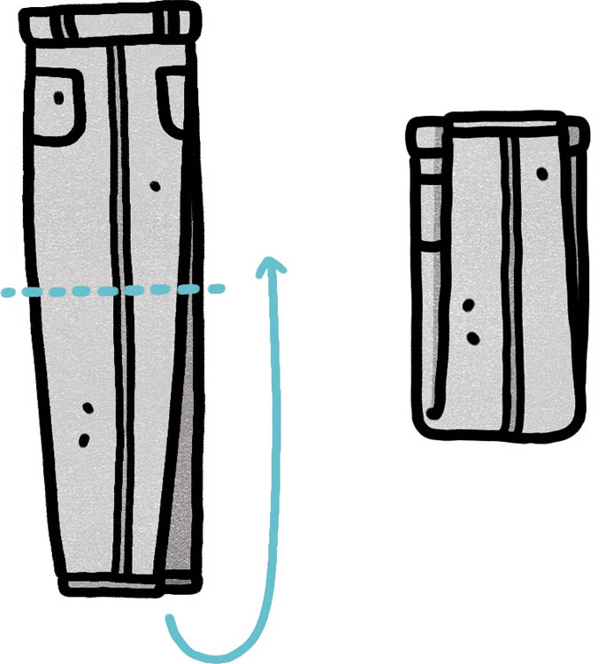

Fold pants by pairing up the legs, then folding them in half, ankle to
waist (and folding them in half again, if that’s what your dresser
needs).

### How to Fold T-shirts and sweatshirts

1.  1. Lay them out flat.
    

    

    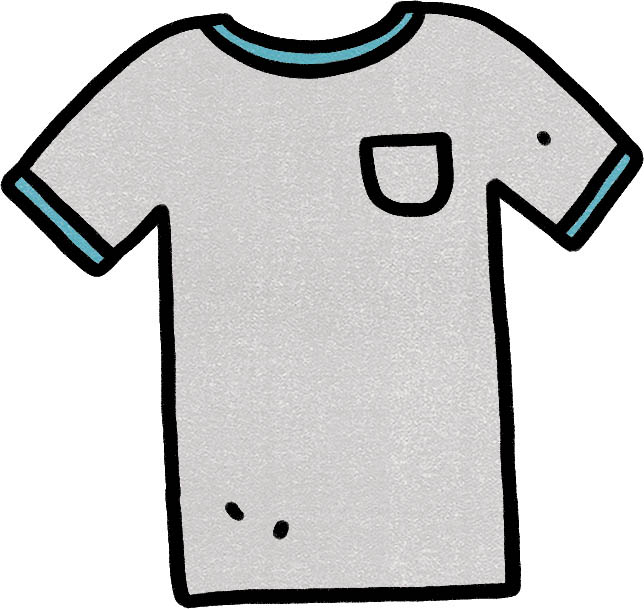

    

    

2.  2. Fold each sleeve and side in toward the
    middle.
    

    

    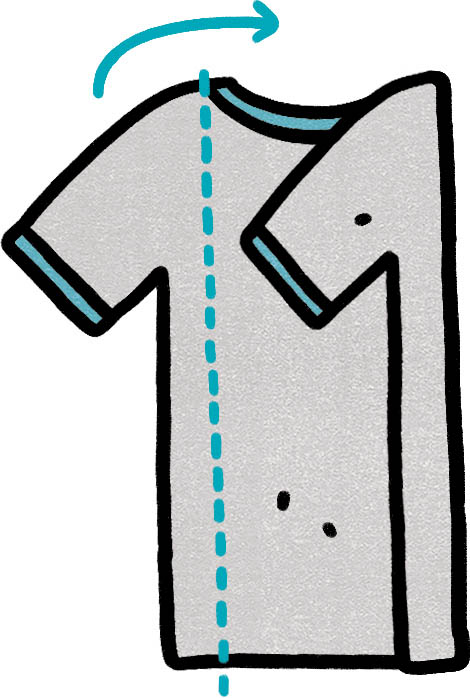

    

    

3.  3. Fold in half, waist to neck.
    

    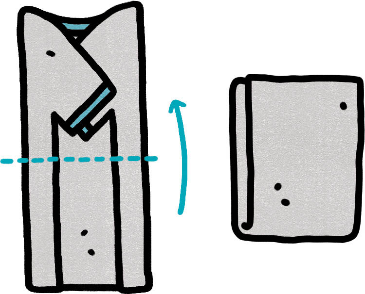

    

**Alternately:** roll up T-shirts and pants to keep them from creasing.

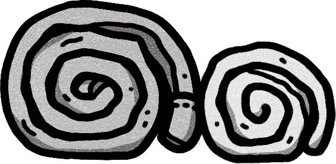

## How to Tie a Necktie

Tired of your dad leaning over your shoulder to tie your tie? He is too!
This is called the Four-in-Hand Knot, and it’s the easiest one we know.

1.  1. Drape the tie around your neck, with the
    wide end hanging down a foot or so below the narrow end.
    

    

    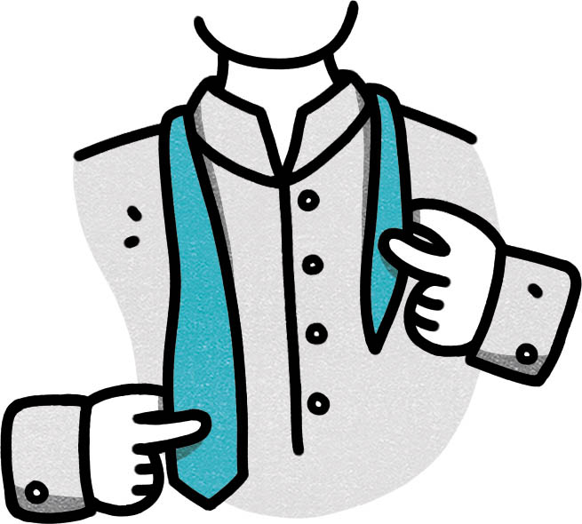

    

    

2.  2. Cross the wide part over the narrow
    part.
    

    

    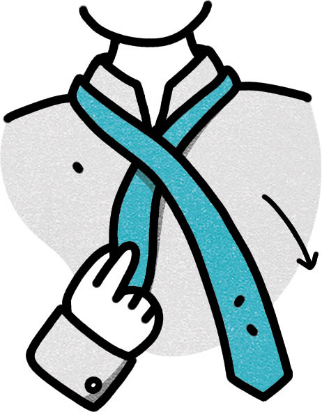

    

    

3.  3. Wrap the wide part
    under the narrow part.
    

    

    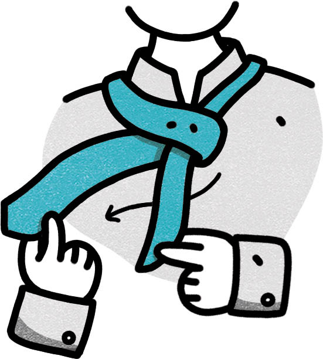

    

    

4.  4. Repeat steps 2 and 3, then pull the wide
    end up and through the loop around your neck.
    

    

    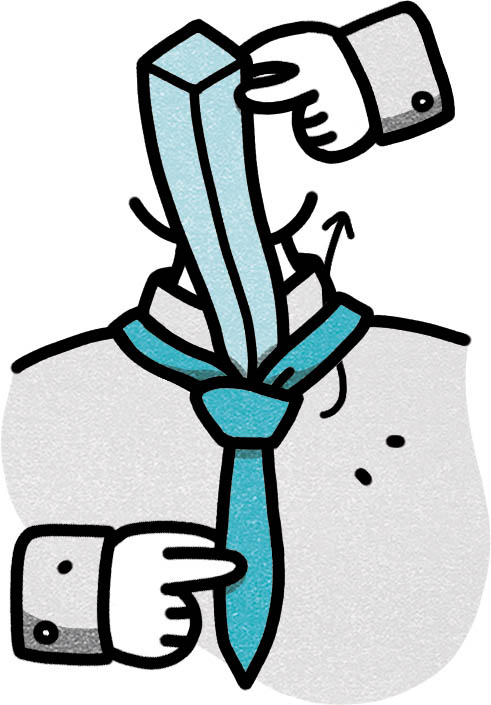

    

    

5.  5. Bring the wide end down through the
    front of the knot.
    

    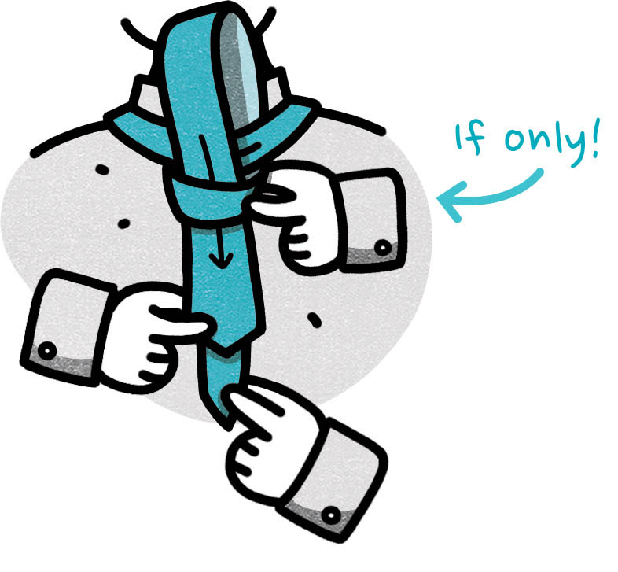

    

6.  6. Tighten by pulling gently on the narrow
    end and pulling the knot up around your collar.
    

    

    

## How to Sew on a Button

Whether a button fell off or you suddenly want an extra, it’s really
pretty easy to sew one on.

1.  1. Thread your needle with a foot or so of
    strong thread and knot one end. (See the [Overhand
    Knot](#626182HowToBeAPerson_ebook-10.xhtml__idTextAnchor020).)If
    your thread isn’t especially strong, start with a longer piece, fold
    it in half, thread one end through the needle, and knot both
    ends together.
    

    

    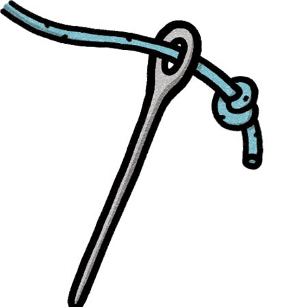

    

    

2.  2. Push the needle up through the fabric,
    back to front, in the place you want the button to end up.
    

    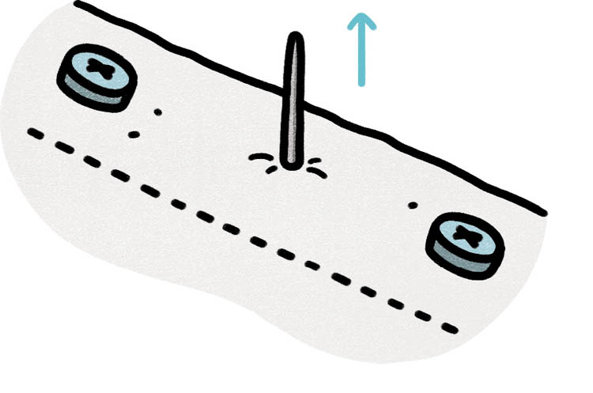

    

3.  3. Thread the button onto the needle, and
    slide the button down the thread until it rests flat against the
    fabric.
    

    

    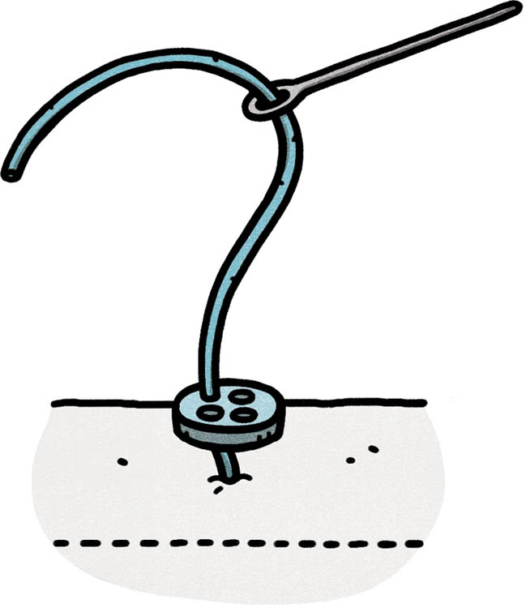

    

    

4.  4. With the button
    pressed against the fabric, push the needle down through another of
    the button’s holes and through to the underside of the fabric.
    Pull snug.
    

    

    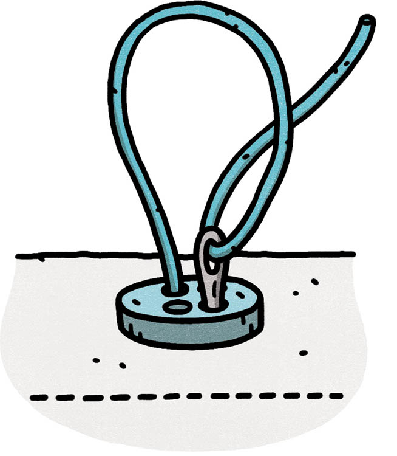

    

    

5.  5. Repeat pushing the needle up and down
    through the holes until you’ve sewn through all of the button’s
    holes at least twice. (The button will likely have two or four
    holes, unless you got some kind of strange button.)
    

    

    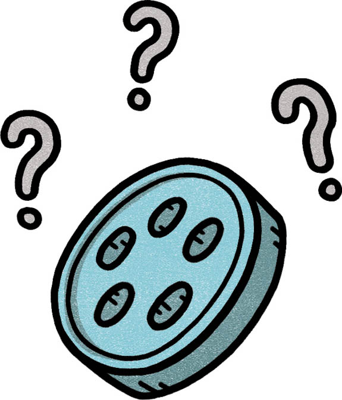

    

    

6.  6. Make a knot on the underside, close to
    the fabric. Snip the thread.
    

    

    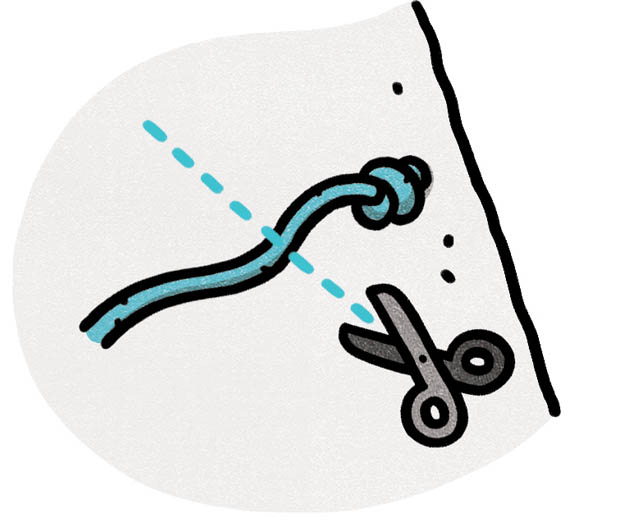

    

    

## How to Patch Your Jeans

If your jeans have deliberate holes in them, you can go ahead and wear
them just the way they are! But if there are any accidental or unwanted
holes, it’s easy and fun to patch them up.

1.  1. Cut a patch from an old pair of jeans
    that’s about an inch bigger all around than the hole you’re fixing.
    

    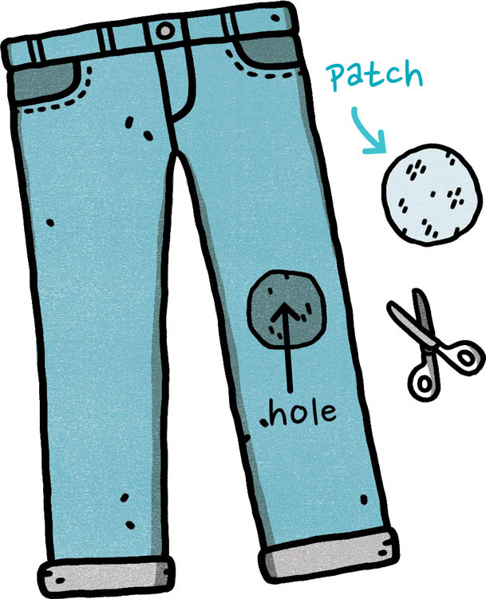

    

2.  2. With the jeans right-side out, pin the
    patch over the hole, making sure to pin only through one layer of
    your jeans, and not all the way through to the opposite side.
    

    

    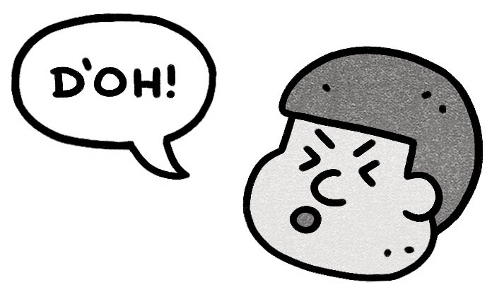

    

    If you sew the leg of your jeans shut, you will be very frustrated!

    

3.  3. Turn your jeans
    inside out. Thread your needle with a foot of heavy thread
    (embroidery thread works well for this) and knot it. Stitch around
    the hole through the patch, about
    1⁄2 inch from its
    edge, using a running or straight stitch. (Look it up on the
    Internet.) Make a knot and snip the thread. Turn your jeans back
    right-side out.
    

    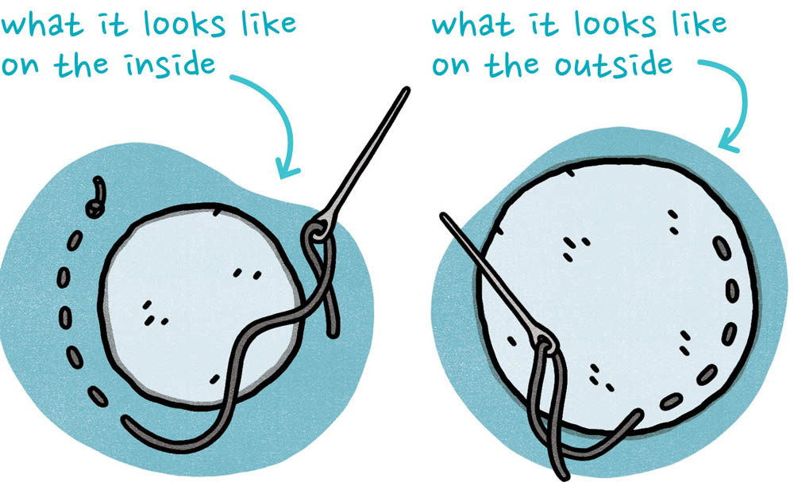

    

4.  4. If you like, you can use a whipstitch or
    a buttonhole stitch to sew around the very edge of the patch and/or
    you can fill in the rest of the patch with decorative rows of
    straight stitches or little Xs.

## How to Pack for a Trip

Yay! You’re going somewhere. What should you bring?

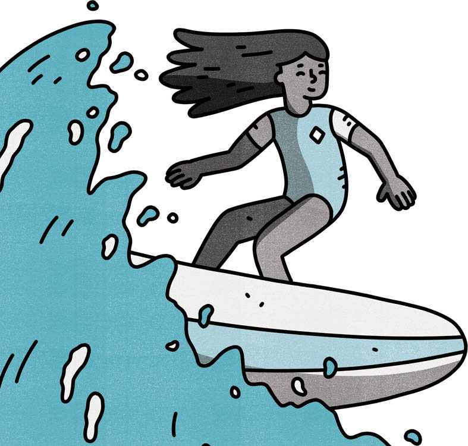

- 1 pair of underwear per day plus 1 extra for . . . good luck
- 1 pair of socks per day
- 1 pair of pajamas (more for longer trips), or whatever you sleep in
- 1 shirt per day
- 1 extra pair of pants, besides the ones you’re wearing (more for
  longer trips)
- A sweater or
  sweatshirt
- Warmer, cooler, or fancier clothing if needed, plus specialty items
  such as a swimsuit, rain jacket, superhero cape, or sequined bow tie,
  as required
- Grooming items such as toothbrush, toothpaste, floss, soap, shampoo,
  sunscreen, etc.
- The book you’re reading and a headlamp if you’re likely to be sharing
  a room with people who go to sleep before you

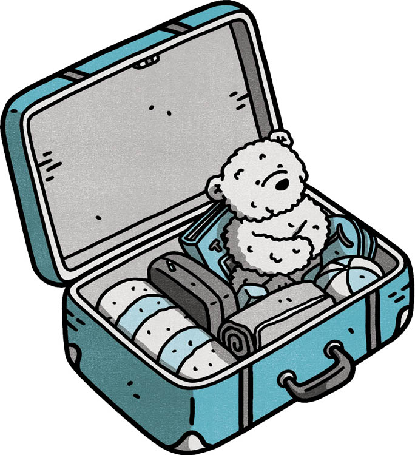

- Rolling your clothes up, rather than folding them, actually makes for
  fewer creases once you get where you’re going.
- Put extra shoes in a plastic bag before packing them.
- If you’re staying at someone’s house, send a thank-you note (see
  [here](#626182HowToBeAPerson_ebook-5.xhtml__idTextAnchor008)) when you
  get home!

# Your Two Cents

How to Get, Give, and Spend Money

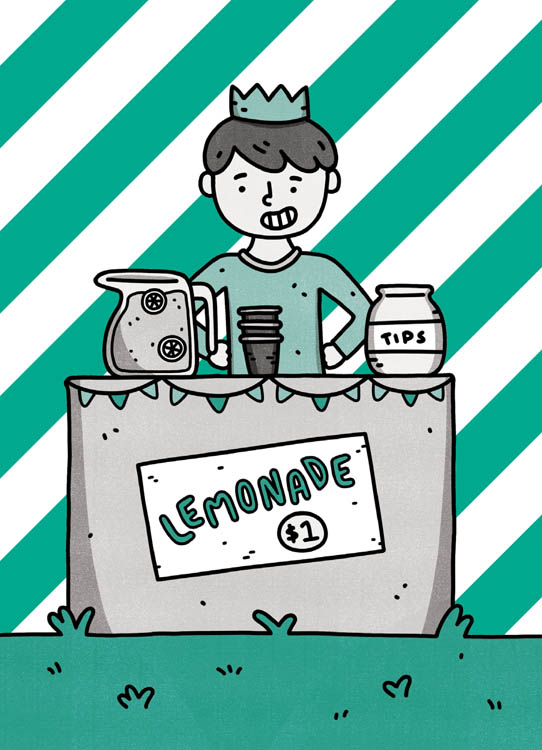

Money doesn’t actually make the world go ’round (the Earth has been
spinning for 4.6 billion years, thanks to the way our solar system was
formed). But you will need to earn it, save it, give it, and spend it
throughout your life, and here’s how.

## How to Make Money

You can earn money by selling things or selling services.

**Things** will likely be stuff you’ve made yourself, as this is the
best way to turn a profit (i.e., make more than you spend):

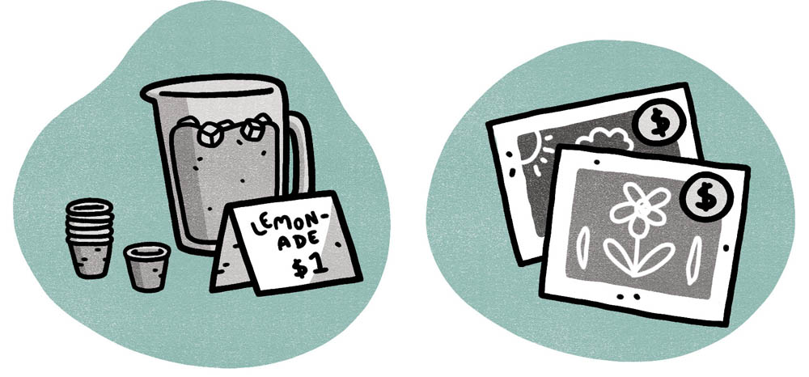

<table id="table-t2_005" class="table-t1">
<colgroup>
<col style="width: 50%" />
<col style="width: 50%" />
</colgroup>
<tbody>
<tr class="table-t2">
<td class="table-t2"><ul>
<li>lemonade or hot chocolate</li>
<li>cupcakes</li>
<li>popsicles</li>
<li>popcorn</li>
</ul></td>
<td class="table-t2"><ul>
<li>jewelry</li>
<li>clothing</li>
<li>artwork</li>
<li>your sister’s rock collection (you would never)</li>
</ul></td>
</tr>
</tbody>
</table>

Do a little research to find out what people in your area charge for
whatever it is you’re doing or selling, then get started by putting
flyers in your neighbors’ mailboxes. Once you get a few good customers,
they’ll tell their friends and you’ll be a billionaire in no time! Or
you’ll at least make enough to support your bubble-tea habit.

**Services** means the help you
have to offer, and it’s most rewarding to get a job doing something
you’re good at:

- babysitting
- pet sitting
- dog walking
- doing yard work
- washing cars
- face painting, or performing music or magic at birthday parties and
  carnivals
- tutoring in a favorite school subject
- giving lessons in piano, skateboarding, knitting, or whatever you do
  well
- offering tech support to older people (which, if you have grandparents
  with smartphones, you’re probably already doing for free)

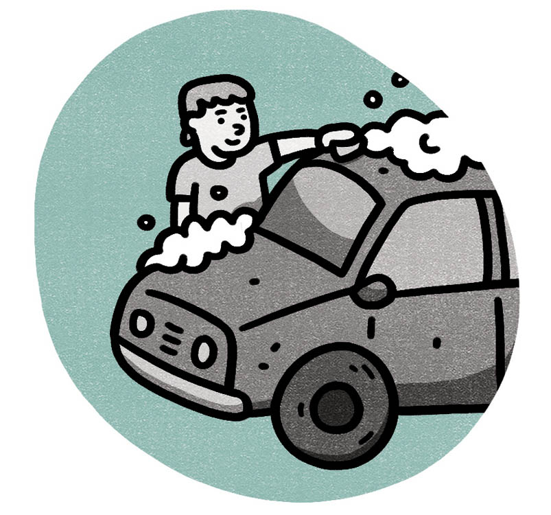

**Fun Fact.** Volunteering is another great way to offer your services.
Instead of money, you’ll get back a tremendous sense of well-being,
health, and happiness. (Volunteering is proven to release dopamine — the
same brain chemical you release when you eat a chocolate bar — and boost
your immune system.) Plus, you’ll make the world a better place!

## How to Manage Your Money

Yay! You made some money. Or you got some for your birthday, or because
you get an allowance. Now you get to decide what to do with it. The
simplest thing is to divide it into three jars:

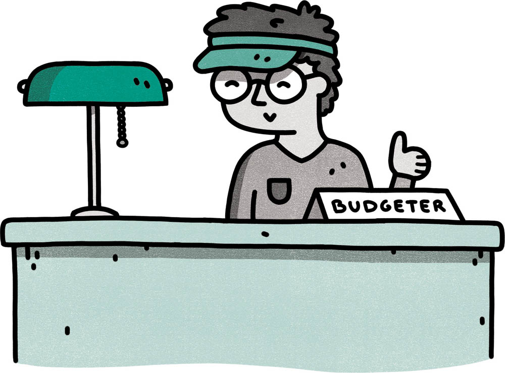

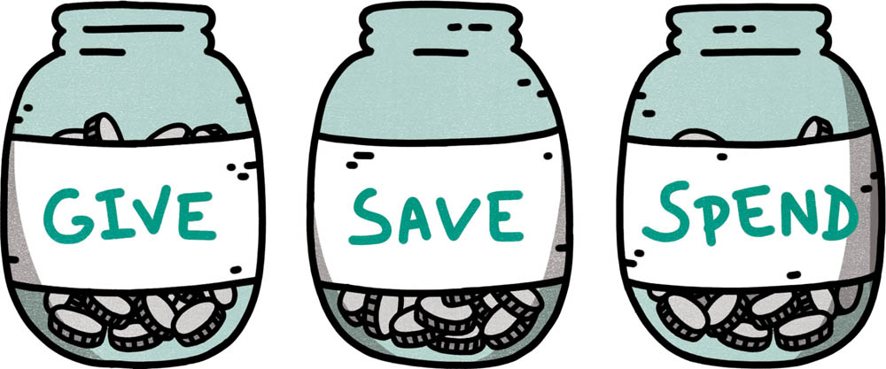

**The Give jar** is for the money you’ll give away to one or more
organizations or causes or people (see here).

**The Save jar** is for the money you’ll, um, save — either because
you’ve got your eye on something expensive, like a phone or (thinking
way ahead) a car, or because your grown-ups will expect you to
contribute to your college education one day. If you save a lot,
consider moving this money into a savings account (see [How to Save
Money](#626182HowToBeAPerson_ebook-9.xhtml__idTextAnchor017)).

**The Spend jar** is for your day-to-day desires and activities: movies,
treats, comic books, games (see [How to Spend Your
Money](#626182HowToBeAPerson_ebook-9.xhtml__idTextAnchor018)). If you
have a lot of things you tend to spend money on, you can further divide
your spending money into labeled envelopes: “comic books,” “art
supplies,” “flowers for Mom” (just kidding). You’ve now made a budget!

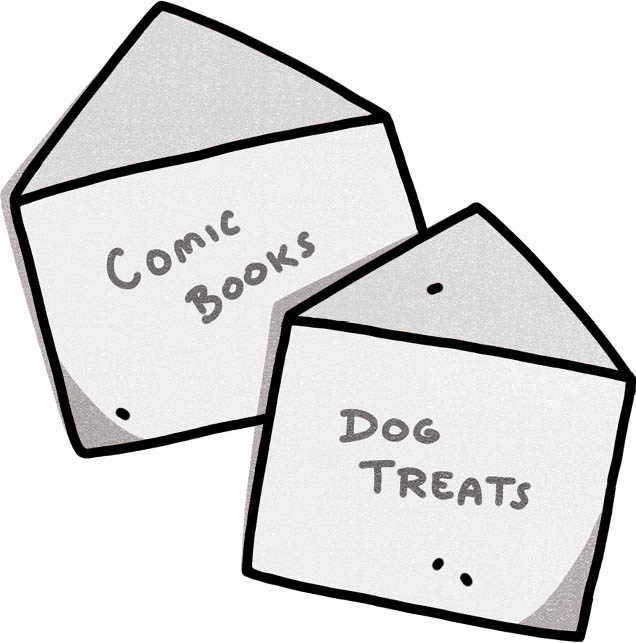

## How to Give Away Your Money

One of the best parts of getting
money is giving some of it away. If you make charitable giving a habit
now, you will probably do it your whole life, feel great about it, and
make the world a better place too! Count up your “give” money at the end
of the year, and decide what to do with it:

1.  1. **Make a list** of issues you care or
    worry about: global health, the environment, gender equality,
    endangered wildlife, disaster relief, public radio, particular
    political campaigns.
    

    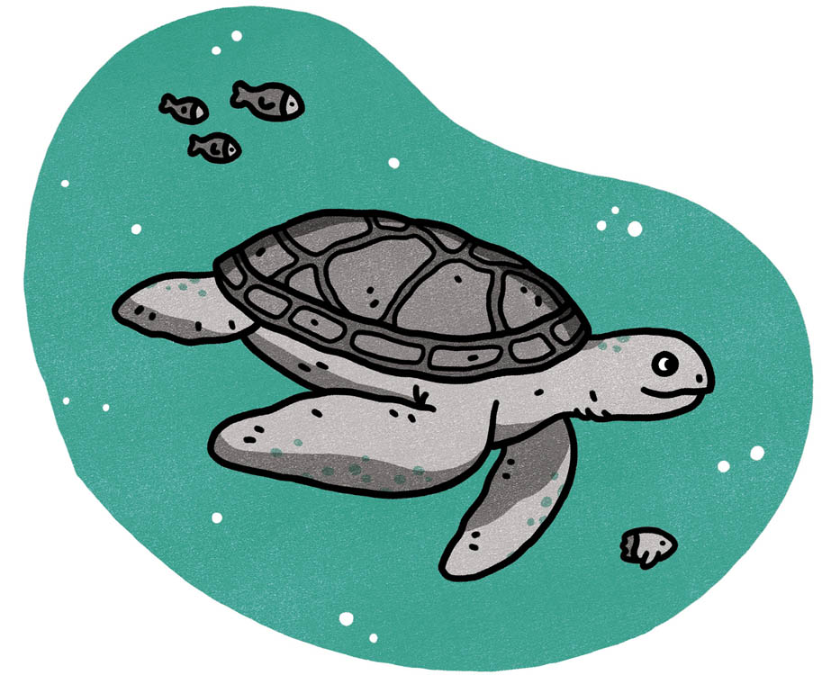

    

2.  2. **Research organizations** that do the
    work you care about. There are useful websites that can tell you a
    lot about how an organization will use your money. Try doing an
    Internet search for “charity ratings.”
3.  3. **Figure out how much** money you want
    to give to each organization, or whether you want to give all of it
    to a single organization.
4.  4. **Ask a grown-up** to help you donate,
    either by writing a check for you to mail or by helping you enter a
    credit card number online. Give your grown-up the cash in return.
5.  5. **Feel happy.**
    

    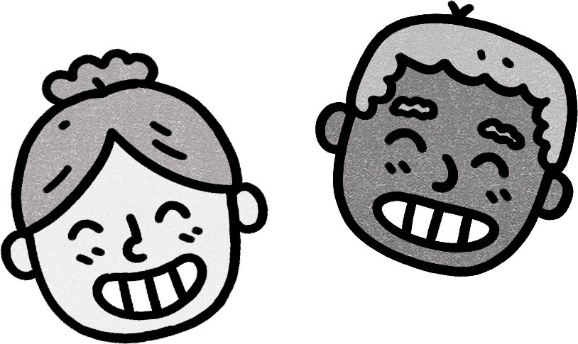

    

**Fun Fact.** Giving makes you feel good. Neuroscientists at the
National Institutes of Health have used neural imaging to show that acts
of generosity light up the pleasure and reward centers in your brain
(the same ones that light up when you get an ice-cream cone or see your
crush in the hallway).

## How to Save Money

Putting money in your “save” jar is a good short-term way to keep it.
But if you’ll be tempted to spend it (hello, blue suede sneakers!) or if
you plan to keep it for a long time, then you might want to consider
other options.

**Get it out of sight.** If your main goal is to make the money harder
to spend, then open an account at a local bank or credit union. You’ll
need an adult with you and some ID (check with the bank about what
they require), and you can ask whether a savings or checking account
makes more sense. Either way, you’ll need to keep track of your deposits
(the money you put in) and your withdrawals (the money you take out).

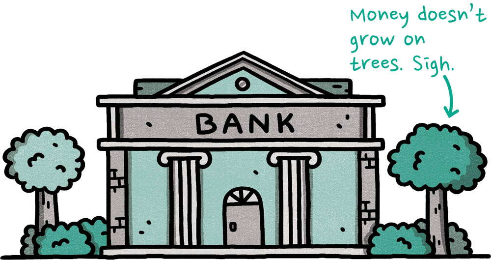

**Get interest.** If you have
more than \$100, look into accounts that earn interest (the amount you
get back from the bank investing your money). Let’s say you got an
interest rate of 2 percent and you invested \$100: at the end of the
year, the bank would give you 2 bonus dollars.

**Make an investment.** If you have \$1,000 or more and you can commit
to saving it for at least a year, research other kinds of
interest-earning investments, such as CDs (certificates of deposit), or
even putting some money in the stock market.

- There are lots of websites that help you compare interest rates and
  options, including specific accounts for kids and teens.
- Wherever or however you invest, try to make sure that your money is
  supporting work or products you believe in. You’d hate to find out,
  for example, that it was getting invested in cigarettes, or working
  against a cause you cared about.

## How to Spend Your Money

Spending money is easy enough — but making spending decisions that have
a positive impact on your life, the planet, other people, and your
budget? Well, that’s a little harder.

**Create less waste —** which will also cost you less money! Mend your
jeans with a cool patch (see
[here](#626182HowToBeAPerson_ebook-8.xhtml__idTextAnchor015)); jazz up
your old flip-flops with glitter glue; shop for clothes at the thrift
store; check books out of the library; get a reusable cup and make your
iced tea at home.

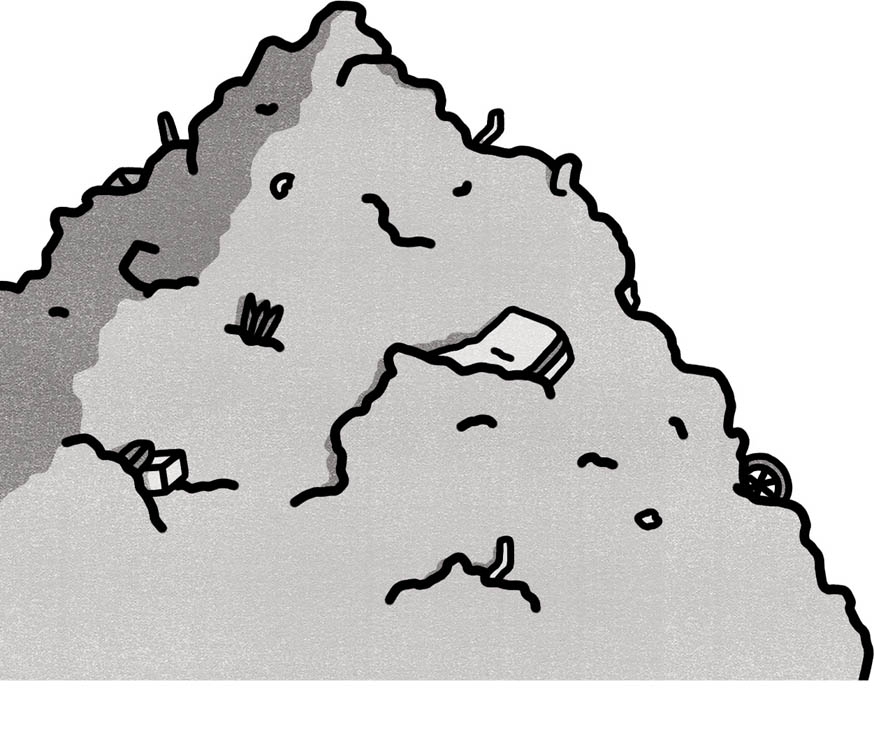

Watch the short animated film “The Story of Stuff” to understand more
about the cycles of mass production and waste in our culture.

**Think about the money you spend** as your investment — in a particular
company, a particular product, a particular way of treating workers or
the planet. Find out more, if you need to, so you can feel confident
about that investment.

**Leave the store** if you’re suddenly dying to buy something you know
you don’t need and haven’t even thought about before (we call this “an
attack of the wanties”). Then see if the wanties go away.

**Keep in mind (and sight)** the big item you’re saving for — a horse, a
bike, college, a phone, concert tickets, a trip to visit your best
friend from camp — by taping a photo of it to your wallet. Then when you
go to spend your money, you’ll remember why you might want to save it
instead.

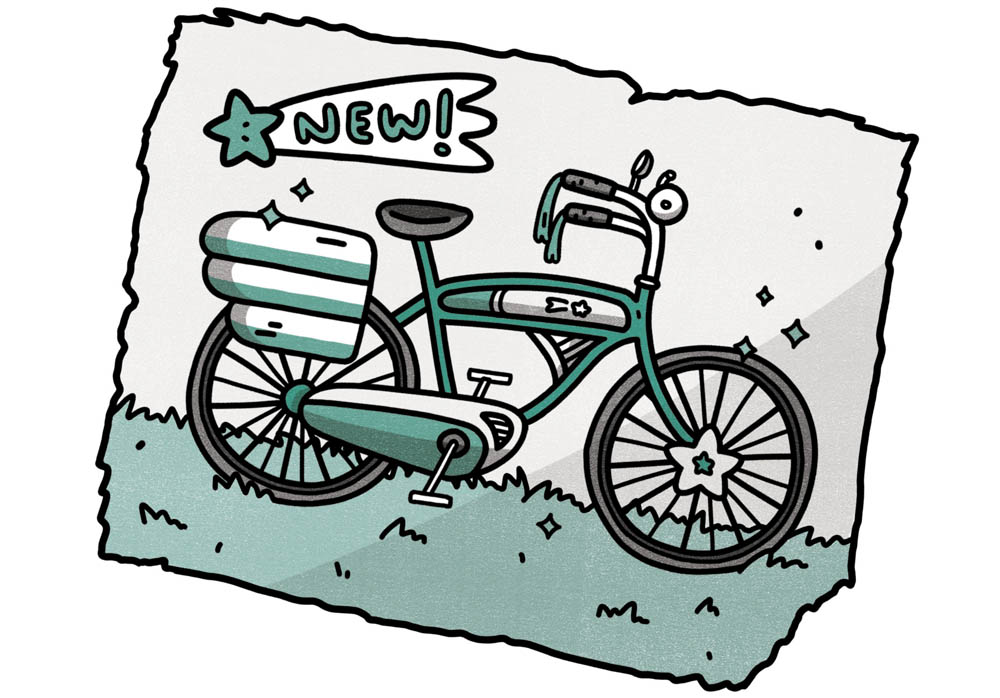

**Consider the research** that shows that spending money on experiences
— trips, concerts, meals, time with friends — brings more pleasure than
spending money on things.

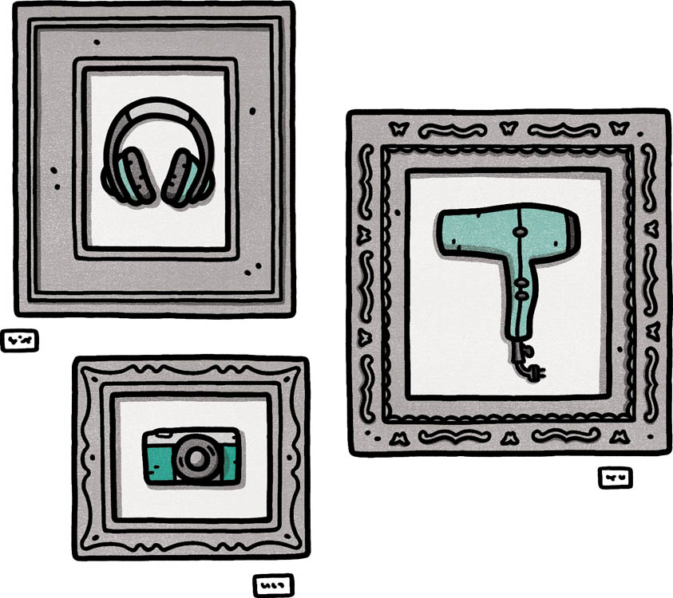

The experience of shopping is kind of a confusing middle ground! We
sometimes jokingly call stores “thing museums” to put us in a
looking-rather-than-shopping mind-set.

# POP QUIZ!

What’s a good reason to buy something you don’t actually need?

|  |  |
|----|----|
| **A.** | According to the ad, having/wearing/drinking it will make you beautiful, wealthy, and popular. |
| **B.** | According to gender stereotypes, you need to have/wear/drink it to be the “right” kind of boy/girl/man/woman. |
| **C.** | If you don’t have/wear/drink it, you will look like Shrek and also have zero friends. |
| **D.** | Having/wearing/drinking it would make you happy. |

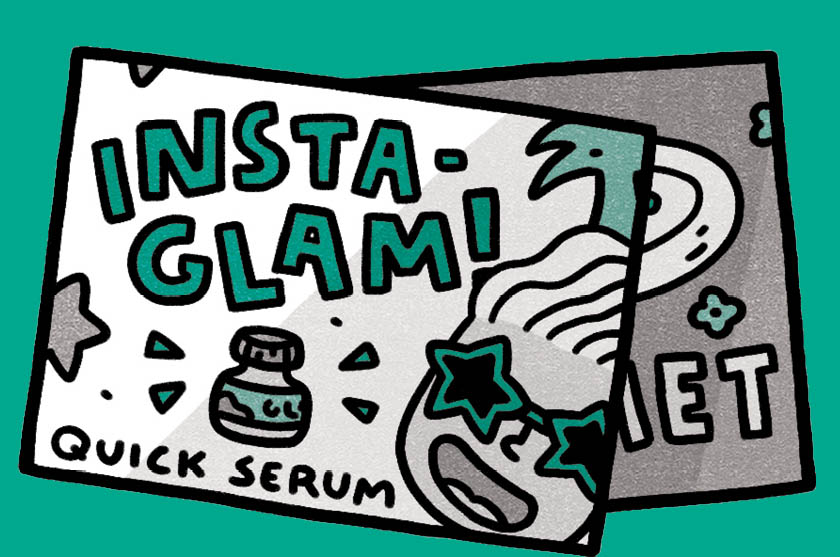

**Answer:** D. You’re too smart for marketing campaigns that assume you
can’t use your brain, need to conform, or only care about what other
people think. (Too bad they already spent all their money on those ads!
Ha ha ha!)

## How to Have a Debit Card

A debit card lets you buy something without using real-life cash. But
it’s different from a credit card because you’re only spending your own
money. (With a credit card, you’re borrowing money until you pay your
bill.) A debit card makes it impossible to spend more money than you
actually have — which means you won’t ever owe money, and you won’t ever
pay interest.

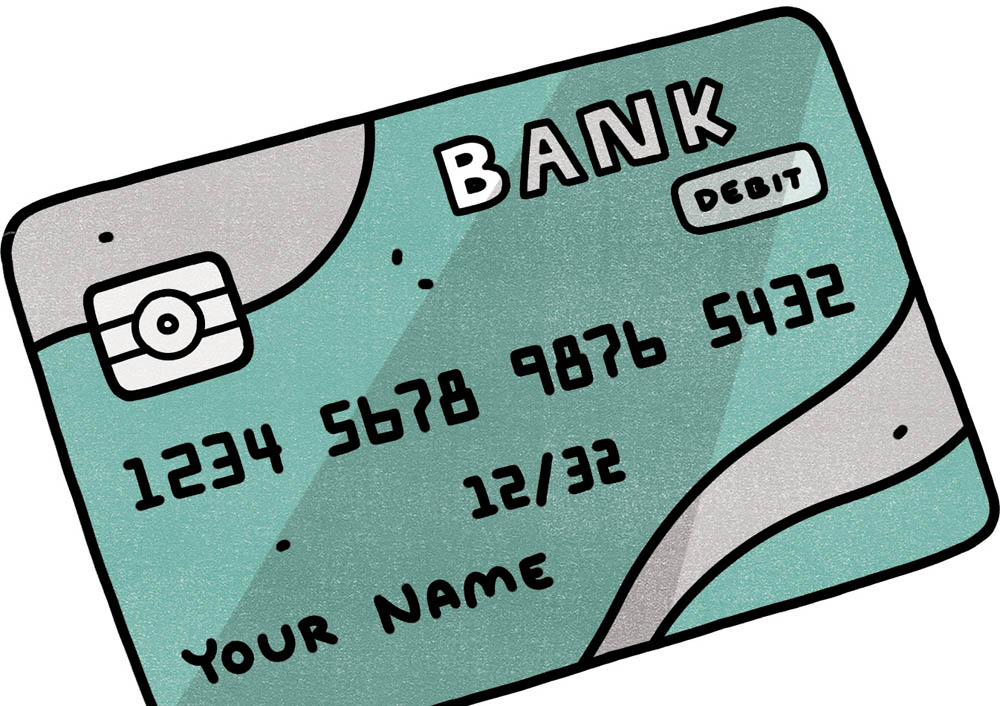

There are two main kinds of debit cards:

- One is connected to your bank account, so anything you spend is
  subtracted from the amount of money you’ve deposited in your account.
- The other is prepaid, which is kind of like a gift card: you (or your
  grandparents or favorite aunt) load money onto the card, and then
  anything you spend is subtracted from that amount.

1.  1. When it comes time to pay for the book,
    movie ticket, or chai you want to buy, slide your debit card through
    (or insert it into) the card reader at the register.
    

    

    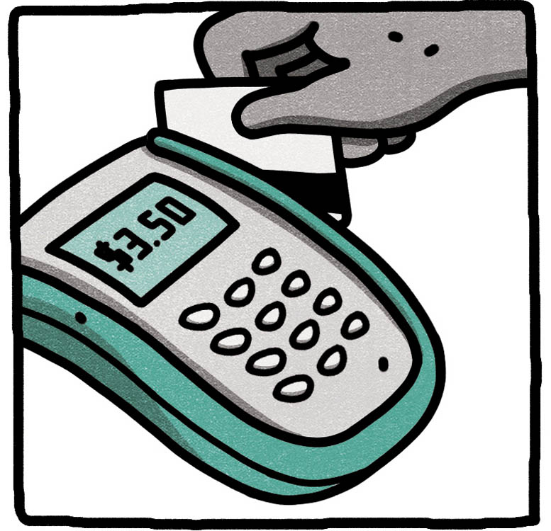

    

    

2.  2. Then you punch in a security code,
    called a PIN (or personal identification number), which tells the
    bank it’s really you (you’ll choose or be assigned this number with
    the card).
    

    

    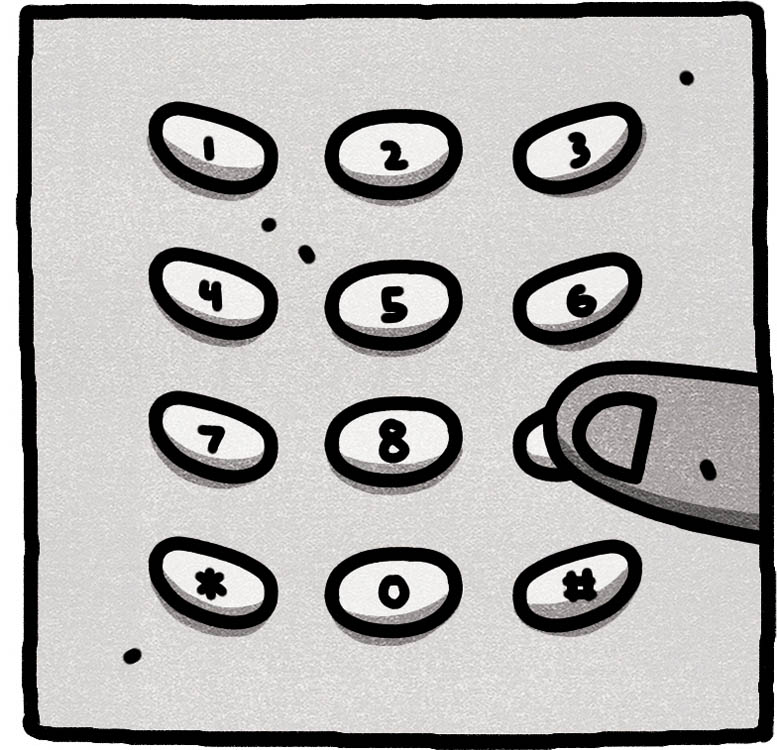

    

    

3.  3. Look up from all the sliding and
    punching to thank the person who checked you out
    

    

    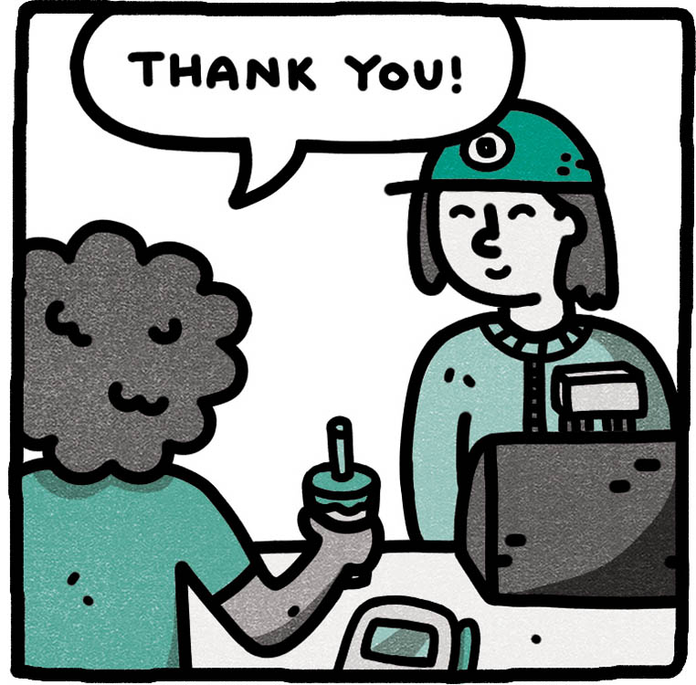

    

    

**Fun Fact.** The personal identification number “1234” accounts for
more than 10 percent of all PINs. Maybe pick something different?

## How to Calculate the tip

If someone serves you kimchi tacos at a restaurant or delivers a pesto
pizza to your home or drives the taxi you’re taking to a Broadway play
(#dreaming), then you will pay them a tip. This is an extra amount
beyond the cost of the service or purchase, and it’s not really optional
because folks in service jobs count on this money to make a living wage.

**As a general rule,** tip 20 percent of the total cost of the bill or
charge. An easy trick for this is to calculate 10 percent, and then
double it.

Figuring out 10 percent is easy: it usually just means lopping off the
last zero. If your kimchi tacos were \$5.00, then you would calculate 10
percent as 50¢, and then double it: \$1.00. (If your bill was \$4.90,
you could just round up to \$5.00 first.)

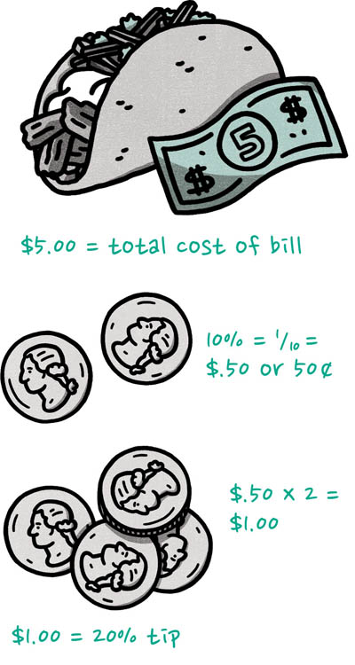

**An exception is pizza delivery,** where you can tip less — 10 or 15
percent — but you should tip at least \$5 per delivery, even if that’s
more than 15 percent of the cost of the pizza.

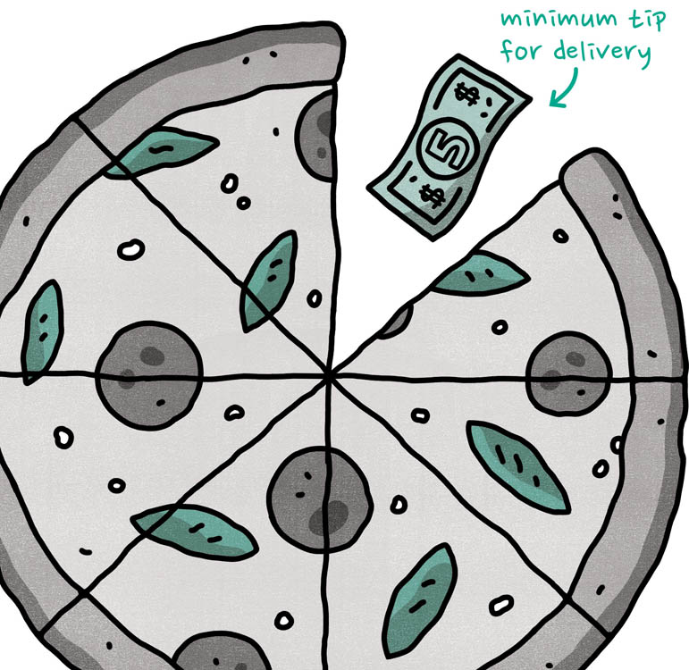

**If you see a tip jar at a café** where you’re ordering at the counter,
you can put \$1 or some change in it, especially if you’re planning to
hang out for a long time talking to your friends over a single mug of
chai.

# Useful Skills

How to Do Basic Important Things

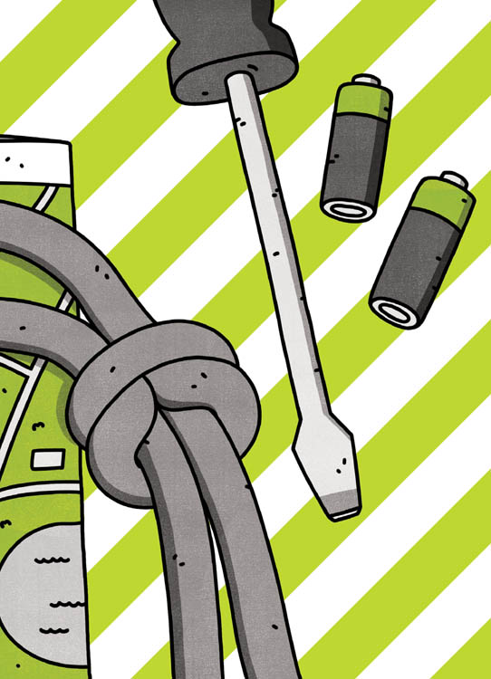

There are some things you will just need to know how to do on and off
throughout your life. We’ve gathered up a few of them here to make a
chapter that’s kind of a collage of repair and improvisation.

## How to Tie Basic Knots

Knots tend to solve attachment problems, like “How do you attach two
ropes together?” or “How do you attach one thing to another thing?” And
knowing how to tie a couple of knots is especially helpful if you’re
going to be sailing, camping, rock climbing, or mountaineering.

### Overhand Knot

An overhand knot makes a kind of stopper at the bottom of your rope,
string, or thread, and it’s the basis for lots of other knots. It’s also
useful on its own to keep a rope from unraveling or to keep the beads
from falling off the bottom of your string.

Make a loop of rope and pass the end through.

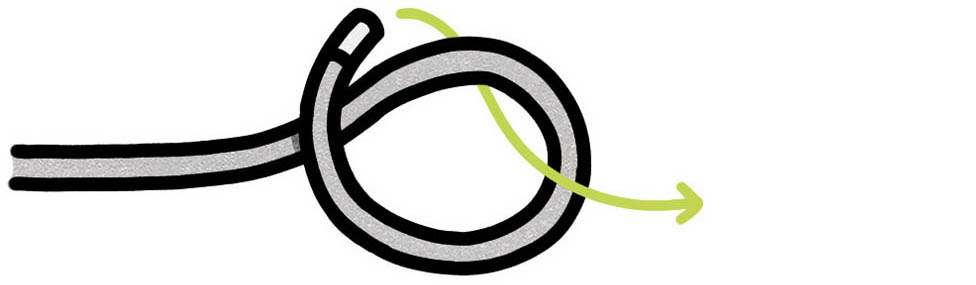

Pull to tighten.

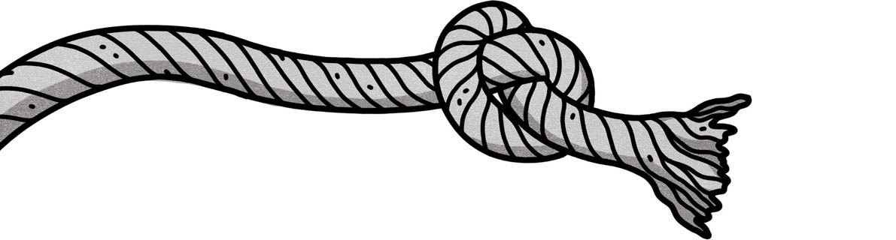

### Square Knot

A square knot is a strong, attractive way to tie together two ends of
rope, to attach two ropes together, or to secure one rope around
something else. It’s an important knot for sailors and scouts, but you
can also use it in crafts such as macramé.

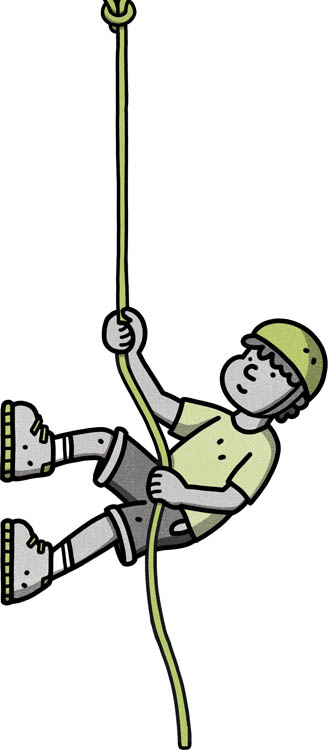

Hold an end of the rope in each hand. Pass the working end (the gray
one) over and under the standing end (the green one).

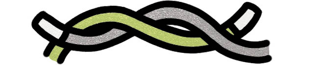

Pass the working end (still the gray one) over the standing (green) end.

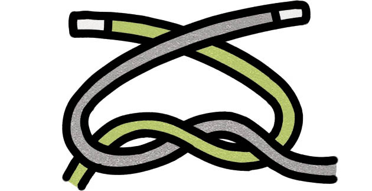

Pass the working end under and up through the standing end. Tighten by
pulling both ends at the same time.

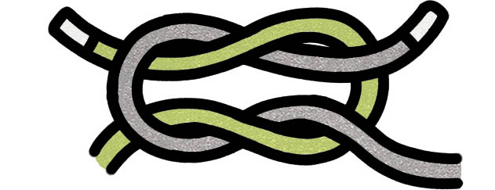

### Clove Hitch

Used by boaters and climbers, this is a great knot for tying a rope to a
pole or a line to a mast.

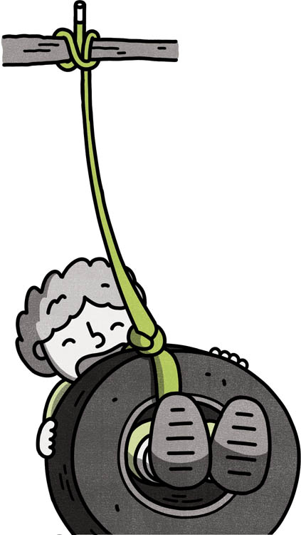

Pass the working end of the rope around the pole (or rod or tree limb).

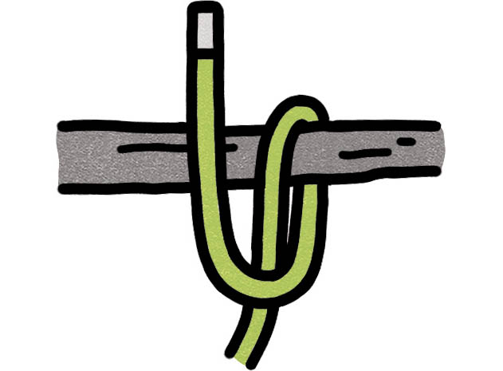

Continue wrapping over the standing end and around the pole a second
time.

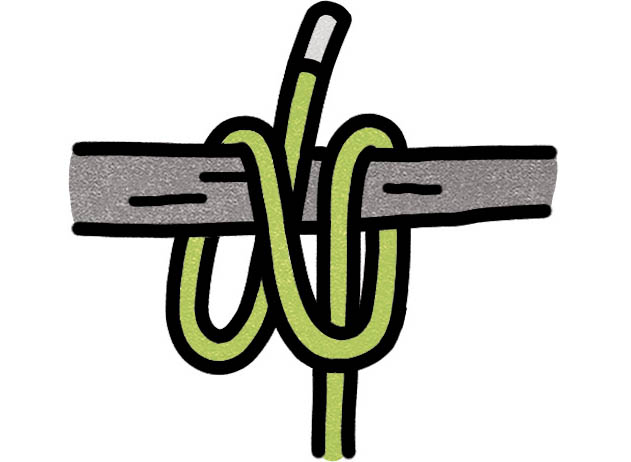

Thread the end under itself and pull tight.

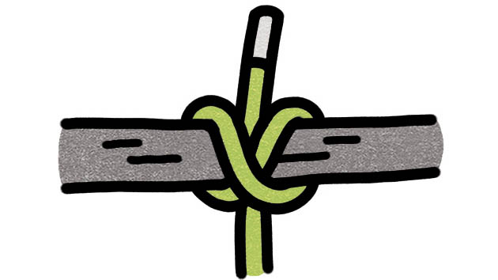

### Braid

Okay, this isn’t really a knot, but it’s a fun and useful skill to know.

Start with three lengths of rope or yarn or hair or whatever you want to
braid, and bind the ends together with tape or a rubber band. (In the
case of hair, someone’s scalp will do this for you.)

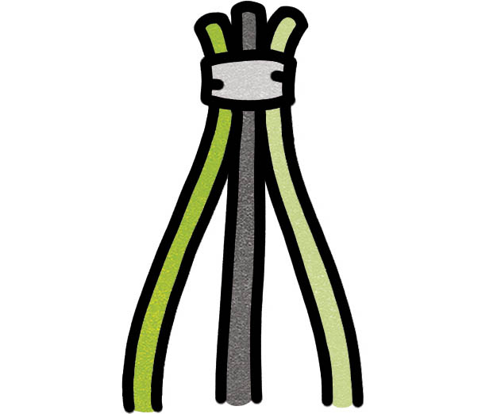

Pass one outside strand across the center strand.

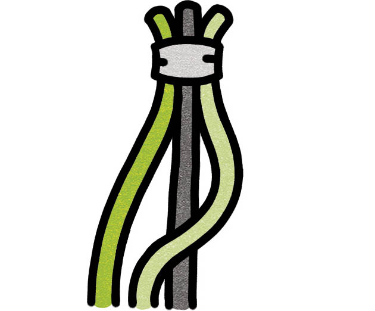

Then pass the other outside strand across the new center strand.

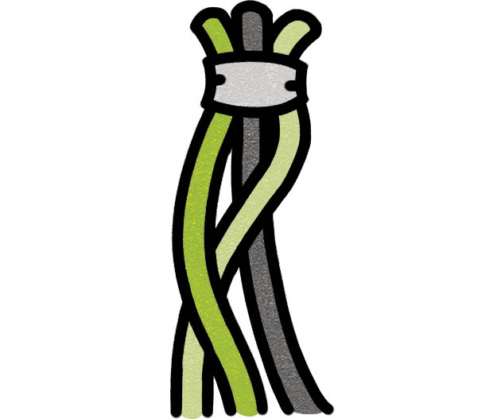

Repeat, alternating one side and then the other, until you come to the
ends, which you can knot (unless it’s hair — then use a hair band
please).

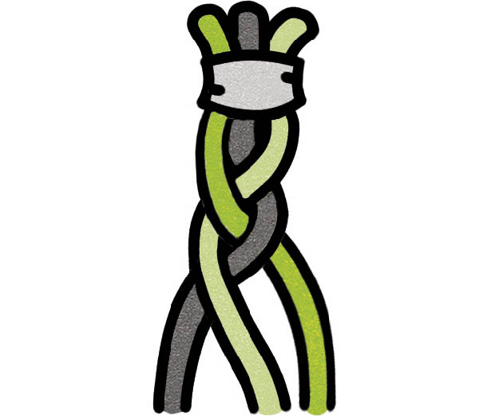

## How to Build a Fire

Outdoor fire pit, woodstove, or fireplace — wherever you build it, most
of the fire-making principles are the same.

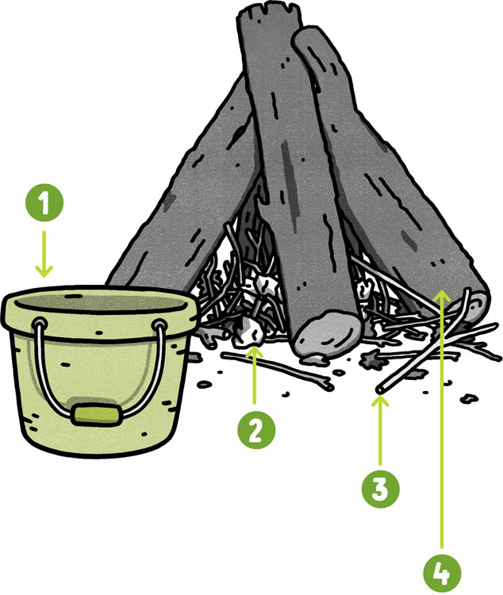

1.  1. You need a bucket of water to put out an
    outdoor fire.
2.  2. Place tinder in the center of the fire.
3.  3. Arrange kindling around and on top of
    the tinder
4.  4. Lean larger pieces of firewood against
    the cone of kindling.

1.  1. First, if you’re
    outside, make sure there’s not a ban or restriction on campfires,
    and that you’re using a designated fire pit. Be sure you have a
    bucket of water to put the fire out when you’re done with it. If
    you’re inside, make sure you know where the fire extinguisher is.
2.  3. Arrange the **kindling** — twigs and
    small sticks — around and on top of the tinder, in an upside-down
    ice-cream cone shape. Don’t pack it too tight, since your fire will
    need air to breathe. Hold some kindling back to feed the fire as it
    gets going.
3.  2. Gather the **tinder**. This is the
    easily lit dry material that will be at the center of your fire:
    twisted-up newspaper, shredded bark, dry pine needles, and, in a
    pinch (if you didn’t eat them all), tortilla chips. Pile this up in
    the center of your fire area.
4.  4. Lean **larger pieces
    of firewood** against the cone of kindling you’ve built, balancing
    them against each other like a game of Jenga you’re planning to win.
    Hang on to your biggest logs for now.
5.  5. Use a match or lighter to ignite the
    tinder. If the kindling doesn’t seem inclined to catch, you can
    gently blow on the fire or fan it with a piece of cardboard or a
    flattened cereal box.
6.  6. Feed the fire some of your reserved
    kindling as necessary until it seems nice and raging. You can add
    your biggest logs once you’re sure that the larger pieces have
    caught.
7.  7. Make s’mores/sing songs/tell ghost
    stories.
8.  8. When you’re done (if you’re outside),
    dump water on the fire until the flames go out, then stir the fire
    with a stick while you dump more water on it until the site is cool.
    If you’re inside, make sure the fire is safely contained in the
    fireplace or woodstove before you leave the room.

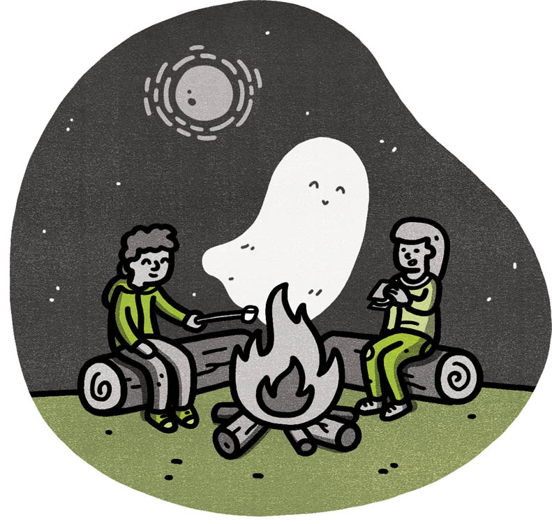

## How to Change Batteries

Your headlamp, wristwatch, graphing calculator, or smoke detector died.
Sad! But you can revive it with new batteries.

1.  1. **First, figure out where the batteries
    are.** They’re usually in a special compartment that has a little
    snap-open door, except in flashlights, where the batteries tend to
    live behind a screwed-on cap.
    

    

    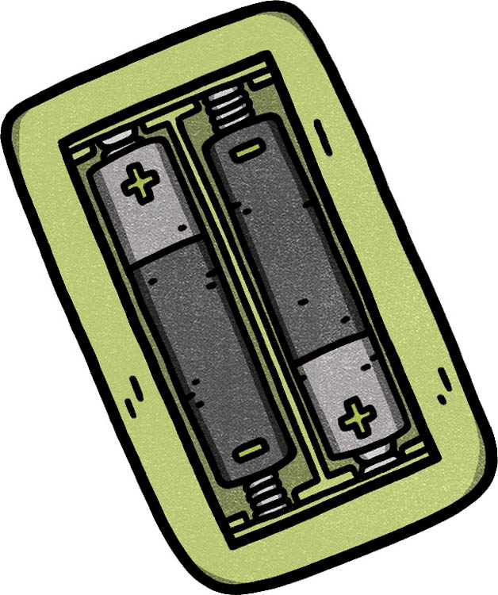

    

    

2.  2. **Before you take the old batteries
    out,** study how they’re arranged so you’ll know how to put in the
    new batteries. If it’s a single little button battery, figure out
    which side is up and which is down. If there are multiple batteries,
    they might be arranged in alternating directions, like a group of
    cousins sleeping head-to-toe in a bed. The **+** end of the battery
    will push up against a little plate, and the **-** end of the
    battery will push into a coily spring. (A 9-volt battery will have a
    snap connection instead.)
3.  3. **Remove the
    batteries,** figure out what kind/size they are, and make sure you
    have the right number of new (or charged) batteries.
4.  4. **Put in the new batteries,** and make
    sure they’re all the same: don’t mix old and new batteries, or
    rechargeable and disposable batteries.
5.  5. Snap the little door closed.

# A Few Battery Sizes

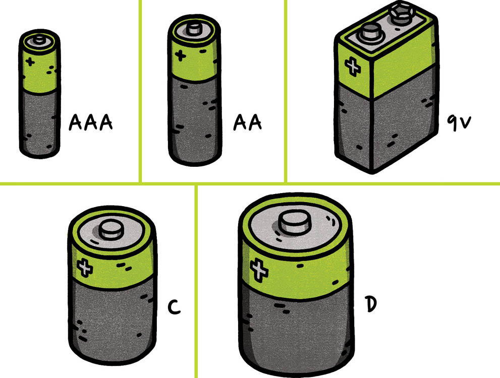

# POP QUIZ!

You replaced the batteries in your headlamp because the light was very
dim. The old batteries still work a little, though. Now what?

|  |  |
|----|----|
| **A.** | Pin a gold star to yourself. |
| **B.** | Mix them back in the package with the new batteries, since someone else will probably be overjoyed when their calculator conks out halfway through the SATs. |
| **C.** | Leave them on the coffee table, kitchen counter, or dining table. It seems crazy to throw out perfect barely working batteries! |
| **D.** | Recharge the batteries if they’re rechargeable, or, if they’re disposable, put them in the trash (unless the package tells you to recycle them or to dispose of them in a special way). |

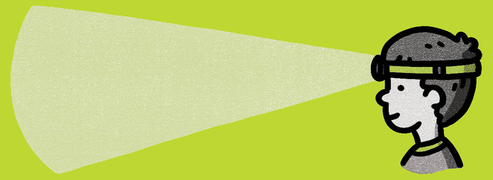

**Answer:** D. (Then, if you want, A.)

## How to Tighten a Screw

If something is loose — the faucet, a chair, your bookshelf – fixing it
might be as simple as tightening a screw! To make sure you pick the
right tool for the job, look at the screw first.

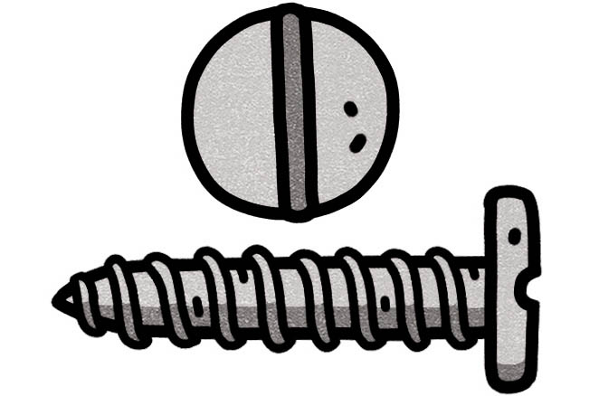

If it’s a flat-head screw, it will have a straight line across it.

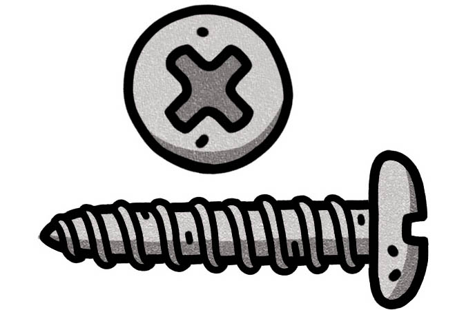

If it’s a Phillips-head screw, it will have an X.

Find the screwdriver that matches your screw: a flat-head screwdriver
will have a flat tip; a Phillips-head screwdriver will have a pointy tip
in the shape of a cross.

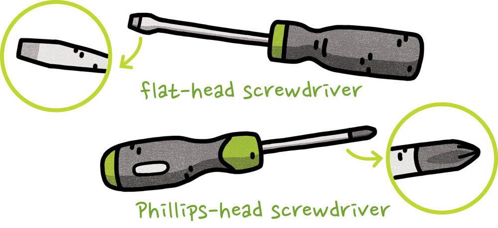

Once you figure out the type and size of screwdriver you need, stick the
tip into the slot or X of your screw and turn the screwdriver toward the
right to tighten it.

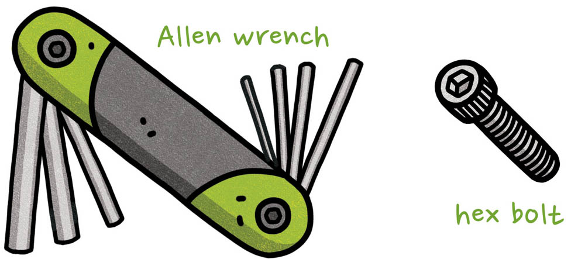

“Righty Tighty/Lefty Loosey” is a good mnemonic device to remember which
way to turn the screwdriver — and you can use it for light bulbs too.

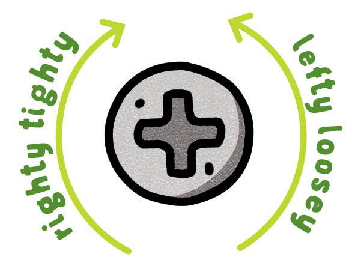

When something on your bike, skates, or skateboard needs tightening, you
might need a different tool. If instead of a straight line or an X you
see a little hexagonal shape in the middle of your screw or bolt, then
you need an Allen wrench (or hex key). An Allen wrench is usually an
L-shaped metal bar with a hexagonal head at each end. (It might also
come as part of a set in a Swiss Army knife–type of body or there might
be a bunch of them connected by a ring.) You’ll need to find the right
size wrench before tightening or loosening your screws or bolts.

## How to Use a Swiss Army Knife

Whether you’re an outdoorsy fish-scaling kind of person or more of a
living-room whittler, a Swiss Army knife is so useful and cool. No
matter what tools you have on yours, here are some all-purpose tips for
keeping yourself (and everyone around you) safe while you use it.

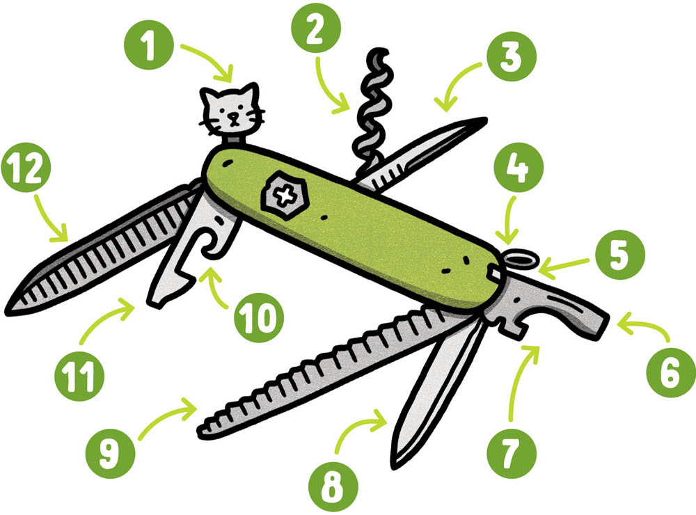

<table id="table-t2_006" class="table-t1">
<colgroup>
<col style="width: 50%" />
<col style="width: 50%" />
</colgroup>
<tbody>
<tr class="table-t2">
<td class="table-t2"><ol>
<li>1. cat head</li>
<li>2. corkscrew</li>
<li>3. punch</li>
<li>4. key ring</li>
<li>5. toothpick and/or tweezers</li>
<li>6. bigger flat-head screwdriver</li>
</ol></td>
<td class="table-t2"><ol>
<li>7. bottle opener</li>
<li>8. small blade</li>
<li>9. saw</li>
<li>10. can opener</li>
<li>11. smaller flat-head screwdriver</li>
<li>12. large blade</li>
</ol></td>
</tr>
</tbody>
</table>

The **large blade** is useful for whittling (always push the sharp edge
away from you).

The **punch** is good for carving out holes in wood or leather.

Try opening a can of beans to practice using the **can opener**.

- Use only one blade or tool at a
  time.
- To open a blade or tool, hold the body of the knife in your nonwriting
  hand. Stick the thumbnail of your other hand in the little groove and
  carefully pull it out from the body of the knife until it’s open
  enough for you to safely grasp it, then open it the rest of the way.
- Never grab the sharp side of a blade.
- Cut, punch, or carve **away** from your body so you’ll be safe if the
  knife slips.
- When you’re done, make sure the blade or tool is clean (rubbing
  alcohol on a cotton ball will remove sap), then pop it back into the
  body of the knife. Do this safely by holding the sides of the knife’s
  body with one hand, keeping all your fingers away from the slot that
  the tool or blade is going back into, and then using your other thumb
  to push on the dull side of the blade toward the body of the knife
  until it snaps into place.

**Fun Fact.** The Wenger Giant is the biggest Swiss Army knife in the
world, and it has 87 tools!

## How to Read a Road Map

Reading a paper map is a great skill to have not only because you could
lose your GPS signal sometime, but also because it helps you understand
where you are in the world. Plot your route **before** walking, riding
your bike, or navigating while someone’s driving (or while you’re
driving yourself, yoiks).

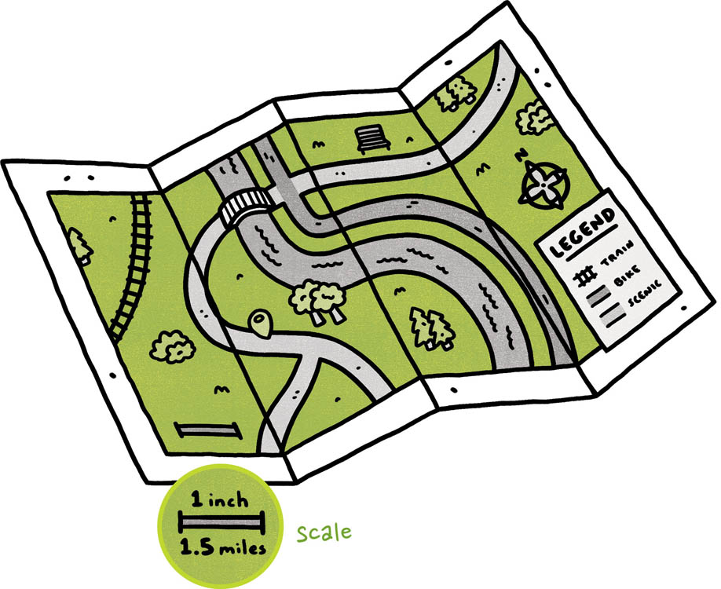

1.  1. Get an area map from
    your local visitors’ center or a gas station, or get a road atlas
    from the book shop.
2.  2. **Learn the legend.** The map will have
    a box somewhere that translates its symbols.
3.  3. **Understand the map’s scale.** This
    will translate distance on the map into distance in real life.
4.  4. **Find yourself.** This is like the
    “start” arrow on a maze — also called “point A.” If you’re not sure
    where you are, see if you can find the nearest roads or landmarks.
5.  5. **Figure out where you’re going** — the
    end point, also called “point B.” Plot your route. Consider whether
    it will be scenic, if you’ll travel on small roads or big highways,
    or, if you’re riding your bike, what the best bike routes are.
6.  6. **If you get lost** (“point Z”) just
    call this a “learning detour.” Consult your map and start over.

If you’re hiking you might use a topographic map, which gives you a 3-D
sense of the land. Concentric contour lines show elevation: the closer
together the lines, the steeper the uphill or downhill. You can tell the
difference between uphill or downhill by the number next to the line.
The number represents the elevation in feet: increasing numbers show an
uphill, and decreasing numbers show a downhill.

## How to Be Happy

You won’t experience happiness every second of your life — and you don’t
need to. But you can definitely maximize your feelings of joy, peace,
connectedness, and purpose.

**Make healthy habits** for yourself that include eating nourishing food
and getting the amount of sleep you need (or as close to it as you can).
Less root beer! More kale!

**Spend time every day feeling grateful** for the people you love, your
pets, your home, the hundreds of ways you’re lucky, even if you don’t
always feel like it. **Gratitude increases your feel-good brain
chemicals**.

**Spend time outside** and in nature. Consider walking or riding your
bike instead of getting a ride. Take a stroll after dinner, with a
headlamp on if it’s dark out. **Look up at the sky!**

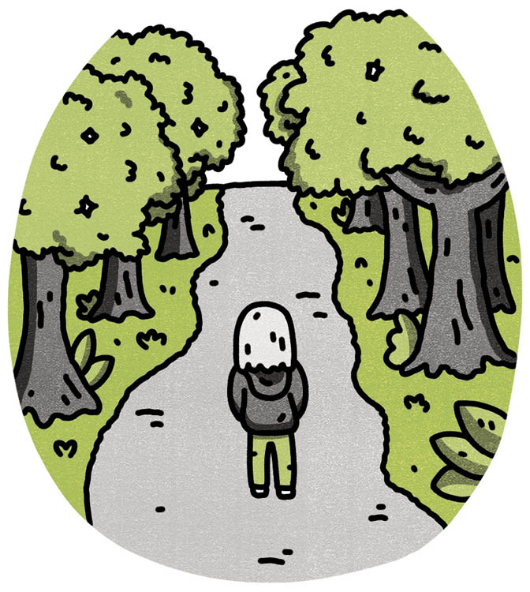

**Be generous** with your time, your money, and your care. Give more and
it will come back to you in happiness and, if you ever need it, in
someone giving back to you.

**Do real stuff with your hands.** Neuroscientists have shown that doing
meaningful physical activities — knitting, chopping wood, making food,
anything with a tangible, useful outcome — releases natural
antidepressants that increase your sense of well-being.

**Relatedly, spend less time on your phone** in general and social media
in particular, since these activities can actually reduce your sense of
well-being.

**Don’t dwell on mishaps or mistakes.** Do whatever you need to do next
— apologize, solve a problem, or learn what went wrong — then forgive
yourself and move on. **This is how we grow.**

**Fight injustice.** Stick up for lonely or bullied kids at your school.
Fight discrimination. Advocate for people in need. Call your political
representatives. March. Donate money. Know what you believe and why.

**Smile more!** Unless you don’t feel like smiling. And then don’t.

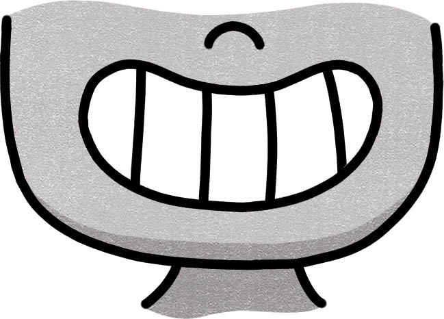

#  THANK YOU

Oh, thank you, thank you! To my friends and family, for being everything
to me, but especially my kids: Birdy Newman, whose stubborn hatred of
being \*explained to\* is what prompted me to write this book in the
first place, and Ben Newman, who — along with Birdy — patiently,
intelligently, and hilariously read and improved early drafts. Their
dad, Michael, makes our lives happy, fun, and easy, and I adore him. My
wise, funny friend Ron Lieber generously bettered the money chapter.

Debbie Fong’s dreamboat illustrations made me understand the book I was
hoping to make, because it’s this. Thank you, Debbie!

Everyone at Storey is both crazily talented and wildly encouraging:
Deborah Balmuth and Deanna Cook championed this idea at every stage with
their usual enthusiasm and flair; Michal Lumsden edited the book with
grace, good humor, and a kind eye; Alee Moncy always brims with ideas
for making the most of everybody’s gifts; Alethea Morrison is a
brilliant, intuitive art director; and Mars Vilaubi cheerfully and
expertly took photos and made videos.

And you, dear reader! Thank you for holding this book in your hands, and
for wanting to know how to do more stuff and be your best self. That’s
how we’ll change the world.

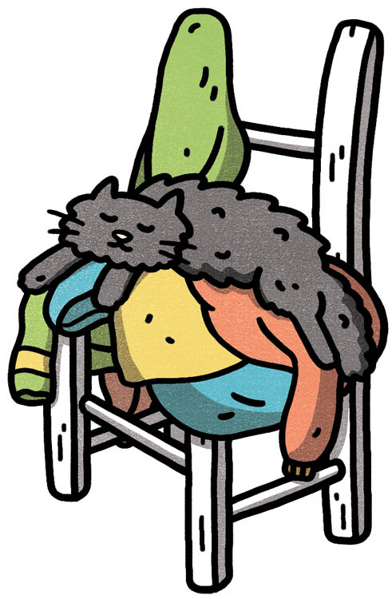

# Power Up Your DIY Skills with More Books from Storey

## Girls’ Home Spa Lab

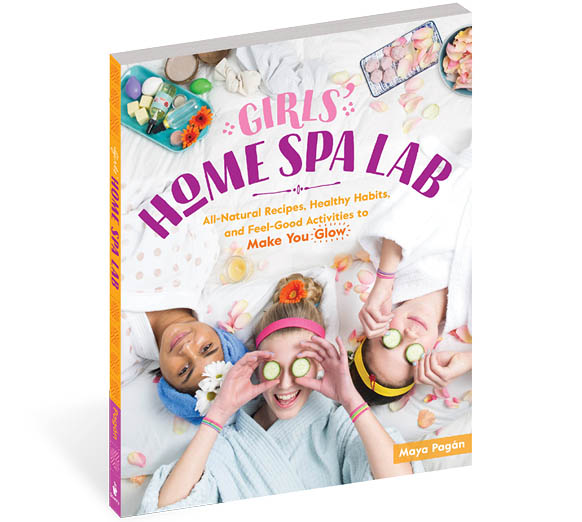

by Maya Pagán

Self-care has never been more fun! De-stress and indulge with 50
formulas for easy-to-make spa treatments, from hair masks to facial
steams and foot soaks, plus simple yoga poses, sleep tea recipes,
natural remedies, and more.

[READ MORE AT
STOREY.COM](https://www.storey.com/books/girls-home-spa-lab/)

## Journal Sparks

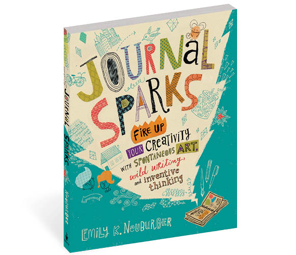

by Emily K. Neuburger

Make a visual day-in-your-life map, turn random splotches into quirky
characters for a playful story, and list the things that make you you!
These 60 interactive writing prompts and art how-tos will help spur your
imaginative self-expression.

[READ MORE AT STOREY.COM](https://www.storey.com/books/journal-sparks/)

## Stitch Camp

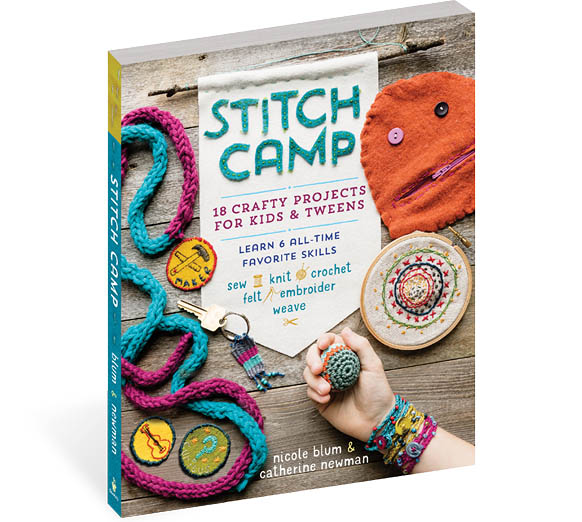

by Nicole Blum & Catherine Newman

Create, hack, or customize! Step-by-step directions show you the basics
of how to sew, embroider, knit, crochet, weave, and felt. You can then
use your new skills to hand-make cool bracelets, backpacks, merit
badges, keychains, and more.

[READ MORE AT STOREY.COM](https://www.storey.com/books/stitch-camp/)

## Wood Shop

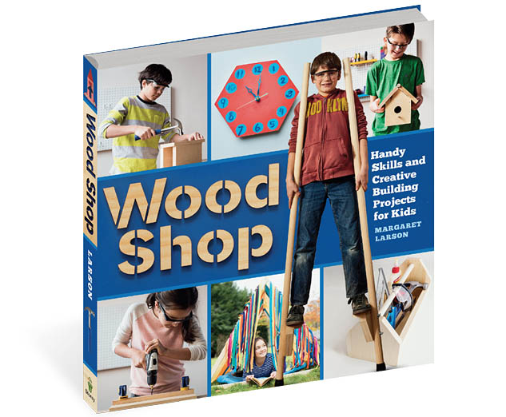

by Margaret Larson

Learn key skills like how to drive a nail and operate a power drill.
Then use what you’ve learned to build 17 fun and creative projects
including your very own workbench, a clever portable tic-tac-toe game, a
message board, and more.

[READ MORE AT STOREY.COM](https://www.storey.com/books/wood-shop/)

**Join the conversation.** Share your experience with this book, learn
more about Storey Publishing’s authors, and read original essays and
book excerpts at *[www.storey.com](http://www.storey.com)*.

Look for our books wherever quality books are sold or by calling
800-441-5700.

|  |
|----|
|       |

## **Newsletter**

Sign up to receive sneak peeks, monthly ebook sales, and news from the
Berkshires.

[SIGN-UP](http://www.storey.com/signup/)

Give it a spin. Unsubscribe at any time. We won’t use your email for any
purpose but our newsletter.

# Share Your Experience!

We value your feedback, and so do your fellow readers. Reviews you leave
at your ebookstore help more people find and enjoy the books you love.
So spread the word, write a review, and share your experience!

[EMAIL STOREY](mailto:devices@storey.com)

